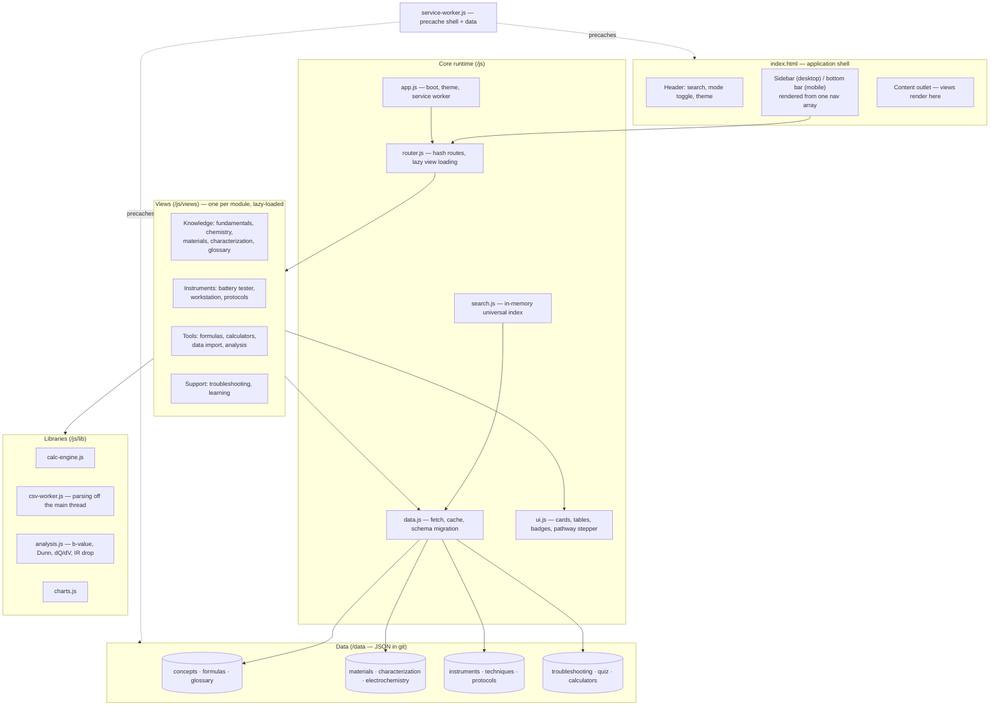
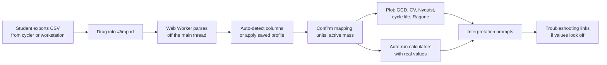
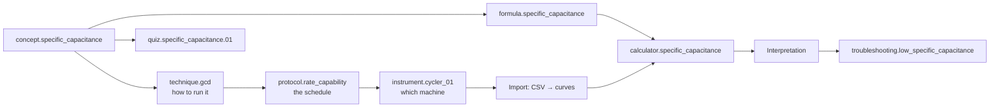

# EDMGLAB — System Architecture & Development Plan

*Energy Devices and Materials Group — Internal Research & Learning Platform*
*Document version: **v0.2** — 26 August 2026*
*Supersedes v0.1. Intended home: `/docs/ARCHITECTURE.md` in the project repository.*

## What changed in v0.2, and why

| # | Change | Driver |
|---|---|---|
| 1 | **Multi-page site → single-page shell with hash routing.** One `index.html` instead of ~15 HTML files. | "Easily executable + speed." Internal-only scope removes the one real argument for multi-page (public search discoverability). See A.1. |
| 2 | **Two new modules: Battery Tester and Electrochemical Workstation.** | Your request. Sections E and F. |
| 3 | **Measurement data import pipeline** — drag in a CSV export, get plots and calculations. | Your answer on data import. Section G. |
| 4 | **Vendor libraries self-hosted, not CDN-loaded.** | Speed on campus networks, offline from first load, no third-party dependency. See I.3. |
| 5 | **Explicit performance budget with numbers.** | "Speed must be good." Section I. |
| 6 | **Google Apps Script demoted to genuinely optional.** | Your access answer — nothing sensitive goes in the repo, so almost nothing needs a backend. Section J. |
| 7 | **Roadmap reordered** — instruments and data import moved much earlier. | They are the highest-value modules for people actually at the bench. Section L. |

Section letters shifted to make room for the new material. Map from v0.1: A→A, B→B, C→C, D→D, E (Apps Script)→**J**, F (PWA)→**K**, G (Roadmap)→**L**, H (Worked example)→**M**.

### Contents

- [Scope and locked decisions](#scope-and-locked-decisions)
- [Guiding principles](#guiding-principles)
- [A. System architecture](#a-system-architecture)
- [B. Folder and file structure](#b-folder-and-file-structure)
- [C. UI architecture](#c-ui-architecture)
- [D. Data architecture](#d-data-architecture)
- [E. Battery Tester module](#e-battery-tester-module)
- [F. Electrochemical Workstation module](#f-electrochemical-workstation-module)
- [G. Measurement data import and analysis pipeline](#g-measurement-data-import-and-analysis-pipeline)
- [H. Internal scope, access, and the day-to-day workflow](#h-internal-scope-access-and-the-day-to-day-workflow)
- [I. Performance architecture](#i-performance-architecture)
- [J. Google Apps Script integration (optional)](#j-google-apps-script-integration-optional)
- [K. PWA architecture](#k-pwa-architecture)
- [L. Development roadmap](#l-development-roadmap)
- [M. Worked example: Specific Capacitance end to end](#m-worked-example-specific-capacitance-end-to-end)
- [Open decisions](#open-decisions)
- [Next step](#next-step)

## Scope and locked decisions

| Decision | Locked value | Consequence |
|---|---|---|
| Primary audience | Your internal research group | No SEO requirement → single-page app becomes the better choice (A.1) |
| Battery cyclers | Neware / Land / Arbin family | Battery Tester module built around the schedule-and-step workflow these share (Section E) |
| Electrochemical workstation | *Not yet specified* | Workstation module built vendor-neutral; tell me the model and I will add a machine-specific layer (Section F) |
| Measurement files | CSV / text import, auto-plot | Client-side parse pipeline, no native binary formats (Section G) |
| Site access | Public URL, nothing sensitive committed | No auth layer needed; two-tier content rule instead (Section H) |
| Google account | Institutional Google Workspace | 6 hr/day Apps Script quota, domain-restricted sign-in available if ever needed (Section J) |

One thing to name plainly, since it shapes Section H: **"internal use" and "public URL" are different claims, and only the second is enforceable here.** A static GitHub Pages site has no way to check who is asking for a file. So the platform is designed to be *internally focused* — built around your instruments, your protocols, your group's way of working — while containing nothing that would cause harm if a stranger found the URL. Section H sets out exactly what that means in practice, and where the genuinely internal material lives instead.

## Guiding principles

Carried over from v0.1, with two added at your request.

**Scientific accuracy outranks everything else**, including in the data model itself. Every number the platform shows must be traceable to a theoretical formula, a cited literature range, an instrument datasheet, or a user's own measurement — never invented. This is a required field on every value (D.3), not a convention someone can forget.

**Context always travels with the number.** Three-electrode vs two-electrode, half-cell vs full-cell, symmetric vs asymmetric, material-level vs device-level. These change which formula is correct, so they are recorded as data on every formula and calculator (D.4). The new Workstation module makes this concrete: the cell configuration is a physical wiring decision at the bench, and the platform now teaches that decision and enforces its consequences in the same place.

**Learn Mode and Research Mode are two views of one record**, never two content sets that can drift apart.

**Maintainable by a working scientist, not a software team.** Nearly all content is data: adding a formula, a material, an instrument, or a protocol means editing a JSON file, not writing code.

**Everything is connected on purpose.** Your pipeline is implemented literally, as a graph of cross-references between records (A.4).

**Fast is a feature, not a finishing touch.** Section I sets numeric targets and the architecture is shaped to hit them, because a tool that takes six seconds to open will lose to a paper notebook at the bench.

**Easy to run and easy to change.** One command to run locally, one push to deploy, and content editable from a browser with no local setup at all (H.3).

## A. System architecture

### A.1 Architectural style — the one significant change from v0.1

**v0.1 proposed** a multi-page application: one HTML file per module, with shared header/sidebar/footer fetched at runtime from a `/partials/` folder.

**v0.2 proposes** a **single-page application shell with hash-based routing**: one `index.html`, a small router, and one lightweight view module per screen. Navigating to Materials changes a route (`#/materials`) and swaps the content region — it does not reload the page.

The reasoning, since you asked to be told before the structure changes:

*Why multi-page was right in v0.1.* Its real advantage is that each module is a genuine, separately-indexable URL — good for public search engines, and it degrades gracefully without JavaScript.

*Why it stops being right once the audience is internal.* Search-engine indexing is worth nothing to a private research group, which was multi-page's main benefit. Meanwhile its costs are all things you just told me matter:

- **Speed.** Every navigation was a full page load: re-parse the HTML, re-execute the CSS and JS, *plus* extra network round-trips to re-fetch the header, sidebar and footer partials. With a single-page shell, the second and every subsequent view change is a local DOM update — target under 100 ms, versus roughly 400–800 ms for a page load on campus wifi.
- **Executability.** ~15 HTML files plus 5 partials collapse to one `index.html`. Adding a module means adding one small view file and one line to a navigation array, instead of creating an HTML file and remembering every place that links to it.
- **Offline.** One shell file to cache is far more robust than fifteen, which matters directly for the PWA (Section K).

*What you do not lose.* Deep links still work and are still shareable: `#/material/hard_carbon` is a real, bookmarkable URL. The back button works. Content still lives in JSON, so the maintenance story is unchanged. There is still no build step, no bundler, no framework.

*The honest trade-off.* JavaScript becomes mandatory (irrelevant internally), and the very first load is marginally larger — mitigated by loading view modules only when first visited (I.2). If you would rather keep multi-page, say so and I will revert this one decision; everything else in this document is unaffected.

### A.2 Technology choices

| Concern | Technology | Why |
|---|---|---|
| Structure & behavior | HTML5, CSS3, vanilla JavaScript (ES modules) | No build step; readable by anyone with basic web knowledge |
| Routing | ~40-line hash router, hand-written | No framework, no dependency, fully understandable |
| Equation typesetting | KaTeX, **self-hosted** in `/vendor/`, lazy-loaded | Fast, offline-capable, no CDN dependency |
| Data plots | Chart.js, **self-hosted**, lazy-loaded | Ragone, Nyquist/Bode, CV/GCD, cycle-life plots |
| CSV parsing | Hand-written parser in a **Web Worker** | Keeps the UI responsive on large exports (G.2) |
| Concept animations | SVG + CSS + vanilla JS | Lightweight, full control |
| Client state | `localStorage` | Theme, mode, progress, import profiles |
| Hosting | GitHub Pages | Free; push to deploy |
| Optional backend | Google Apps Script + Sheets | Only where genuinely needed (Section J) |
| Installability | Web App Manifest + Service Worker | Section K |
| Android packaging | Trusted Web Activity via Bubblewrap / PWABuilder | Section K.5 |

### A.3 Layer diagram



### A.4 The knowledge graph

Unchanged from v0.1, and now extended to hardware. Every record in every data file carries a stable namespaced ID and a `relatedIds` array: `concept.specific_capacitance`, `formula.specific_capacitance`, `material.hard_carbon`, `technique.gcd`, `protocol.rate_capability`, `instrument.cycler_01`, `troubleshooting.high_ir_drop`.

Pages never hard-code cross-links; they read `relatedIds` and render whatever exists, grouped by type. The two new modules slot into the pipeline exactly where you would expect, and in doing so fill in what was previously the vaguest stage of it:

```
… → ELECTRODE FABRICATION → [ INSTRUMENT → TECHNIQUE → PROTOCOL ] → RAW DATA
      → IMPORT → CALCULATION → INTERPRETATION → TROUBLESHOOTING
```

That bracketed stage is the new material. Previously "ELECTROCHEMICAL TESTING" was a single box that a student had to fill in from a lab-mate or a manual. It is now three linked, browsable layers, and the arrow out of it — raw data into the app — is a real feature rather than a hand-off to Origin.

### A.5 Boot and render lifecycle

1. `index.html` loads: shell markup, CSS, and `app.js` as a module.
2. `app.js` applies the stored theme and Learn/Research mode *before first paint* (avoiding a flash of the wrong theme), renders the navigation from the nav array in `nav.js`, and registers the service worker.
3. `data.js` fetches the small core files — concepts, formulas, glossary — in parallel and hands them to `search.js` to index.
4. `router.js` reads the hash, dynamically imports the matching view module (first visit only; cached thereafter), and renders it into the outlet.
5. Subsequent navigation re-runs step 4 only. No page reload, no CSS/JS re-parse, no partial fetches.
6. Heavier data files load on first visit to the view that needs them, then stay in memory.

## B. Folder and file structure

Considerably simpler than v0.1 — one HTML file, no `/partials/`, no `/pages/`.

```
/EDMGLAB
├── index.html                  # The ONLY HTML file — shell + mount points
├── manifest.json               # PWA manifest (root: required for scope)
├── service-worker.js           # PWA service worker (root: required for scope)
├── README.md                   # What this is; how to run it locally
├── CONTRIBUTING.md             # How a lab member adds content — no coding needed
│
├── /css/
│   ├── tokens.css              # Design tokens ONLY: colors, spacing, type scale
│   ├── style.css               # Base styles + components (cards, tables, badges)
│   ├── responsive.css          # Breakpoints
│   └── animations.css          # All @keyframes; respects prefers-reduced-motion
│
├── /js/
│   ├── app.js                  # Boot: theme, nav, router, service worker
│   ├── router.js               # Hash router + lazy view loading
│   ├── nav.js                  # THE navigation model — one array, both layouts
│   ├── data.js                 # Fetch / cache / lazy-load / schema migration
│   ├── search.js               # Universal in-memory search
│   ├── ui.js                   # Shared renderers: card, table, badge, stepper
│   │
│   ├── /views/                 # One file per module screen, lazy-loaded
│   │   ├── dashboard.js            fundamentals.js       chemistry.js
│   │   ├── materials.js            preparation.js        characterization.js
│   │   ├── battery-tester.js   ← NEW
│   │   ├── workstation.js      ← NEW
│   │   ├── protocols.js        ← NEW
│   │   ├── data-import.js      ← NEW
│   │   ├── electrochemistry.js     formulas.js           calculators.js
│   │   └── troubleshooting.js      learning.js           glossary.js
│   │
│   └── /lib/
│       ├── calc-engine.js      # Generic calculator engine
│       ├── csv-worker.js       # Web Worker: parse + downsample (NEW)
│       ├── importers.js        # Instrument column-mapping profiles (NEW)
│       ├── analysis.js         # b-value, Dunn, dQ/dV, IR-drop extraction (NEW)
│       ├── charts.js           # Chart.js wrappers
│       ├── animations.js       # Play / Pause / Reset / Step controller
│       └── storage.js          # localStorage, namespaced + versioned
│
├── /data/
│   ├── concepts.json           # Fundamentals + mechanisms (Learn/Research pairs)
│   ├── formulas.json           # Formula library
│   ├── calculators.json        # Calculator UI definitions
│   ├── materials.json          # Material database
│   ├── instruments.json    ← NEW  Your actual hardware registry
│   ├── techniques.json     ← NEW  Vendor-neutral instrument function library
│   ├── protocols.json      ← NEW  Your group's standard test schedules
│   ├── characterization.json   # XRD / Raman / FTIR / BET / SEM-TEM / XPS
│   ├── electrochemistry.json   # CV / GCD / EIS interpretation science
│   ├── troubleshooting.json    # Symptom → causes → diagnostics → fixes
│   ├── quiz.json               # Question bank
│   ├── glossary.json           # Standalone terms
│   └── /_schema/               # Annotated example record per file (templates)
│
├── /vendor/                    # Self-hosted, lazy-loaded, version-pinned
│   ├── /katex/
│   └── chart.umd.min.js
│
├── /assets/icons/              # UI iconography
└── /pwa/icons/                 # App icons incl. maskable
```

Three notes worth more than a folder comment:

**`nav.js` is the single source of navigation truth.** One array of `{id, label, icon, route, group}` objects renders *both* the desktop sidebar and the mobile bottom bar. Adding a module is one array entry plus one view file — not an edit to fifteen HTML files.

**`tokens.css` is split out from `style.css` deliberately.** Every color, spacing step and font size lives in one short file. Changing the palette later means editing roughly forty lines in one place, never hunting through component styles.

**`formulas.json` vs `calculators.json`.** A formula is science and is true regardless of any interface. A calculator is an interface concern — which inputs appear, which unit options, how the interpretation reads. Keeping them separate lets one formula back several calculators, and means editing calculator wording can never accidentally alter the underlying science.

## C. UI architecture

### C.1 One shell, three breakpoints

One three-zone shell that rearranges rather than three different layouts: **navigation**, **main content**, and a **context rail** carrying the cross-references from the knowledge graph.

### C.2 Desktop (≥1024px)

Persistent left sidebar (~240px, collapsible to a ~64px icon rail) listing all modules grouped to mirror the pipeline:

- **Learn** — Fundamentals, Energy Storage Chemistry, Glossary, Learning/Quiz
- **Lab** — Materials, Electrode Preparation, Characterization, **Battery Tester**, **Workstation**, **Protocols**
- **Tools** — Formula Library, Calculators, **Data Import & Analysis**
- **Troubleshooting** — standalone, because it is entered from everywhere

Top bar: breadcrumb, universal search (keyboard shortcut), Learn/Research toggle, theme toggle. Card grid reflows 4→3→2 columns. Context rail (~280px, right) auto-collapses below ~1280px so the main column never gets squeezed.

### C.3 Tablet (600–1023px)

Sidebar becomes an icon rail or a slide-over drawer. Card grid at two columns. Context rail moves below content as a collapsible "Related" accordion rather than disappearing — cross-linking is too central to drop on width alone.

### C.4 Mobile (<600px)

Bottom navigation as you specified: **Home | Learn | Lab | Tools | Menu**.

| Tab | Contains |
|---|---|
| Home | Dashboard |
| Learn | Fundamentals, Chemistry, Glossary, Quiz |
| Lab | Materials, Preparation, Characterization, **Battery Tester**, **Workstation**, **Protocols** |
| Tools | Formulas, Calculators, **Data Import & Analysis** |
| Menu | Troubleshooting, settings, about, full search |

Same grouping as the desktop sidebar, so the mental model does not change between laptop and phone. Minimum 48×48px touch targets, labels always visible. Tables become stacked cards below ~480px.

One mobile-specific consideration for the new modules: the Battery Tester and Workstation views will most often be opened *standing at the instrument, on a phone*. Those views therefore default to a checklist-style layout with large tap targets and collapsed detail, rather than the dense reference layout used on desktop — same data, prioritized differently.

### C.5 Routing

Hash routes, readable and bookmarkable:

```
#/                            Dashboard
#/fundamentals                Module index
#/concept/specific_capacitance    Detail
#/materials                   Browse + filter
#/material/hard_carbon        Detail
#/battery-tester              Module index
#/technique/cccv              Technique detail
#/protocol/rate_capability    Protocol detail
#/instrument/cycler_01        Instrument detail
#/import                      Data import workspace
#/calculator/specific_capacitance
#/troubleshooting/high_ir_drop
```

### C.6 Pathway stepper

A per-topic strip on detail pages rendering the relevant slice of the pipeline as clickable steps, built automatically from `relatedIds`. On Hard Carbon it might read: Concept → Preparation → Characterization (XRD/BET) → **Instrument (cycler)** → **Protocol (rate capability)** → Testing (GCD) → Calculation → Troubleshooting. This is the clickable form of your core philosophy.

### C.7 Dashboard

Not a marketing homepage. Continue-where-you-left-off from `localStorage`; a clickable rendering of the pipeline as the visual centerpiece; quick tiles for the most-used calculators; recently viewed items; quiz progress once that exists. Nothing on it requires a network call beyond already-cached JSON, so it opens instantly, including offline.

### C.8 Card system

One component family — Concept, Material, Formula, Instrument, Protocol, Troubleshooting cards share markup and CSS class, differing only in which fields they surface, because one generic function renders all of them from whatever record it is given.

### C.9 Search

One universal search across every loaded JSON file, built in memory, working fully offline. Results group by type ("3 concepts, 1 formula, 2 protocols matched 'IR drop'"). If content ever grows enough that indexing on boot becomes slow — unlikely below a few thousand records — the fix is a pre-generated index file, with no change to how the UI calls it.

### C.10 Theme system

CSS custom properties in `tokens.css`, switched by a `data-theme` attribute on `<html>`, persisted in `localStorage`, applied before first paint. Dark default: deep charcoal/graphite surfaces, one restrained accent reserved for interactive elements and active states, a second distinct hue reserved *only* for warnings so color carries meaning, and monospace type for numbers, units and equations — a real legibility convention borrowed from instrument displays. Light theme tuned separately for glare and printing, not a naive inversion.

Accessibility is part of the theme, not a later pass: WCAG AA contrast minimum in both themes, visible focus outlines, `prefers-reduced-motion` respected throughout with static-diagram fallbacks, 44×44px minimum touch targets, ARIA labels on icon-only controls.

## D. Data architecture

### D.1 Content as data

Static JSON in git is simultaneously the database, the CMS, and the peer-review trail. A change to `materials.json` appears as a reviewable diff exactly like a manuscript edit — a co-author can see precisely which number changed and challenge it before it merges. That property vanishes the moment content moves into a live-editable spreadsheet, which is a large part of why Section J keeps Apps Script out of the authoritative content path.

### D.2 The data files

| File | Holds | Notable fields |
|---|---|---|
| `concepts.json` | Fundamentals and mechanisms | `id`, `learnMode{}`, `researchMode{}`, `equationIds[]`, `relatedIds[]` |
| `formulas.json` | Every equation | `latex`, `plainText`, `variables[]`, `validContext{}`, `assumptions[]`, `calculatorId` |
| `calculators.json` | Calculator UI definitions | `formulaId`, `inputs[]`, `interpretationRules[]`, `modes[]` |
| `materials.json` | Material database | Every value as `{value, unit, provenance, source}` |
| **`instruments.json`** | **Your actual hardware** | `vendor`, `model`, `channels[]`, `ranges{}`, `specs{}` (all provenance-tagged), `sop[]`, `quirks[]` |
| **`techniques.json`** | **Vendor-neutral instrument functions** | `id`, `instrumentClass`, `parameters[]`, `outputs[]`, `relatedFormulaIds[]`, `pitfalls[]` |
| **`protocols.json`** | **Your group's standard schedules** | `steps[]`, `purpose`, `typicalDuration`, `relatedTechniqueIds[]` |
| `characterization.json` | XRD / Raman / FTIR / BET / SEM-TEM / XPS | `interpretationGuide[]`, `relatedFormulaIds[]` |
| `electrochemistry.json` | CV / GCD / EIS interpretation science | `plotConfig`, `teachingPoints[]` |
| `troubleshooting.json` | Symptom → cause → diagnosis → fix | `symptom`, `causes[]`, `diagnostics[]`, `fixes[]`, `safetyNotes[]` |
| `quiz.json` | Question bank | `conceptId`, `level`, `question`, `answer`, `explanation` |
| `glossary.json` | Standalone terms | `term`, `shortDef`, `linkId` |

**The boundary between `techniques.json` and `electrochemistry.json` matters and is easy to blur.** `electrochemistry.json` holds the *science of the resulting curve* — what a CV shape means, why a Nyquist semicircle appears, how to read a plateau. `techniques.json` holds *how to actually run the measurement* — which parameters to set, in what ranges, what the instrument outputs, what commonly goes wrong during acquisition. A student asking "what scan rate should I use and why" is in `techniques.json`; asking "why does my CV have that shape" is in `electrochemistry.json`. Each links to the other.

### D.3 Provenance — extended to hardware

Every numeric value is an object, never a bare number:

```json
"theoreticalCapacity": {
  "value": 372, "unit": "mAh/g",
  "provenance": "theoretical",
  "note": "graphite, LiC6 stoichiometry"
}
```

`provenance` is one of:

| Value | Meaning | UI treatment |
|---|---|---|
| `theoretical` | Derived from a formula or stoichiometry | Neutral badge |
| `literature` | Published range, **requires** a `source` (citation/DOI) | Cited badge, source shown |
| `datasheet` | From an instrument manual — **requires** `source` with manual version/page | Cited badge |
| `measured` | Your group's own calibration or measurement, **requires** date and who | Distinct badge, dated |
| `userEntered` | Typed by a student in this session | Clearly transient, never stored as reference |

Extending this to `datasheet` and `measured` is the reason the Battery Tester module can be genuinely useful without me inventing anything. **I will not write a single instrument specification into `instruments.json`.** The file ships as a template with your vendors' field names and empty, provenance-tagged slots; your group fills them from your own manuals and calibration records. An instrument entry with no datasheet reference renders with a visible "unverified" marker rather than looking authoritative.

### D.4 Measurement context

Every formula and calculator carries a `validContext` recording cell configuration (three-electrode / two-electrode), device configuration (symmetric / asymmetric / half-cell / full-cell), and performance level (material / device). Specific capacitance is the clearest case (Section M): the single-electrode value from a three-electrode cell is not the same quantity as the single-electrode-equivalent value derived from a symmetric two-electrode device, which conventionally carries a factor of four. A calculator that never asks which context you are in will quietly hand a student the wrong formula.

The Workstation module (Section F) is where this stops being an abstraction: the cell configuration is a *wiring decision made with physical cables*, and the platform now teaches that decision in the same place it enforces its consequences.

### D.5 Link integrity

Because cross-references are hand-maintained strings, they can rot silently. A small **data health-check view** (route `#/health`, not in the navigation) loads every JSON file in the browser and reports unresolved `relatedIds`, records missing required fields, formulas missing `validContext`, and numeric values missing `provenance`. Pure client-side, no tooling — turning "did I break a link" into a ten-second check before merging.

### D.6 Schema versioning

Every file carries `"schemaVersion": 1`. `data.js` is the single place that checks the version and migrates older records at load time, so no view ever needs to know about historical schema variants.

### D.7 Client state

`storage.js` owns one namespaced key (`edmglab.state.v1`) holding theme, mode, quiz progress, calculator history, recently viewed items, and saved CSV import profiles. Namespaced and versioned so a future format change can be migrated deliberately.

## E. Battery Tester module

Built around the Neware / Land / Arbin workflow you confirmed. The module has four layers, and the layering is what keeps it honest: general principles that are true of any cycler, your specific machines, the functions they run, and what to do when it goes wrong.

### E.1 Concepts — what a cycler is and how it differs from a workstation

This distinction is the single most useful thing a new student can learn here, and it is usually absorbed by osmosis rather than taught:

| | Battery cycler | Electrochemical workstation |
|---|---|---|
| Optimized for | Many channels, long-duration constant-current cycling | One or few channels, precise potential control and small signals |
| Typical use | Formation, rate capability, thousands of cycles | CV, EIS, mechanistic studies |
| Cell config | Usually two-electrode (full device) | Two-, three-, or four-electrode |
| Current resolution | Coarser; optimized for larger currents | Very fine; down to very small currents |
| Timescale | Days to months | Minutes to hours |

Concept topics in the module:

- **Channel architecture** — independent channels, per-channel current ranges, what range switching does to your data, and why channels are not interchangeable when comparing cells.
- **Accuracy vs resolution vs precision** — routinely conflated, and the distinction determines whether a difference between two samples is real. This links straight into the Fundamentals module.
- **Two-wire vs four-wire (Kelvin) sensing** — force and sense leads separated so lead and contact resistance are excluded from the voltage measurement. This is the direct physical explanation for a large fraction of "why is my IR drop so high" cases, and it links to `troubleshooting.high_ir_drop`.
- **Cell fixtures** — coin-cell holders, Swagelok cells, pouch clamps, and contact pressure as an experimental variable rather than an afterthought.
- **Sampling and logging conditions** — logging by time interval, by ΔV, or by ΔI, and the resulting trade-off between file size and curve fidelity. Under-sampling silently destroys dQ/dV analysis, and students usually discover this only after a month-long run.
- **Safety and limits** — voltage, current, capacity, time and temperature cutoffs; what each protects against; why a protocol without limits is a hazard.
- **Auxiliary channels** — temperature probes, chambers, and correlating temperature with capacity fade.
- **Active material mass** — where it is entered, how the instrument uses it, and why an error here silently scales every specific value you subsequently report. This is the most common and most invisible error in the whole workflow, so it gets its own concept page.

### E.2 Functions — the step language

Cyclers from all three vendors express a test as a **schedule**: an ordered list of steps, each with an action and a transition condition, with loops. Teaching that grammar once transfers across vendors.

**Step actions**

| Step | What it does | Key parameters |
|---|---|---|
| Rest / OCV | No current; cell relaxes | Duration |
| CC charge | Constant current until a condition | Current or C-rate, cutoff voltage |
| CC discharge | Constant current discharge | Current or C-rate, cutoff voltage |
| CCCV charge | CC to voltage, then hold voltage while current decays | Cutoff voltage, cutoff current (commonly C/10–C/20; protocol-dependent) |
| CV hold | Hold potential, let current decay | Voltage, cutoff current or time |
| CP / CR | Constant power / constant resistance | Power or resistance value |
| Loop | Repeat a block N times | Start step, count |

**Transition conditions** — the part students most often get wrong: time elapsed, voltage limit reached, current falling below a threshold, capacity accumulated, or dV/dt flattening. Each step needs at least one, and a safety limit as backstop.

**Standard protocols** shipped in `protocols.json` as editable templates:

- **Formation** — first cycles at low rate, where the SEI forms; explains why first-cycle coulombic efficiency is low and what that number tells you.
- **Rate capability** — a C-rate ladder (e.g. ascending rates, then a return to the initial rate) with the return step explaining how to separate genuine rate limitation from irreversible degradation.
- **Long-term cycling** — fixed rate over hundreds to thousands of cycles, with capacity retention and coulombic efficiency as outputs.
- **GITT** — current pulse followed by relaxation, repeated across state of charge, used to extract diffusion behavior and near-equilibrium potential.
- **dQ/dV analysis** — derived from GCD data rather than a separate protocol; peaks correspond to plateaus and phase transitions, and sampling density determines whether they are resolvable at all.

Each protocol record states its purpose, its steps, its typical duration, what it produces, and which calculations it feeds — so a student can see the whole arc from "I want to know rate capability" to "here is the number and what it means."

### E.3 Output — what the instrument gives you

A concept page mapping the standard exported column set to what it is for:

| Column | Feeds |
|---|---|
| Cycle index, step index, step type | Segmenting data for per-cycle analysis |
| Time | Δt in the capacitance and capacity formulas |
| Voltage | ΔV, IR drop extraction, GCD shape |
| Current | I in nearly every calculation |
| Charge capacity, discharge capacity | Specific capacity; coulombic efficiency (discharge/charge) |
| Energy | Energy density |
| Temperature (aux) | Correlating fade with thermal history |

This table is what makes the import pipeline (Section G) teachable rather than magic: a student can see which column becomes which symbol in which equation.

### E.4 Instrument-specific troubleshooting

Entries in `troubleshooting.json` tagged to this module, each with symptoms, candidate causes, diagnostic tests, corrective actions and safety notes — framed as diagnostic prompts to work through, never as a definitive verdict:

- Channel reports over-voltage or an error immediately on start → contact, fixture, polarity, wiring
- Measured capacity far below expectation → active mass entry, C-rate definition, cutoff voltages, wetting
- Coulombic efficiency above 100% → soft internal short, redox shuttle, residual charge carried from the previous cycle, or a current/mass entry error
- Noisy or stepped voltage trace → contact pressure, two-wire sensing, current-range switching
- Gaps or coarse steps in the data → logging condition set too coarse; usually unrecoverable after the fact
- Cell never reaches the CV-step cutoff current → high cell impedance or an unreachable cutoff
- Large channel-to-channel scatter on nominally identical cells → fixture variation, calibration, or genuine cell-to-cell variance

### E.5 Your instrument registry

`instruments.json` holds one record per physical machine: vendor, model, channel count and grouping, current and voltage ranges per channel, resolution and accuracy **as stated in your manual with the manual version recorded**, plus lab-specific content that exists nowhere else — your SOP for mounting a coin cell in a given fixture, which channels are on which chamber, calibration dates, and known quirks.

That last category is the real prize, and it is why this module is worth building for an internal group specifically. "Channel 7 reads about 2 mV low, verified March 2026" is exactly the institutional knowledge that currently lives in one senior student's head and leaves when they graduate. It is also, notably, not sensitive — it is useless to anyone outside your lab — so it can live in the public repo without conflict (Section H).

## F. Electrochemical Workstation module

You did not specify a workstation vendor, so this module is built **vendor-neutral**: the concepts and functions are common to Autolab, Gamry, BioLogic, CH Instruments, Ivium, PalmSens and others, with technique names cross-referenced across vendor vocabularies. Tell me your model and I will add a machine-specific layer in `instruments.json` the same way as the cyclers.

### F.1 Concepts — how a potentiostat actually works

- **The control loop.** A potentiostat controls the working electrode's potential *relative to the reference* and measures the resulting current; a galvanostat controls current and measures potential. Understanding that the instrument is a feedback loop explains most of what goes wrong with it.
- **The lead set** — working, counter, reference, and sense leads — and what each physically does.
- **Cell configurations**, which is where this module earns its place in the architecture:

| Configuration | Wiring | Measures | Reports |
|---|---|---|---|
| Two-electrode | WE + CE (RE tied to CE) | Whole-device response | Device-level performance |
| Three-electrode | WE, CE, separate RE | Single electrode vs a stable reference | Material-level performance |
| Four-electrode | Separate sense leads | Membrane/interface studies | Specialized |

This table is the physical origin of the `validContext` field in the data model (D.4). A student who wires a two-electrode cell and then applies the three-electrode capacitance formula gets a wrong number with no error message anywhere. The platform can catch this because the calculator asks which configuration was used — and this module is where the student learns why that question is being asked.

- **Reference electrodes** — common types (Ag/AgCl, saturated calomel, Hg/HgO, Li metal in non-aqueous systems), their maintenance and failure modes, drift, and junction potential. Scale conversion is presented as a formula with its conditions attached, not a memorized constant: converting to SHE requires the reference's own standard potential, which depends on filling-solution concentration and temperature, and conversion to RHE additionally requires pH. The platform will provide the conversion structure and require you to supply the constant for *your* electrode from its certificate — consistent with the no-invented-values rule, and more correct than the single number most students copy from a paper.
- **Compliance voltage** — the maximum the instrument can apply to drive the requested current, and what hitting the limit looks like in your data.
- **Current ranges and autoranging** — and the artifacts range changes leave in a CV.
- **Bandwidth and stability** — why a high-impedance reference or a long cable can send the loop into oscillation.
- **Floating vs grounded mode** — relevant whenever the cell touches anything else grounded, such as a temperature chamber or an autolab-connected rotator.
- **Noise** — Faraday cage, mains pickup, cable routing, and why single-point grounding matters.
- **iR compensation** — positive feedback versus current interrupt, obtaining the uncompensated resistance from the high-frequency intercept of an EIS spectrum, and the risk of over-compensation causing oscillation.
- **Equilibration** — why a stable open-circuit potential is a precondition for a meaningful measurement, not a formality.

### F.2 Functions — the technique library

| Technique | Controls | Key parameters | Primary output |
|---|---|---|---|
| OCP | Nothing | Duration, stability criterion | Equilibrium potential, cell health |
| CV | Potential sweep | Vertex potentials, scan rate, cycles, step size | Current–potential curve |
| LSV | Single potential sweep | Start/end, scan rate | Onset potentials |
| CA | Potential step | Step potential, duration | Current–time decay |
| CP | Current step | Current, cutoff | Potential–time |
| GCD | Constant current cycling | Current density, voltage window | Charge/discharge curves |
| EIS (potentiostatic) | Small AC potential about a DC bias | Frequency range, amplitude, points/decade, DC bias | Impedance spectrum |
| EIS (galvanostatic) | Small AC current | Frequency range, AC amplitude, DC current | Impedance spectrum |

Vendor vocabulary differs — the same technique appears as PEIS/GEIS, or as "FRA potentiostatic," or as "EIS vs OCP." `techniques.json` carries an `aliases[]` field so a student searching the term printed on your instrument's screen finds the right page.

**Parameter guidance** is stated with its reasoning, never as a bare recommended value: EIS amplitude is chosen small enough that the response stays linear (commonly a few mV to ~10 mV), and the correct check is that the spectrum does not change when you halve the amplitude — a test the student can run rather than a number to trust. Similarly, scan rate selection, frequency range, and points per decade each get "what it controls, what happens if too high, what happens if too low."

**Validity checks** get their own page, since they are routinely skipped: an impedance spectrum is only interpretable if the system is linear, stationary during the measurement, and causal — with the Kramers–Kronig test as the practical check, and drift during a slow low-frequency sweep as the most common violation in battery work.

### F.3 Analysis functions

Two analyses you explicitly asked for live here, because they are properties of *how the measurement was run* rather than of a single curve:

- **b-value analysis** — from peak current versus scan rate across a series of CVs, fitted as i = a·v^b on log–log axes. A b near 1 indicates surface-controlled/capacitive response; near 0.5 indicates diffusion-controlled. The platform will emphasize what the technique cannot tell you: b is an empirical descriptor over a limited scan-rate window, not a mechanism, and reporting it without stating the window and the potential at which it was evaluated makes it uninterpretable.
- **Capacitive/diffusive deconvolution (Dunn method)** — separating i(V) = k₁v + k₂v^½ at each potential, with its assumptions stated plainly, since it is frequently applied outside the conditions where it holds.

Both require a *series* of measurements at different scan rates, which is why they belong to the workstation module and feed directly into the import pipeline: the student uploads several CVs at once and the analysis runs across the set.

### F.4 Workstation troubleshooting

- Oscillation or ringing → bandwidth setting, high-impedance or blocked reference, cable length, over-compensated iR
- Overload indication → current range, compliance voltage, disconnected lead
- Noisy CV → shielding, ground loop, contact quality, mains pickup
- Drifting or unstable OCP → cell not equilibrated, reference degradation, leak
- Distorted or depressed Nyquist semicircle → amplitude too large, non-stationarity, poor reference placement
- Inductive tail at high frequency → cable inductance, lead routing
- Unexpected high-frequency intercept → contact resistance, electrolyte, cell geometry

Each cross-links to the relevant concept page, so "my CV is noisy" leads to *why* rather than just a checklist.

## G. Measurement data import and analysis pipeline

You chose CSV/text import with automatic plotting. This turns the Data Analysis module from a placeholder into the feature students will use most, and it is what makes the two instrument modules pay off rather than remaining reading material.

### G.1 The flow



### G.2 Design decisions

**Everything happens in the browser. No file is ever uploaded anywhere.** The parsing, plotting and calculation all run locally in the student's browser; nothing is transmitted to GitHub, to Google, or to me. This is worth stating in the interface itself, not just in this document, because it means unpublished measurement data can be analyzed on the platform without any of the concerns that would otherwise come with a public URL (Section H).

**Parsing runs in a Web Worker.** A long cycling run can be tens or hundreds of thousands of rows. Parsing that on the main thread freezes the interface for seconds. A Web Worker keeps the UI responsive and lets us show real progress.

**Plots are downsampled, calculations are not.** Rendering 200,000 points to a canvas is slow and visually pointless — no screen has that many pixels. The chart layer downsamples to a couple of thousand points using a shape-preserving algorithm, while every calculation runs on the full dataset. Fast and correct, rather than one or the other.

**Column mapping is a saved profile, not a guess.** `importers.js` ships with mapping profiles for the export layouts of your instruments, and the first time a student maps an unfamiliar export they can save it as a named profile for the whole group. Auto-detection is offered as a suggestion the student confirms, never applied silently — a wrong column mapping is exactly the sort of error that produces plausible-looking, entirely wrong numbers.

**Active mass and cell configuration are required inputs, not optional.** The importer will not produce a specific capacitance until the student has stated the active material mass and whether the measurement was two- or three-electrode. This is the mechanism that makes the `validContext` rule (D.4) actually bind at the point where it matters.

### G.3 What it produces

Per-cycle capacity and coulombic efficiency; capacity retention against cycle number; GCD curves with IR drop extracted from the discharge onset; CV curves with peak identification and, given a scan-rate series, b-value and Dunn analysis; Nyquist and Bode plots with the high-frequency intercept read off; Ragone plots from energy and power; and dQ/dV curves where the sampling density supports it.

Each result appears alongside the equation used, the substitution, the units, and an interpretation prompt — the same Input → Equation → Substitution → Result → Unit → Interpretation structure as the manual calculators, so a student sees the same reasoning whether they typed the numbers or imported them.

## H. Internal scope, access, and the day-to-day workflow

### H.1 What "internal" means here, precisely

You chose a public URL with nothing sensitive committed. That is the right call — it keeps the site free, fast, and free of login friction at the bench — but it needs one clear rule to work, because the site's URL will inevitably be shared, indexed, or forwarded.

**The two-tier rule.** Anything committed to the repository must be safe to be public. That includes essentially all of the platform: the science, the formulas, the calculators, the characterization guidance, the instrument concepts, and — perhaps counter-intuitively — your protocols and instrument quirks, which are operationally valuable to you but of no use or interest to anyone else.

What does *not* go in the repository: unpublished experimental results, data from manuscripts under review, anything under a collaboration NDA, personal information about group members, and credentials of any kind.

The pipeline in Section G is what makes this rule painless rather than limiting. Because imported measurement files are parsed entirely in the browser and never leave the student's device, an unpublished dataset can be analyzed on the platform without ever being committed to it. The sensitive data flows *through* the tool without being *stored in* it.

### H.2 If you ever need real access control

Worth recording, so the option is understood rather than rediscovered later. GitHub Pages can be published from a private repository on paid plans, but **a genuinely access-controlled Pages site — one that checks who is asking — is a GitHub Enterprise Cloud feature.** A password prompt implemented in client-side JavaScript is not access control: the content is already in the browser before the prompt appears, and anyone can read it from the page source. I will not build one, because it would create a false sense of protection that could lead someone to commit something they shouldn't.

If real gating ever becomes necessary, the workable route on your stack is to move the restricted content out of the repo and serve it from an Apps Script Web App with your institutional Workspace domain restriction — genuine Google sign-in, checked server-side. Your Workspace account makes this straightforward. It is not needed for anything in the current plan.

### H.3 The day-to-day workflow — "easily executable"

**Running it locally.** One command, no installation:

```
python3 -m http.server 8000
```

then open `localhost:8000`. A local server is required (not just double-clicking `index.html`) because browsers block `fetch()` of local JSON files opened directly from disk — a five-minute confusion for every newcomer, so it goes in `README.md` prominently.

**Deploying.** Push to the `main` branch. GitHub Pages rebuilds automatically, typically within a minute. There is no build step, no CI configuration, no deployment script.

**Adding content without any local setup at all.** This is the part that matters most for a research group. A student can open `data/formulas.json` in GitHub's web editor — in a browser, on any machine, including a phone — add an entry, and commit. The site updates itself. No git client, no Node, no editor configuration, nothing installed. `CONTRIBUTING.md` will be a one-page walkthrough of exactly this, with a worked example of adding one formula.

**Checking before committing.** The health-check view (D.5) catches broken cross-references, missing provenance and malformed records. Run it locally, or on the live site after deploying, before telling anyone the new content is ready.

## I. Performance architecture

"Speed must be good" deserves numbers rather than adjectives, so here are the targets the architecture is built to hit.

### I.1 Budget

| Metric | Target | How |
|---|---|---|
| First visit, interactive | < 1.5 s on campus wifi | Small shell; no framework; core data only |
| Repeat visit, interactive | < 0.4 s | Service worker precache — no network at all |
| View switch (data loaded) | < 100 ms | SPA: DOM update only |
| View switch (lazy data) | < 300 ms | Parallel fetch, cached thereafter |
| Search results appear | < 50 ms | In-memory index |
| CSV import, 50,000 rows | < 2 s to first plot | Web Worker + downsampled rendering |
| Total shell payload | < 150 KB before compression | No framework, no runtime |

### I.2 How the targets are met

**No framework.** React, Vue and similar cost 40–150 KB of runtime that must be downloaded, parsed and executed before anything appears. For a content-driven site with hand-written views, that expense buys nothing here.

**Lazy view loading.** Each view module is a separate ES module imported on first visit to its route. A student who never opens the import workspace never downloads its parsing code.

**Parallel data loading, separate files.** There is a real tension between speed (fewer, bigger files) and maintainability (smaller, focused files that diff cleanly). It resolves cleanly: GitHub Pages serves over HTTP/2, which multiplexes several requests over one connection, so fetching `concepts.json`, `formulas.json` and `glossary.json` in parallel costs essentially the same as one combined file. Keep them separate for maintainability; load them with `Promise.all` for speed. No trade-off needed.

**Two-tier data loading.** Small, universally-needed files load at boot; heavier ones (materials, instruments, troubleshooting, quiz) load on first visit to their view and stay in memory.

**Self-hosted vendor libraries, lazy-loaded.** KaTeX and Chart.js live in `/vendor/` rather than loading from a CDN. Three reasons: a campus network's route to an international CDN is often slower than to your own Pages origin; the app works offline from the very first load rather than only after a CDN response is cached; and there is no third-party availability or DNS dependency. Each is loaded only when a view needs it — Chart.js never downloads for a student who only reads concept pages.

**Theme applied before first paint**, from a tiny inline script, so there is no flash of the wrong theme.

**Service worker precache.** After the first visit, the entire shell and all data files are served from local cache. This is the single largest win, and the reason repeat visits target under half a second.

### I.3 Guarding it

Performance regressions creep in quietly. Two cheap habits: a Lighthouse run before each phase is called done (also required for Play Store submission later, per K.5), and the payload budget in I.1 checked whenever a dependency is added. If a proposed feature cannot fit the budget, that is a design conversation, not something to absorb silently.

## J. Google Apps Script integration (optional)

Your access answer changes this section's status substantially. In v0.1 Apps Script was a planned phase; in v0.2 it is genuinely optional, because with nothing sensitive in the repo and all measurement analysis running client-side, **almost nothing in the platform needs a backend at all.** That is a good outcome: no backend means nothing to maintain, nothing to break, and nothing to secure.

### J.1 What it would still be useful for

1. **Feedback and corrections.** A "flag an error" control posts to a Sheet; you review and, if valid, promote the fix into the JSON through a normal commit. The Sheet is a submission inbox, never a source of truth — the human review gate stays intact.
2. **Cross-device progress sync.** Quiz progress and calculator history currently live in `localStorage`, which is per-device. Syncing to a Sheet keyed by institutional email would let progress follow a student from phone to lab desktop. A convenience, not a record.
3. **Shared protocol submissions.** A student proposes a new protocol through a form; it lands in a Sheet for your approval before entering `protocols.json`.

### J.2 If and when you build it

The shape: a Google Sheet as datastore, one tab per purpose, and an Apps Script project deployed as a Web App exposing `doGet(e)`/`doPost(e)` and returning JSON via `ContentService`. The frontend calls it only through `data.js`, which is the single place in the app that knows where content comes from — which is why adding this later is additive rather than a rewrite. This is the `Code.gs` + `Index.html` pairing you mentioned; `Index.html` is only needed if you also want a small moderation view served from within the Apps Script project itself.

### J.3 Constraints, verified rather than assumed

- **6 minutes** maximum per execution.
- **6 hours/day** total script runtime on Google Workspace (against 90 min/day on a consumer account) — your institutional account gives you the higher limit, comfortably beyond anything this platform would need.
- Concurrency: roughly 30 simultaneous executions per user, 1,000 per script — far beyond a research group's scale.
- **CORS.** Simple `doGet`/`doPost` JSON responses work with `fetch()`, but browsers preflight certain POST requests. The standard workaround is sending the body as `text/plain` and parsing it server-side, which keeps the request "simple" and avoids the preflight. Worth testing at the start of this work rather than discovering mid-feature.
- **Sheets is not a transactional database.** Concurrent writes can race; wrap every write handler in `LockService`.
- **Authentication is real only within your domain.** With Workspace, restricting the Web App to your institution's domain gives genuine server-side identity. Outside a domain, reliably identifying the caller is awkward — one more reason your institutional account is the right one to use here.
- Google revises quotas; reconfirm before depending heavily on these figures.

## K. PWA architecture

### K.1 manifest.json

`name`/`short_name` ("EDMGLAB"), `start_url`, `display: "standalone"`, `theme_color` and `background_color` matched to the dark palette so the launch splash does not flash white, unlocked `orientation`, and an `icons` array including at least one **maskable** icon — without one, Android launchers crop the icon awkwardly — alongside 192px and 512px sizes.

### K.2 Caching strategy

Two strategies for two kinds of file, because treating them alike is the most common PWA mistake:

- **App shell** (HTML, CSS, JS, vendor libraries, icons): **cache-first**, precached on install. Opens instantly, works offline.
- **Data files** (`/data/*.json`): **stale-while-revalidate**. Serve the cached copy immediately, fetch a fresh copy in the background for next time — so content updates propagate without students getting stuck on a stale version.

The cache is versioned (`edmglab-v1`, `edmglab-v2`, …); the `activate` handler deletes superseded caches, and `app.js` shows an unobtrusive "Update available — refresh" banner when a new worker is waiting. Getting this versioning wrong is the single most common reason PWAs serve stale content on phones long after a fix shipped, so it goes in from Phase 0 rather than being retrofitted.

### K.3 Installability

On Android/Chrome, capture `beforeinstallprompt` and present your own "Install EDMGLAB" button rather than relying on Chrome's easily-missed mini-infobar. iOS Safari has no such event — installation there is manual via Share → Add to Home Screen — so the honest plan is correct `apple-touch-icon` and meta tags plus a one-time tip for iOS visitors, not a promise of parity.

### K.4 Offline behavior

Because every calculator and the entire import pipeline are pure client-side JavaScript, and all reference content is cached JSON, the platform works completely offline after one visit: fundamentals, formulas, materials, instruments, protocols, calculators, CSV import and analysis, troubleshooting, quiz. For a lab with unreliable wifi, or a basement instrument room with no signal, this is a substantive benefit rather than a checkbox.

### K.5 Android packaging

The recommended route is a **Trusted Web Activity**, built with **Bubblewrap** (Google's own CLI) or **PWABuilder** (a GUI wrapper over the same approach, no command line needed). Both wrap an existing PWA with minimal extra code — far closer to "no complicated build process" than any native rewrite.

Play Store submission via TWA expects a Lighthouse PWA score around 80 or above, a valid manifest and service worker, Digital Asset Links verification proving you own both the app and the site, and the one-time developer registration fee. For internal distribution you would likely use Play's internal testing track rather than a public listing — worth deciding when you get there.

Apple's App Store does not accept this approach at all, rejecting WebView-wrapped web apps under its guidelines. This path is Android-only, which matches what you asked for.

## L. Development roadmap

### L.1 Two tracks

Two different kinds of work run throughout, and conflating them is a common way projects like this stall: an **engineering track** (the phases below) and a **content authoring track** (the actual definitions, equations, material data, protocols, troubleshooting logic — work only your group can do). The phases sequence the engineering; content authoring starts as soon as a schema exists, well before its display page is polished.

### L.2 Revised phases

Reordered from v0.1 to put the highest-value bench tools early. Instruments and data import moved up from the back half; materials and deep chemistry content moved later, since they benefit most from parallel content authoring anyway.

| Phase | Focus | Exit criteria |
|---|---|---|
| **0** | **Foundation** — shell, router, nav model, theme tokens, `data.js`, service worker, health-check view | Empty but fully navigable app live on GitHub Pages, installing as a PWA |
| **1** | **Fundamentals + Formula Library** — schemas, seed entries, card/detail renderers, Learn/Research toggle | A student can read real fundamentals content end to end |
| **2** | **Calculator engine** — generic engine, first 6 calculators, `validContext` enforcement | Specific capacitance, specific capacity, energy/power density, coulombic efficiency, C-rate, current density all usable |
| **3** | **Battery Tester module** — concepts, step language, `protocols.json` with your standard schedules, instrument registry template | A new student can be handed the module instead of a verbal explanation of the cycler |
| **4** | **Data import + charting** — Web Worker parser, column mapping, GCD/cycle-life/Ragone plots, auto-calculation | A student drags in a cycler CSV and gets specific capacity, CE and retention |
| **5** | **Electrochemical Workstation module** — concepts, technique library, cell configuration teaching | Wiring decisions and their consequences are documented and linked to the calculators |
| **6** | **Electrochemical analysis depth** — CV/EIS import, b-value, Dunn deconvolution, Nyquist/Bode, dQ/dV | A scan-rate series can be analyzed on the platform |
| **7** | **Materials database** — provenance-tagged schema, browse/filter/detail | Several real materials fully populated with cited values |
| **8** | **Energy Storage Chemistry** — supercapacitor / LIB / SIB / ion-capacitor structures | At least one storage class complete end to end |
| **9** | **Preparation + Characterization** — SOP guides; XRD/Raman/FTIR/BET/SEM-TEM/XPS with Bragg and Scherrer linked | One full prep-to-characterization pathway for a real material |
| **10** | **Troubleshooting engine** — symptom search; smart links from calculator and import results | Instrument, IR drop, cycling stability and distorted-CV entries all live |
| **11** | **Animations** — reusable controller; EDLC adsorption, Li/Na-ion movement, GCD, CV | 4–5 animations matching your list |
| **12** | **Quiz + Glossary** — engine, progress tracking, aggregated glossary | A student can complete a quiz tied to a fundamentals topic |
| **13** | **Hardening** — performance audit against the I.1 budget, accessibility pass, Lighthouse, `CONTRIBUTING.md` finalized | Budget met; a new member adds content unsupervised |
| **14** | **Optional: Apps Script layer** | A submitted correction reaches a Sheet you review |
| **15** | **Optional: Android packaging** — TWA build, internal distribution | Installable build on group phones |

### L.3 The incremental rule

Every phase ends with something you could hand to a student that day. That is a constraint on how phases are scoped, not an aspiration — and it is why later phases can be reordered freely: each adds to a working system rather than depending on a future one. If after Phase 4 you decide materials matter more than the workstation module, that swap costs nothing.

## M. Worked example: Specific Capacitance end to end

Extended from v0.1 to include the new instrument and import layers.



### M.1 The formula record

```json
{
  "id": "formula.specific_capacitance",
  "schemaVersion": 1,
  "name": "Specific Capacitance (galvanostatic)",
  "plainText": "Cs = I × Δt / (m × ΔV)",
  "latex": "C_s = \\dfrac{I \\, \\Delta t}{m \\, \\Delta V}",
  "variables": [
    {"symbol": "I",  "name": "Discharge current", "siUnit": "A"},
    {"symbol": "Δt", "name": "Discharge time", "siUnit": "s"},
    {"symbol": "m",  "name": "Mass of active material", "siUnit": "kg", "commonUnit": "g"},
    {"symbol": "ΔV", "name": "Voltage window (state whether IR drop is excluded)", "siUnit": "V"}
  ],
  "validContext": {
    "cellType": "three-electrode",
    "performanceLevel": "material (single electrode)",
    "note": "For a symmetric two-electrode device the single-electrode-equivalent value is conventionally reported as 4·I·Δt/(m_total·ΔV) — a different variant, not the same equation with different numbers."
  },
  "assumptions": [
    "Applies most directly to near-linear capacitive discharge; pseudocapacitive or battery-type curves require care in choosing ΔV and the linear region"
  ],
  "measuredBy": ["technique.gcd"],
  "relatedFormulaIds": ["formula.specific_capacity", "formula.areal_capacitance", "formula.energy_capacitor"],
  "calculatorId": "calculator.specific_capacitance"
}
```

### M.2 The technique record — new in v0.2

```json
{
  "id": "technique.gcd",
  "schemaVersion": 1,
  "name": "Galvanostatic Charge–Discharge",
  "aliases": ["GCD", "CC cycling", "GCPL", "chronopotentiometry cycling"],
  "instrumentClass": ["battery-tester", "workstation"],
  "parameters": [
    {"name": "Current density", "guidance": "Set from C-rate or per-gram current; record which convention was used"},
    {"name": "Voltage window", "guidance": "Bounded by electrolyte stability; too wide causes decomposition, too narrow understates performance"},
    {"name": "Logging interval", "guidance": "Fine enough to resolve the IR drop at discharge onset — the most common cause of unusable data"}
  ],
  "outputs": ["time", "voltage", "current", "chargeCapacity", "dischargeCapacity"],
  "feedsFormulaIds": ["formula.specific_capacitance", "formula.specific_capacity", "formula.coulombic_efficiency"],
  "pitfalls": [
    "IR drop included in ΔV inflates the apparent capacitance — state the convention used",
    "Active mass entered incorrectly on the instrument scales every specific value silently"
  ],
  "relatedIds": ["concept.specific_capacitance", "protocol.rate_capability", "troubleshooting.high_ir_drop"]
}
```

### M.3 What a student actually experiences

A postgraduate student needs the specific capacitance of a new carbon.

They open the **Battery Tester** module on their phone at the instrument, follow `protocol.rate_capability`, and — because the protocol page tells them to — record the active material mass carefully. The step language page explains why the discharge cutoff matters.

Two days later they export the CSV and drop it into **#/import**. The parser reads it in a Web Worker, applies the saved Neware profile, and asks for the active mass and cell configuration. They select three-electrode.

The platform plots the GCD curves, extracts the IR drop at discharge onset, and runs `calculator.specific_capacitance` — showing the equation, the substitution with their real numbers, the result with units, and the interpretation. Because they selected three-electrode, it labels the result electrode-level and does not apply the factor of four.

The number is lower than the literature range recorded for that material class, so the interpretation panel surfaces a link to `troubleshooting.low_specific_capacitance`, which asks about mass loading, wetting, and whether the IR drop was included in ΔV. Following that back, they land on the concept page, switch to Research Mode, and read the assumptions behind the equation they just used.

Every link in that sequence is derived from `relatedIds`, `measuredBy`, `feedsFormulaIds` and `calculatorId`. Nobody hand-wrote a "see also" section anywhere — and adding a new material, protocol, or troubleshooting entry extends the graph automatically.

## Open decisions

1. **Which electrochemical workstation do you have?** The module is vendor-neutral, which is the right default, but naming the model lets me add its technique vocabulary as aliases and record its specs in `instruments.json` from your manual. Needed by Phase 5, not before.
2. **Do you want the single-page change?** Section A.1 explains the reasoning and the trade-off. It is the one structural departure from v0.1 and it is easy to revert — but it is also where most of the speed and simplicity you asked for comes from.
3. **Colors and typography.** The system is fully specified; the specific values are not. Easier to choose from two or three live options than from a description — I can prepare those at the start of Phase 0.
4. **Where should protocols come from?** I can build `protocols.json` as empty templates for your group to fill, or seed it with standard protocol *structures* (formation, rate ladder, long-term cycling) carrying no invented parameter values, for you to adjust. I would suggest the latter — the structure is generic, the numbers are yours.

## Next step

Per your incremental rule, this document still stops at architecture. The natural first build is **Phase 0**: `index.html`, the router, the nav model, the theme tokens, `data.js`, the service worker, and the health-check view — a navigable, installable, empty application deployed to GitHub Pages, with every later phase slotting into it.

If you would rather see something scientific working sooner, an alternative is a combined Phase 0+1 delivering the shell *and* the Fundamentals and Formula Library with a handful of real entries, so the first thing you see is recognisably EDMGLAB rather than an empty frame. Say which you prefer and I will start there.

---

*Technical claims in Sections H, J and K verified against: [Google Apps Script quotas](https://developers.google.com/apps-script/guides/services/quotas), [GitHub Pages site visibility documentation](https://docs.github.com/en/enterprise-cloud@latest/pages/getting-started-with-github-pages/changing-the-visibility-of-your-github-pages-site), [Bubblewrap (GoogleChromeLabs)](https://github.com/GoogleChromeLabs/bubblewrap), [publishing PWAs to app stores, 2026](https://www.mobiloud.com/blog/publishing-pwa-app-store). Instrument specifications are deliberately absent — `instruments.json` ships as a template for your own manual and calibration values.*
