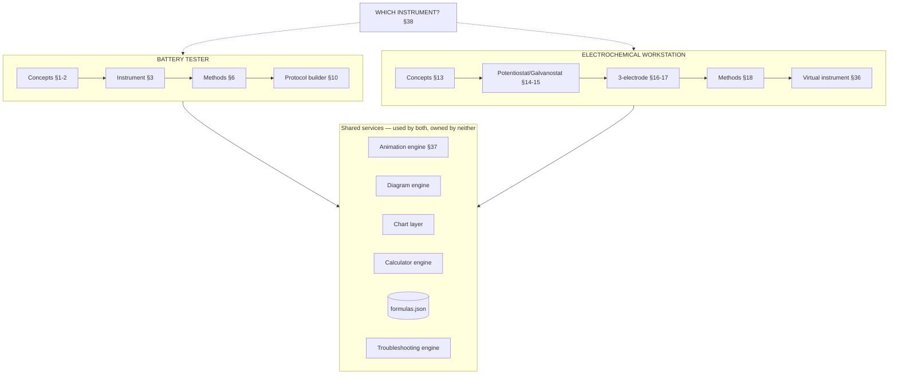

# EDMGLAB — Instrumentation Modules: Integration Report

*Battery Tester + Electrochemical Workstation*
*Responds to spec §41 (report before implementation) and §42 (first coding stage)*
*26 August 2026 · companion to Architecture v0.2*

> Your spec text says "ENERGYLAB" throughout; your follow-up message says EDMGLAB. I've taken ENERGYLAB as a slip and used **EDMGLAB** everywhere. Say the word if it's actually a rename.

---

## 0. Status check — what "existing architecture" means today

Your §41 asks me to inspect the existing architecture before reporting. The honest position, stated plainly because it changes the shape of everything below:

**No code exists yet.** We have produced two architecture documents (v0.1, v0.2). Nothing has been written to disk — no `index.html`, no shell, no animation engine, no data files. Architecture v0.2 Sections E and F already sketched these two modules at the *architectural* level; your new spec is roughly ten times more detailed and supersedes those sketches at the *implementation* level.

So §41.1 ("which existing files need modification") really means **"which planned files change, and which architectural decisions from v0.2 need revising."** That is what Section 1 answers. It also means the Stage-1 list in your §42 has a dependency problem — all sixteen deliverables assume an application shell and a shared animation engine that do not exist. Section 7 proposes a fix that keeps your Stage-1 scope intact.

One decision is still open from v0.2 and blocks the file layout below. I'll flag it once here and once at the end rather than repeatedly: **your §39 proposes `/pages/battery-tester.html` and `/pages/electrochemical-workstation.html` (multi-page); v0.2 §A.1 proposed a single-page shell with hash routing for speed.** Section 6.8 works through the reconciliation. It is a genuinely small code difference, but I need your call before writing files.

---

## 1. Existing (planned) files that need modification

Nine files from the v0.2 plan change. Every change is additive — nothing gets rewritten.

| File | Change | Why |
|---|---|---|
| `index.html` | Add two module routes; add mount point for the virtual instrument panel | New top-level modules |
| `js/nav.js` | Add Battery Tester, Workstation, and "Which instrument?" entries under the **Lab** group | §38 needs a shared entry point between the two modules |
| `js/router.js` | Add route patterns: `#/battery-tester/*`, `#/workstation/*`, `#/method/*`, `#/which-instrument` | New deep-linkable content types |
| `js/data.js` | Load and merge the new per-module data folders; merge both `troubleshooting.json` files into one searchable index (see 5.4) | Two-folder data layout from your §39 |
| `js/lib/animations.js` | **Substantially extended** — from a Play/Pause/Reset controller into the full shared engine of your §37: primitive component library, speed control, explanation toggle, single shared rAF loop | §7 and §37 |
| `js/lib/charts.js` | Add zoom/pan/point-inspection, sign-convention handling, reset; add Nyquist, Bode, Tafel, dQ/dV chart types | §8 and §32 |
| `js/lib/calc-engine.js` | Add normalization-basis and cell-configuration gating (see 6.5) | §9 and §31 require explicit material/electrode/device level |
| `data/formulas.json` | Add the battery and electrochemical equations as **one shared library**, not two | §40 accuracy — see risk 6.5 |
| `data/troubleshooting.json` | Gains a `module` tag so entries can be filtered per module but searched globally | §11 and §33 |

Two v0.2 decisions are **revised** by your new spec:

- **v0.2 §E/§F treated the modules as primarily reference content.** Your spec makes them interactive laboratories with simulators, builders and clickable diagrams. That is a substantially larger build and it changes the roadmap (Section 7).
- **v0.2 had no simulation layer at all.** Your §27 and §36 require one. This introduces a scientific-integrity requirement that must be enforced architecturally, not by convention — see 6.3.

---

## 2. New files to create

I've largely adopted your §39 structure, with three deliberate departures flagged **⚠** and justified in Section 6. Files marked **[S1]** are needed for Stage 1.

### 2.1 Shared foundation (must exist first — see 7.1)

```
/js/lib/
  anim-engine.js       [S1]  Shared animation engine: rAF loop, timeline, controls  §37
  anim-components.js   [S1]  Primitive library: Li⁺, Na⁺, cation, anion, electron,
                             electrode, electrolyte, separator, current collector,
                             particle, carbon layer, pore, arrow, voltage indicator,
                             current indicator, circuit element, label, tooltip  §37
  diagram.js           [S1]  Generic clickable-SVG engine (hotspots from JSON)
                             — powers §3, §14, §15, §16, §17 with ONE component
  sim-label.js         [S1]  Mandatory "Illustrative simulation" wrapper  §27, §36, §40
  decision-tree.js     [S1]  Generic decision-tree renderer  §30, §38
  charts.js            [S1]  Extended: zoom, pan, inspect, reset, sign conventions
  calc-engine.js             Extended: normalization basis + configuration gating
```

### 2.2 Battery Tester module

```
/js/battery-tester/
  index.js             [S1]  Landing page + module routing
  instrument.js        [S1]  Block diagram + fundamentals (§1, §3)
  cells.js                   Cell configuration diagrams (§4)
  workflow.js                Interactive testing workflow (§5)
  methods.js                 Generic method renderer — ALL methods from data ⚠ (§6)
  protocol-builder.js  [S1]  Visual protocol builder + timeline (§10)
  animations.js        [S1]  CC, CV, CC-CV, charge, discharge, cycling, GITT, PITT (§7)
  plots.js             [S1]  Chart configs only — no plotting logic ⚠ (§8)
  troubleshooting.js         Module-scoped view of the shared engine (§11)
  safety.js                  Safety section (§12)
```

### 2.3 Electrochemical Workstation module

```
/js/echem/
  index.js             [S1]  Landing page + module routing
  workstation.js       [S1]  Fundamentals (§13)
  potentiostat.js      [S1]  Potentiostat block diagram (§14)
  galvanostat.js       [S1]  Galvanostat block diagram + comparison (§15)
  electrodes.js        [S1]  Three-electrode interactive diagram (§16, §17)
  methods.js                 Generic method renderer — ALL methods from data ⚠ (§18)
  virtual-instrument.js [S1] Simulated workstation panel (§36)
  /sim/                      Simulation MATHEMATICS only, one file per technique
    cv.js              [S1]  §20, §27
    gcd.js             [S1]  §24
    eis.js             [S1]  Randles / CPE / Warburg impedance model  §25, §26, §27
    ca.js                    §22
    cp.js                    §23
    ocp.js                   §19
    lsv.js                   §21
    tafel.js                 §29
  equivalent-circuits.js     Interactive Rs / Rct / C / CPE / W components (§26)
  ir-compensation.js         §28
  plots.js             [S1]  Chart configs only ⚠ (§32)
  troubleshooting.js         Module-scoped view (§33)
```

### 2.4 Shared between the modules

```
/js/shared/
  which-instrument.js  [S1]  "Which instrument should I use?" (§38)
  method-selector.js   [S1]  Method-selection decision tree (§30)
```

### 2.5 Data files

```
/data/battery-tester/
  concepts.json              §1, §2 fundamentals + operating principles
  instrument.json            Block diagram + hotspot content (§3)
  cells.json                 Cell configurations + component hotspots (§4)
  workflow.json              Workflow steps + per-step content (§5)
  methods.json               11 methods × the §6 field set
  protocols.json             Protocol templates + builder parameter definitions (§10)
  troubleshooting.json       §11
  safety.json                §12

/data/echem/
  concepts.json              §13 fundamentals
  potentiostat.json          Block diagram hotspots (§14, §15)
  electrodes.json            Three-electrode diagram hotspots (§16, §17)
  methods.json               11 methods × the §18 field set
  circuits.json              Equivalent circuit elements (§26)
  troubleshooting.json       §33

/data/shared/
  instrument-choice.json     §38 mapping
  method-decision-tree.json  §30 tree
```

⚠ **Three departures from your §39, all in service of your own §41 rule "do not create duplicate functionality":**

1. **No `equations.json` inside `/data/echem/`.** All equations live in the single global `data/formulas.json`, referenced by ID. Reason in 6.5 — this is the most important one.
2. **`plots.js` in each module holds chart *configuration only*.** The plotting logic is the shared `js/lib/charts.js`. Your §39 listed `plots.js` in both folders, which would mean two zoom implementations to keep in sync.
3. **No `calculations.js` in either module.** Both use the shared `js/lib/calc-engine.js` driven by `calculators.json`. Module-specific behavior is data, not code.

Also: your §39 lists one JS file per electrochemical method (`cv.js`, `gcd.js`, `eis.js`, `ca.js`, `cp.js`, `ocp.js`, `lsv.js`). I've kept those **only for simulation mathematics**, which genuinely differs per technique. The *content pages* for all 22 methods across both modules render from one generic `methods.js` per module, driven by `methods.json`. Otherwise you would maintain 22 near-identical page files, and adding a method would mean writing code rather than adding data.

---

## 3. How the two modules integrate

They stay **separate modules with separate navigation, data, and code**, exactly as your spec requires. They connect at four defined points and nowhere else.



**Connection point 1 — "Which instrument should I use?" (§38).** A shared landing view, reachable from both modules and from the dashboard. Data-driven from `instrument-choice.json`, so entries carry the caveat your spec requires: capability varies by manufacturer and model, and no instrument supports every technique. GITT/PITT are represented as *configuration-dependent* rather than assigned to one instrument.

**Connection point 2 — the method-selection decision tree (§30).** Lives in `/js/shared/` because its leaves point into both modules. Every leaf states what the technique can and cannot tell you, never a bare recommendation.

**Connection point 3 — the shared formula library.** GCD appears in both modules (§6 and §24), and specific capacitance can be computed from either instrument's data. There is exactly one `formula.specific_capacitance` record, carrying `validContext`, referenced by both. This is the mechanism that prevents the two modules from drifting into contradictory statements of the same equation.

**Connection point 4 — one troubleshooting engine, two views.** Authoring happens in two files for clarity; `data.js` merges them into one index at load. So "IR drop" searched from anywhere returns both the cell/contact causes (§11) and the uncompensated-resistance causes (§28), which is the correct answer — a student with a large IR drop does not know in advance which module their problem belongs to.

**What deliberately does *not* connect:** methods, concepts, animations, and instrument diagrams stay module-owned. A CC-CV animation is a battery-tester object; a three-electrode diagram is a workstation object. No shared "electrochemistry" abstraction sits over them, per your instruction not to merge the modules.

---

## 4. How the shared animation system is reused

Your §37 requires one engine, not two. Three layers:

**Layer 1 — `anim-engine.js`: timing and control.** One `requestAnimationFrame` loop for the whole page (see risk 6.9), a timeline abstraction, and the standard control set from your §7: Play, Pause, Reset, **Speed**, **Explanation toggle**, **Labels toggle**. `prefers-reduced-motion` is honoured at this layer — every animation registers a static fallback frame, and the engine renders that instead of running, so no individual animation can forget.

**Layer 2 — `anim-components.js`: the primitive library.** Every item in your §37 list as a parameterized SVG factory: `ion('Li')`, `electron()`, `electrode({role})`, `separator()`, `currentCollector()`, `pore()`, `carbonLayer()`, `arrow()`, `voltageIndicator()`, `currentIndicator()`, `circuitElement(type)`, `label()`, `tooltip()`. Consistent visual language across both modules, styled from `tokens.css` so they follow the theme automatically.

**Layer 3 — module scenes.** Each animation is a short script composing primitives on a timeline. The CC-CV animation (§2) is roughly: an axis pair, a voltage trace, a current trace, a transition marker, and a caption track — perhaps 60 lines, no rendering or timing logic of its own.

**Reuse in practice.** The battery-charging animation (§7) and the Li-ion transport animation from the wider platform are the same primitives on different timelines. The GITT pulse-rest sequence (§7) and the chronoamperometry step-response (§22) share the step-and-relax timeline construct with different axis labels.

**Labelling is enforced, not remembered.** Every scene declares `conceptual: true` or a `simulationBasis` object. The engine renders the required caption — *"Conceptual representation — not an atomistically accurate simulation"* — as part of the frame. A developer cannot ship an unlabelled conceptual animation, because the label is not theirs to omit.

The same principle covers §27 and §36: `sim-label.js` wraps every simulated plot with *"Illustrative simulation — NOT experimental data"*, applied by the chart layer whenever the data source is a simulator. See 6.3.

---

## 5. How the data architecture works

### 5.1 The §34 five-layer split becomes the schema

Your §34 asks that INSTRUMENT / CELL / APPLIED SIGNAL / RESPONSE / DATA PROCESSING / INTERPRETATION stay clearly separated throughout. The strongest way to guarantee that is to make it the **required shape of every method record**, rather than a writing convention:

```json
{
  "id": "method.cv",
  "schemaVersion": 1,
  "module": "echem",
  "name": "Cyclic Voltammetry",
  "aliases": ["CV", "cyclic voltammogram"],

  "instrument":   { "controls": "potential", "measures": "current",
                    "configuration": "three-electrode (material-level) or two-electrode (device-level)" },
  "cell":         { "whatHappens": "…", "dependsOn": ["electrode material", "electrolyte",
                    "concentration", "geometry", "cell configuration"] },
  "appliedSignal":{ "waveform": "triangular potential sweep",
                    "parameters": ["initial E", "vertex E", "scan rate", "cycles"] },
  "response":     { "measured": "current vs potential", "plot": "chart.cv" },
  "processing":   { "steps": ["baseline considerations", "peak identification",
                    "charge integration"], "formulaIds": ["formula.b_value"] },
  "interpretation": { "learnMode": "…", "researchMode": "…" },

  "limitations":  ["…"],
  "commonMistakes": ["…"],
  "troubleshootingIds": ["ts.noisy_cv"],
  "applications": ["…"],
  "relatedIds":   ["method.lsv", "method.gcd", "concept.b_value"]
}
```

One generic renderer produces every method page in both modules from this shape. Consequences worth naming: the five-layer distinction cannot be accidentally blurred by an author; a method missing `limitations` fails the health check; and adding method #23 is a data edit, not a code change.

### 5.2 Loading

`data.js` loads module data lazily on first visit to that module and caches it in memory — a student reading fundamentals never downloads the workstation method set. Battery-tester and echem data are independent; neither blocks the other.

### 5.3 Provenance, extended for simulation

Architecture v0.2 §D.3 defined `theoretical` / `literature` / `datasheet` / `measured` / `userEntered`. Your spec adds a sixth that must be visually distinct from all of them:

| Provenance | Meaning | Rendering |
|---|---|---|
| `illustrative` | Output of a stated mathematical model with user-chosen parameters | Permanent "Illustrative simulation — NOT experimental data" banner; distinct plot styling |

Every simulator output carries `simulationBasis` naming the model and its assumptions — for EIS, the specific equivalent circuit and element equations used; for CV, the model and its stated regime of validity. A simulated curve is never rendered without that basis being inspectable by the student.

### 5.4 Troubleshooting: two files, one index

Authored as `data/battery-tester/troubleshooting.json` and `data/echem/troubleshooting.json`; merged by `data.js` into one searchable index with a `module` tag for filtering. Each entry follows your §11/§33 requirements: symptom, **multiple** possible causes, diagnostic checks, corrective actions, safety notes — and the renderer will not display a single-cause entry, because your spec is explicit that one symptom must never be presented as proving one cause. That is enforced by the health check.

### 5.5 Equations

One `data/formulas.json` for the whole platform. Battery and echem methods reference formula IDs; they never restate equations locally. Each formula carries variables, SI and common units, `validContext` (cell type, device configuration, performance level), `normalizationBasis` (gravimetric / areal / volumetric), assumptions and limitations — everything your §40 requires, in one place, checked once.

---

## 6. Architectural problems and risks

Ordered by how much trouble each causes if ignored.

### 6.1 Stage 1 has no foundation to sit on — **blocking**

All sixteen §42 deliverables assume an application shell (routing, navigation, theme, data loading) and a shared animation engine. Neither exists. Seven of the sixteen are animations or simulations that cannot be built before the engine.

*Fix:* Section 7 splits Stage 1 into 1A (foundation) and 1B (your sixteen items), without cutting anything from your list.

### 6.2 The animation engine is the critical path — **high**

Seven Stage-1 items depend on it. Built well, the remaining scenes are ~60 lines each. Built ad hoc, every scene reimplements timing and controls, and your §37 "do not create separate animation engines" is violated within a week.

*Fix:* Build and freeze the engine API before any scene. Treat it as its own deliverable with its own review.

### 6.3 Simulators vs "do not present simulated data as experimental" — **high, scientific**

Your §40 forbids presenting simulated data as experimental. Your §27 and §36 require simulators. These are compatible only if the boundary is enforced by the system rather than by author discipline. Three architectural rules:

1. **The label is not optional.** Any chart whose data source is a simulator gets the banner from `sim-label.js` automatically. There is no code path that renders a simulated series without it.
2. **The model is always inspectable.** Every simulator exposes `simulationBasis` — the governing equations and assumptions — through an "About this model" control on the plot itself.
3. **No realism theatre.** Simulated curves get no synthetic noise, no fabricated material names, no invented axis values presented as characteristic of a real system. A student must never be able to screenshot a simulator output and mistake it for data.

Rule 3 deserves emphasis: adding plausible-looking noise to make a simulation "look real" is the single easiest way to turn a teaching tool into a source of fabricated data. The simulators will look clean and obviously theoretical, and that is the correct design.

### 6.4 Content volume is the real bottleneck, not code — **high**

Rough count from your spec: 22 methods × ~15 required fields ≈ 330 authored scientific fields, plus ~30 concepts × 12 fields, plus troubleshooting, safety, cell configurations, workflow steps and diagram hotspots. **Somewhere around 600–700 individually written, scientifically checkable pieces of text.**

The code for both modules is perhaps 30% of this project. The other 70% is scientific authoring only you and your group can do — I can draft, but every claim needs your review before it teaches anyone.

*Fix:* the renderers handle partial records natively. A method with `interpretation` and `limitations` written but `applications` still empty renders cleanly, showing what exists and marking the rest "not yet written" rather than breaking or, worse, showing a confident empty section. So the modules ship usable with three methods each and grow continuously, instead of waiting on a complete content set. I'd also suggest we agree a per-method authoring template early so several group members can write in parallel without inconsistency.

### 6.5 Duplicate equations across modules — **high, scientific**

Your §39 puts `equations.json` inside `/data/echem/`, while the platform already has a global `formulas.json`. Specific capacitance, coulombic efficiency, current density and energy/power all legitimately appear in both modules. Two copies means two wordings, two sets of assumptions, and eventually two different answers to the same question — precisely the failure your §40 is written to prevent.

*Fix:* one global `formulas.json`, referenced by ID from both modules. Adopted in Section 2.5.

### 6.6 EIS equivalent-circuit fitting is genuinely hard — **medium**

Your §18 lists "EIS fitting" as a method. Complex nonlinear least-squares fitting is difficult to do well in browser JavaScript: local minima, strong parameter correlation (notably between CPE parameters and Rct), and weighting choices that materially change the result. A fitter that silently returns a bad fit is worse than no fitter, and it collides with your §26 requirement not to present any one circuit as universally correct.

*Fix:* defer automated fitting. Start with **interactive manual fitting** — the student adjusts Rs, Rct, CPE and Warburg parameters with sliders and watches the model curve move against a reference. This is more pedagogically valuable anyway: it builds intuition for which feature of the spectrum each element controls, and it makes parameter correlation visible rather than hidden inside an optimizer. Automated fitting can follow later, with residual plots and an explicit "fit quality is not physical validity" treatment.

### 6.7 Tafel analysis invites misapplication — **medium, scientific**

§29 is correctly scoped as conceptual, but Tafel analysis is routinely misapplied — to non-linear regions, to mass-transport-limited data, and to capacitive systems where it has no meaning. Given your platform serves supercapacitor researchers, some students will try to apply it to EDLC data.

*Fix:* the Tafel module opens with applicability conditions before the method, and the calculator requires the student to state the potential range used and flags ranges that fall outside a plausible Tafel region rather than silently returning a slope.

### 6.8 Multi-page vs single-page — **medium, needs your decision**

Your §39 proposes `/pages/battery-tester.html` and `/pages/electrochemical-workstation.html`. Architecture v0.2 §A.1 proposed a single-page shell with hash routing, chosen for the speed and simplicity you asked for.

Your §41 also says "do not generate a giant single HTML file." Worth separating those two ideas: the single-page shell is a ~100-line `index.html` with all logic in modular JS files — it is not a giant HTML file, and it satisfies that requirement fully. The two approaches differ by roughly twenty lines of routing code, and all module code and data are identical either way.

- **Single-page (v0.2):** module switching under 100 ms, one file to cache offline, one navigation definition. Deep links still work (`#/battery-tester/methods/cccv`).
- **Multi-page (your §39):** each module is a real URL; full page load (~400–800 ms) on every navigation; navigation markup duplicated per page.

*Recommendation:* single-page, for the reasons in v0.2 §A.1. But this is your call and I'll build either. **It is the one thing genuinely blocking file creation.**

### 6.9 Animation performance on mobile — **medium**

Your spec requires mobile-friendly, performant animations, and some views could hold several simultaneously. Naïvely, each animation runs its own `requestAnimationFrame` loop, and a mid-range Android phone will drop frames badly with more than a few running at once.

*Fix, built in from the start:* one shared rAF loop driving all registered scenes; `IntersectionObserver` to pause any animation scrolled off screen; a cap on concurrent running scenes with the rest paused until visible; SVG for structure with Canvas only where particle counts demand it; and a low-power mode that reduces particle counts on constrained devices. Cheap to design in now, painful to retrofit.

### 6.10 Chart interactivity adds a dependency — **low**

Zoom, pan and point inspection (§8, §32) need `chartjs-plugin-zoom` alongside Chart.js — roughly 15 KB, self-hosted per v0.2 §I.2, lazy-loaded only on plot views. Within the payload budget, but worth recording rather than discovering later.

### 6.11 The virtual instrument could be mistaken for instrument control — **low but reputationally important**

Your §36 panel deliberately resembles real instrument software. A student could plausibly believe it is driving hardware.

*Fix:* persistent header text on the panel reading *"Educational simulator — not connected to any instrument"*, alongside the per-plot illustrative label. Same reasoning for the protocol builder (§10), which carries "Educational protocol simulator" and states that a generated protocol is not automatically appropriate for any given chemistry, electrode, cell design or voltage window.

---

## 7. Revised Stage-1 plan

Your §42 list is kept intact. It is split so the foundation exists before the things that depend on it.

### 7.1 Stage 1A — foundation (prerequisite, no user-visible modules)

| # | Deliverable |
|---|---|
| 1 | App shell: `index.html`, router, `nav.js`, `tokens.css`, theme system |
| 2 | `data.js` with lazy per-module loading and schema versioning |
| 3 | **`anim-engine.js`** — rAF loop, timeline, Play/Pause/Reset/Speed/Explanation/Labels, reduced-motion fallbacks, shared-loop performance design |
| 4 | **`anim-components.js`** — the §37 primitive library |
| 5 | **`diagram.js`** — generic clickable-SVG engine driving all four interactive diagrams |
| 6 | **`sim-label.js`** — enforced simulation labelling |
| 7 | `charts.js` with zoom/pan/inspect/reset |
| 8 | Health-check view (validates schemas, cross-references, single-cause troubleshooting entries) |

Exit: an empty but navigable, installable app; one throwaway demo animation proving the engine; one demo clickable diagram proving `diagram.js`.

### 7.2 Stage 1B — your §42 list

**Battery Tester**

| # | Item | Built from |
|---|---|---|
| 1 | Landing page | `index.js` + `concepts.json` |
| 2 | Instrument block diagram | `diagram.js` + `instrument.json` |
| 3 | CC animation | engine + components |
| 4 | CV animation | engine + components |
| 5 | CC-CV animation | engine (transition timeline) |
| 6 | Charge/discharge animation | engine + ion/electron primitives |
| 7 | Basic protocol builder | `protocol-builder.js` + `protocols.json` |
| 8 | Voltage-time graph | `charts.js` |

**Electrochemical Workstation**

| # | Item | Built from |
|---|---|---|
| 1 | Landing page | `index.js` + `concepts.json` |
| 2 | Potentiostat block diagram | `diagram.js` + `potentiostat.json` |
| 3 | Galvanostat block diagram | same, with comparison view |
| 4 | Three-electrode diagram | `diagram.js` + `electrodes.json` — with the WE↔RE potential path and WE↔CE current path visually emphasized per §16 |
| 5 | Basic CV simulation | `sim/cv.js` + `sim-label.js` |
| 6 | Basic GCD simulation | `sim/gcd.js` + `sim-label.js` |
| 7 | Basic EIS simulation | `sim/eis.js` (Rs + Rct ∥ CPE + Warburg) + `sim-label.js` |
| 8 | Method-selection decision tree | `decision-tree.js` + `method-decision-tree.json` |

Deferred to Stage 2 per your instruction, and noted here so nothing is silently dropped: the full method sets (§6, §18), cell configurations (§4), workflow (§5), GITT/PITT animations, equivalent-circuit interactive components (§26), iR compensation (§28), Tafel (§29), the full virtual instrument panel (§36), troubleshooting engines (§11, §33), and safety (§12).

### 7.3 Suggested build order within 1B

Battery Tester items 1–3 first, as the thinnest end-to-end slice touching every shared service — landing page, one diagram, one animation. Once that renders correctly, the remaining thirteen items are variations on proven machinery rather than new problems.

---

## 8. What I need from you before writing code

1. **Single-page or multi-page?** (6.8) The only genuinely blocking item. My recommendation is single-page; your §39 says multi-page; the difference is ~20 lines and I'll build whichever you choose.
2. **Which electrochemical workstation do you have?** Still open from v0.2. The module stays vendor-neutral either way, but knowing the model lets me use your instrument's technique vocabulary as aliases so students searching the term on your screen find the right page.
3. **Confirm Stage 1A.** It adds one preparatory stage before your §42 list. Everything in your list survives; it just gets a foundation to stand on.
4. **Who reviews the science?** (6.4) Around 600–700 authored fields need a reviewer before they teach anyone. If that is you alone, the content track should be paced accordingly; if group members will write in parallel, we should agree the per-method authoring template early.

Answer 1 and 3 and I'll start on Stage 1A.

---

*Scope note: this report covers only the Battery Tester and Electrochemical Workstation modules, per your instruction. It does not revise the wider platform architecture — I'll fold the shared-service changes from Section 1 into Architecture v0.3 once the single-page decision is settled, so the two documents don't drift.*

---

## 9. Stage 2 — what was built (added after Stage 1B shipped)

Stage 2 completes both instrument modules. Everything §7.2 listed as deferred is now built,
with two exceptions noted at the end.

### 9.1 Battery Tester

| Spec | Built | Files |
|---|---|---|
| §4 | Cell formats and configurations, split apart | `battery-tester/cells.js` · `data/battery-tester/cells.json` |
| §5 | Twelve-step clickable testing workflow | `battery-tester/workflow.js` · `workflow.json` |
| §6 | Twelve method records in the five-layer schema | `methods.json` |
| §10 | Protocol builder with a V–t preview | `protocol-builder.js` |
| §11 | Troubleshooting symptom library | `troubleshooting.json` |
| §12 | Safety orientation — 14 hazards, 4 groups | `renderSafety()` · `safety.json` |

The §4 split is the decision worth recording: the spec lists coin, pouch, cylindrical, half,
full, symmetric and three-electrode as one list, but a coin cell can be a half cell *or* a full
cell. **Format** is how the cell is built; **configuration** is what the measurement is about,
and it is the configuration that decides which formula is valid — including the factor of four
between a symmetric device and its single electrode. Presenting them as one list would teach the
wrong model of the relationship.

### 9.2 Electrochemical Workstation

| Spec | Built | Files |
|---|---|---|
| §18 | Eleven method records, OrigaMaster aliases | `data/echem/methods.json` |
| §20, §24, §25 | CV, GCD and EIS simulators | `sim/cv.js` · `sim/gcd.js` · `sim/eis.js` |
| §26 | **Equivalent-circuit element explorer** | `circuits.js` · `sim/circuits.js` · `circuits.json` |
| §29 | **Tafel analysis** | `tafel.js` · `sim/tafel.js` · `tafel.json` |
| §30 | Method-selection decision tree | `decision-tree.js` |
| §33 | Troubleshooting symptom library | `data/echem/troubleshooting.json` |

### 9.3 How §26 was implemented, and why that way

§38 forbids assuming any one equivalent circuit is universally correct. A page that *states* this
and then hands over a fitting tool teaches the opposite of what it says, so the rule is demonstrated
instead:

- **Each element is plotted alone** — Nyquist, log|Z| and phase — so its signature is learned by
  looking. Every element record carries `oftenAssociatedWith` **and** a separate `butNot` list, because
  naming an element after a process is the usual route by which a fit becomes an unsupported claim.
- **Non-uniqueness is demonstrated, not asserted.** Two different topologies are plotted together:
  `Rs + (Rp ∥ C)` and `Ra ∥ (Rb + Cb)`. The mapping between them is exact algebra, derived in the
  header of `sim/circuits.js`:

  ```
  Ra = Rs + Rp        Cb = Rp²·C/(Rs+Rp)²        Rb = Rs·(Rs+Rp)/Rp
  ```

  The two spectra agree to ~4×10⁻¹⁶ relative — double-precision rounding — at every frequency and
  for every parameter setting the sliders allow. The page displays that residual, so the claim is
  checkable rather than rhetorical. No fit quality, residual or information criterion can separate
  the two circuits, which is exactly the point: choosing between circuits needs evidence from
  outside the impedance measurement.

Equal-axis scaling is applied to a Nyquist plot only where the locus has real width. A purely
reactive element has no angle to preserve, and forcing equal axes there would stretch the real
axis across an empty frame to match a 160 kΩ imaginary range.

**Automated CNLS fitting remains deliberately unbuilt**, per §6.6. Nothing on this page changes
that assessment — if anything the degenerate-pair demonstration strengthens it.

### 9.4 How §29 was implemented

§6.7 committed to three things. All three are built, with one deliberate departure:

1. **Applicability before method.** The page opens with four conditions that must all hold, each
   with why it matters and when it fails. The calculator is below them.
2. **The fitting range is an explicit, required choice**, not a default the student can leave alone.
3. **Unsuitable ranges are flagged** — proximity to the limiting current, iR share of the recorded
   overpotential, background share of the total current, and windows narrower than a decade.

*Departure:* §6.7 said the calculator should flag an implausible range "rather than silently
returning a slope". It flags the range **and still returns the slope**, next to the slope the model
actually contains. Refusing to compute would teach that a tool protects you. Showing a fit return
238 mV/dec from a system whose true slope is 118 mV/dec, with R² = 0.98, teaches that it does not.
The `system` selector goes further: set it to a purely resistive electrode — no faradaic reaction
at all — and the same fit returns a plausible-looking ~118 mV/dec in one window and ~700 mV/dec in
another. That is the §29 misapplication warning made unforgettable rather than merely printed.

The comparison is only possible because the response is generated from a stated model. On real data
the fitted number is the only number there is, and the page says so.

### 9.5 Shared-layer changes made during Stage 2

- `sim/complex.js` extracted so the EIS and circuit-element models share one complex arithmetic
  implementation rather than two copies that can drift.
- `.field-label` and `.lim-list` moved into `css/style.css`. Both were used across modules while
  being defined inside one module's inline `<style>` — the same defect class as the `.tabbar` bug.
  `.field-label` is deliberately **not** uppercased: these labels carry symbols where case is
  meaningful (Rs is not RS, n is not N).
- Method records may now declare `interactive: { route, label }`; `method-view.js` renders it as a
  link. Seven method records use it.
- The health check reports a `_kind` file's shape instead of calling it "empty".

### 9.6 Still open

Not part of the instrument modules, and carried into the platform roadmap: materials database (P7),
storage chemistry (P8), electrode preparation and characterisation (P9), the calculators engine (P2),
formula library UI (P1), CSV data import (P4), quiz and glossary (P12), PWA hardening (P13).

The ~35,000 words of scientific content across both modules carry a visible draft banner and are
**pending review by the research group**. The safety section (§12) should be reviewed with your
safety officer specifically.

---

## 10. Formula library and calculation workbench (Roadmap P1 + P2)

The pathway's CALCULATION stage. Two views over one data file, and no per-formula code
anywhere in the application.

### 10.1 The calculator IS the formula record

A formula declares its own `expression`, the units each variable may be entered in, and the
units its result may be shown in. One generic renderer turns that into a working calculator.
Adding a formula is a JSON edit; it is never a code change, and there is no `calculators.json` —
a separate calculator file would have been a second place for the same equation to live and drift.

`js/lib/expr.js` is a real recursive-descent parser, not `eval` or `new Function`. That matters
because the expressions live in a git-tracked content file that group members are explicitly
invited to edit through GitHub's web editor: handing that file a path to arbitrary JavaScript
execution would be indefensible however trusted the authors are. The parser accepts numbers,
declared symbols, `+ − × ÷ ^`, parentheses and a fixed function list. Verified rejections include
`alert(1)`, `process.exit()`, template literals, arrow functions and `__proto__` access.

**Everything is evaluated in SI.** Each unit carries the factor that converts it to SI (and an
additive offset, used only for temperature). Unit confusion — mA against A, g against kg — is by
a wide margin the most common way a specific capacitance comes out a thousand times wrong, so the
conversion is done once, centrally, and shown to the user under "Show the working, in SI".

Authoring this set caught exactly that class of error in review: `mAh/g` had been factored as 3.6
rather than 3600 — a per-gram basis mistaken for per-kilogram. It made specific capacity read
200 000 mAh/g instead of 200. The unit-invariance test now asserts that entering the same physical
quantity in any of a variable's alternative units gives an identical result; all 72 alternative-unit
entries pass.

### 10.2 Ordering is the argument

On a formula page the **valid context comes first** — cell type, configuration, performance level,
normalisation — above the equation and well above the input boxes. A student arriving to compute a
specific capacitance meets the question of which configuration they are in before they meet a place
to type. That ordering is the reason this exists rather than a spreadsheet: the spreadsheet will
happily apply the three-electrode equation to a symmetric device, return a number four times too
large, and look entirely normal doing it.

Where two conventions exist they are **separate records with distinct names**, never one record
with a footnote — the factor-of-four capacitance pair, and the factor-of-two ESR pair (IR drop read
at a current reversal, where the current changes by 2I, versus from rest, where it changes by I).

### 10.3 The workbench asks before it computes

`#/calculators` is organised by what you MEASURED, not by what you want. Pick the measurement,
answer the configuration questions, enter what you read off the curve once, and every quantity that
measurement supports is computed from the same inputs. Quantities that feed others — capacitance
into energy into power, ESR into maximum power — are chained automatically and labelled as chained,
so it stays visible that a number rests on the assumptions of the one above it.

The equations your answers rule out are **shown, greyed, with the reason**, rather than hidden.
Selecting "three-electrode" leaves the symmetric-device form on screen saying *"Ruled out by your
answer: this is the symmetric two-electrode form, and you selected three-electrode."* Hiding it
would teach that only one equation ever existed; showing it disabled teaches that the measurement
chose between them.

### 10.4 Machine-enforced rules added

The health check now refuses to pass a formula whose `expression` does not parse, uses a symbol not
declared in `variables`, leaves an input or a result without units, or states no limitations.
Verified by injecting a deliberately broken record: 3 errors and 1 warning raised, all four naming
the specific defect; removed, back to zero.

### 10.5 Content

28 formulas across supercapacitor, battery, kinetics and shared/electrode domains, each with its
valid context, assumptions, limitations and cross-references. Every one was checked against a
hand-worked value; 28/28 agree. The library is draft and pending review by the research group.

---

## 11. Data import (Roadmap P4)

The DATA ANALYSIS stage, and the only place in EDMGLAB that handles the user's own measured data.
Everything else is either authored content or a declared simulation; this is the one module where
`provenance` is genuinely `measured`, and it is banner-labelled as such so it is never confused with
a simulator output. No simulated curve is ever drawn on the same axes as an imported one.

### 11.1 The ordering, again

Parse report → detected settings → column mapping to confirm → *then* a plot. Every import tool is
tempted to show the chart first; the chart is a claim about the data and the report is what makes it
checkable. The report costs the user two seconds and catches the failures that are otherwise silent.

### 11.2 Never silently clean data

A parser that quietly drops the rows it does not understand turns a 5,000-point discharge into 4,200
points and yields a capacity 16% low, with nothing on screen to suggest anything happened. So every
rejected row is counted, categorised and **listed with its original line number**, and cells that are
`NA`, `####` or otherwise unreadable are counted separately rather than becoming zeros. A statistic
computed over 195 of 197 rows says 195.

### 11.3 Detection is a proposal, never a decision

Delimiter, decimal separator, header row, column role and unit are all detected and then shown for
confirmation, with the alias each match was made on. Two cases justify the whole design:

- **The European export.** Semicolon-delimited with decimal commas. Read as if it used points, it
  produces numbers wrong by factors of ten *with no parse error anywhere*. The delimiter is therefore
  chosen by consistency across lines rather than by frequency — frequency alone picks the comma —
  and the decimal mark is inferred only where the delimiter makes it unambiguous. Where it cannot be
  determined, the page says so in an amber callout instead of guessing.
- **The unit.** A current column in mA read as A is a factor of a thousand and produces no error, just
  a specific capacitance wrong by three orders of magnitude. The unit sits next to the role in the
  mapping table with the column's actual range beside it, so it can be checked against expectation.

Three detection bugs were found and fixed during verification, all of the same family — a rule that
was right in general and wrong at an edge:

| Bug | Cause | Fix |
|---|---|---|
| `Z're/ohm` matched nothing | the unit suffix was still attached during role matching | try both the full header and the header with its unit stripped |
| A column called `Note` was mapped to **time** | it contains "t", and "t" is a time alias | a short alias may match only exactly — unless it carries punctuation (`z'`, `\|z\|`), which must still substring-match |
| `\|Z\|/ohm` had no unit | `'Ω'.toLowerCase()` is Greek small omega, so the symbol failed to match itself | one canonical `unitKey()` used on both sides of every comparison |

### 11.4 Off the main thread

Parsing runs in a module Web Worker importing the same `csv-core.js` the main thread uses — one
parser, not two. A long cycling export is hundreds of thousands of rows, and parsing that on the main
thread freezes the interface for seconds, during which the progress bar added to reassure the user
cannot repaint. `csv.js` falls back to synchronous parsing if the worker fails to construct, so an
environment without module-worker support still imports files.

Plots are downsampled with LTTB for **drawing only**; every statistic uses the full set, and the plot
hint states both counts whenever they differ.

### 11.5 What it will not do

It does not identify plateaus, peaks or steps, and it does not compute a result. Those are
interpretations, and the pages that make them ask the questions a CSV cannot answer — a file records
what the instrument did, never which cell arrangement produced it. The summary hands off to the
calculation workbench, which asks for the configuration first.

One inference it *does* draw is stated as a fact about the numbers rather than a guess: on a
current-against-potential plot, if the current magnitude stays within 1% of its median across more
than 90% of rows, the plot says so and adds that the current was held, not the potential — so this is
not a voltammogram. Constant current is galvanostatic by definition; the note goes no further than
that, names no technique and reads no shape.

### 11.6 Content, not code

`data/import-profiles.json` holds every column alias, unit and plot definition. When somebody meets
an export whose headers this build does not recognise, they add the alias and commit — no code change,
and every future import understands it.

---

## 12. Electrode preparation and characterisation (Roadmap P9)

The PREPARATION and CHARACTERISATION stages of the pathway. Both are **methodology, not measured
values** — which is also why they could be written at all. A materials database needs literature
values with citations; inventing those would break the accuracy rules this platform is built around,
so it stays unbuilt until the group sources it. Methodology has no such problem.

### 12.1 The "cannot tell you" field is the module

Nearly every characterisation mistake in this field is a technique applied outside the question it
can answer, and the wrong answer still looks like a result:

- BET area presented as the electrochemically accessible area
- Scherrer crystallite size reported as particle size
- A bulk composition claim from XPS, which sees a few nanometres
- A lithium-free EDS spectrum read as evidence about a lithium compound
- An I_D/I_G ratio compared against a paper that used a different laser

So the limits are not a "Limitations" section at the bottom. They sit in the summary bar at the top
of every record — a third chip reading **"Blind to: N stated limits"** beside what the technique
probes and detects — and in a panel of equal visual weight beside what it can answer. The index card
for each technique leads with its first limit rather than its capabilities.

**The health check refuses a technique record with no `cannotTell` entries**, and warns on one.
Verified by injecting two deliberately deficient records: 1 error and 4 warnings raised, each naming
the specific defect; removed, back to zero.

### 12.2 Deliberately almost no numbers

Resolution, detection limit and spot size are properties of a particular instrument in a particular
configuration, not of a technique. Quoting them here would invite someone to cite a figure that does
not describe the machine they used. The library therefore describes capability qualitatively and
tells the group to fill in their own instruments' figures. Where a number is definitional — nitrogen
physisorption at its 77 K boiling point — it is given as such.

### 12.3 Preparation is a decision guide, not an SOP

Same framing as the safety page (§9.1), for the same reason: a web page cannot be a laboratory
procedure. It gives no quantities, temperatures or times — those belong to the group's own written
method, and copying them from here is how a procedure stops being traceable.

What it does give is the field that makes the module worth building: **how a mistake at each step
shows up once the cell is on test.**

| Step | The signature on test |
|---|---|
| Incomplete drying | First-cycle irreversible capacity, gassing, efficiency that improves over early cycles |
| Over-calendering | Rate capability falls while low-rate capacity is unchanged — a transport signature, not a kinetic one |
| Poor dispersion | Scatter between nominally identical cells, and rate capability worse than the material deserves |
| Active-mass error | Every gravimetric result scaled by the same factor, with nothing in the data to reveal it |
| Electrode left in air after drying | Reabsorbed water read as a material property |

That table is the difference between a fixed electrode and a fortnight spent blaming the material.

The step chain reuses the workflow layout from the Battery Tester, because it is the same kind of
object: an ordered process where each step has a purpose, a controlled quantity and a consequence
downstream. Step 7, determining the active mass, links directly into the formula library.

### 12.4 Shared-layer fix made first

`.mv-*`, `.cbar`, `.param` and `.cols` lived inside `method-view.js`'s inline `<style>` while
`workflow.js` was already using them — the same latent defect as the `.tabbar` bug and the
`.lim-list` bug before it. They are now in `css/style.css`. That is three instances of one pattern;
the rule is now explicit in the CSS file: **a class used by more than one module belongs in
`style.css`, never in a module's inline style.**

---

## 13. Storage chemistry (Roadmap P8)

The CHEMISTRY/PHYSICS stage — the mechanism layer that decides which quantity the rest of the
platform is allowed to compute.

### 13.1 One model produces both plots

Everything in this module is built on a single quantity: the differential capacitance dQ/dV.

```
x_i(V) = 1 / ( 1 + exp( −(V − V_i)/k_i ) )        occupancy of couple i
dQ/dV  = C_dl + Σ Q_i · x_i(1 − x_i) / k_i        the one function
i(V)   = v · dQ/dV                                 the voltammogram
t(V)   = [ Q(V_max) − Q(V) ] / I                   the discharge curve
```

That logistic is not a curve-fitting convenience: inverting it gives back the Nernst equation, with
k = RT/nF for an ideal one-electron couple. Larger k is the standard empirical stand-in for
interactions and site-energy dispersion.

So the voltammogram and the discharge curve are **the same object seen through two experiments**, and
the Signatures page draws all three plots from one set of sliders. A flat dQ/dV gives a rectangular CV
*and* a linear discharge; a peaked dQ/dV gives a peaked CV *and* a plateau. A student who sees one
function control both stops treating "capacitor-like" and "battery-like" as categories.

Verified numerically: Nernst width 0.02569 V at 25 °C (exact); ∫dQ/dV agrees with the closed-form
charge to 8 decimal places; the capacitor's window capacitance is identical to 9 decimals across any
two windows.

### 13.2 The demonstration this module exists for

`C = I·Δt/ΔV` always returns a number. Whether that number describes the electrode or the window
depends entirely on whether dQ/dV is flat — and nothing in the arithmetic reveals which case you are
in. The Quantity page slides the window and shows the answer:

| Electrode | Window 0.00–0.20 V | Window 0.40–0.60 V | Ratio |
|---|---|---|---|
| Double layer | 0.100 F | 0.100 F | **1.00×** |
| Surface pseudocapacitance | — | — | 2.18× |
| Battery-type intercalation | 0.010 F | 0.588 F | **58.8×** |

Same material, same equation, different window, a factor of fifty-nine. The page colours its verdict
from that spread and says plainly: below ~1.2× a capacitance is a property of the electrode; above it
the number is a property of your window, and the quantity to report is capacity in mAh/g.

Reporting F/g for a material with plateaus is the most consequential reporting error in this field.
This makes it obvious rather than asserted.

### 13.3 The rule the health check now enforces

Mechanisms sit on a continuum, and every curve shape is shared with at least one neighbour — a
near-rectangular voltammogram is double-layer *or* broad surface redox; a plateau is intercalation
*or* a side reaction holding a voltage. So **every mechanism record must state how to distinguish it
from its neighbours**, and the health check errors without it. Verified by injection: 1 error and 4
warnings raised naming each defect, then back to zero.

That is now the third rule of this shape in the checker — multiple causes on troubleshooting entries,
`cannotTell` on techniques, `distinguishFrom` on mechanisms. They are the same principle applied at
three layers: *a single observation does not identify a single explanation.*

### 13.4 Layout note

The device comparison is rendered as cards, not a table. Six fields per device is a record rather than
a row, and a six-column table needed a horizontal scrollbar at tablet width — which the standing
requirement rules out. Caught by the audit, not by eye.

---

## 14. Fundamentals (Roadmap P1)

The CONCEPT stage — the entry point of the pathway and the quantities every other module is built
from. 13 records across four groups: the electrical quantities, what storage means, what happens at
the interface, and reporting and normalisation.

### 14.1 Two versions of one record

Each concept carries a `learnMode` and a `researchMode` version of the same idea, and the header
switch chooses between them. They are the **same record**, not two pages, so they cannot drift apart —
and switching mid-read is the fastest way to see how a plain statement and a rigorous one relate.

The health check now errors on a concept with neither version filled in (it would render as a heading
with nothing under it) and warns when one is missing, because that concept silently disappears in
that mode. Verified by injection: 1 error, 1 warning, then back to zero.

### 14.2 "Better than what?"

The demonstration this module exists for. *Specific* means "divided by something", and the something
is almost never stated. Two electrodes, one measurement each, six bases:

| Basis | Electrode A (thin) | Electrode B (thick, calendered) | Better |
|---|---|---|---|
| Cell capacitance | 0.10 F | 1.10 F | **B**, 11× |
| Per gram of active material | 250 F/g | 183 F/g | **A**, 1.36× |
| Per gram of whole electrode | 200 F/g | 147 F/g | **A** |
| Per square centimetre | 100 mF/cm² | 1100 mF/cm² | **B**, 11× |
| Per cubic centimetre | 125 F/cm³ | 138 F/cm³ | **B** |
| Per gram of both electrodes | 100 F/g | 73.3 F/g | **A** |

Three all. **Both authors can write "outperforms" truthfully about the same pair of electrodes.**
The question "which is better?" has no answer until the application names the constraint — mass,
footprint, or volume. A paper reporting only the basis it wins on has not lied, and has not told you
anything either.

The arithmetic is deliberately trivial and the page says so on screen: these are six divisions of
numbers the user typed, nothing modelled, nothing simulated. What the page contributes is putting all
six on screen at once — the one thing a paper reporting a single basis cannot do.

Move a slider and the split closes: raise electrode A's loading and it loses on every basis, and the
verdict callout turns from red to green. The flip is a property of the geometry, not a fixture.

### 14.3 Cross-reference integrity, again

Authoring these records introduced a dead `relatedIds` pointer — `concept.capacity`, which does not
exist; the record is `concept.capacitance_vs_capacity`. The health check caught it on the first run
after authoring. That is the check doing exactly the job it was built for in Phase 0: cross-references
are hand-maintained strings that rot silently, and nothing about a broken one is visible in the
interface.

---

## 15. Learning check and glossary (Roadmap P12)

The last buildable module. It closes the loop: everything the platform teaches about judgement is now
also something the platform can ask about.

### 15.1 A judgement quiz, not a recall quiz

18 questions across four areas, and almost none can be answered by remembering a definition. They are
the judgements that actually go wrong in this group's work: *your discharge curve has a plateau —
what quantity may you report?* *EDS shows no lithium — what follows?* *R² is 0.998 — what does that
establish?*

Three design consequences, and they are the whole module:

1. **Every option explains itself, including the wrong ones.** Explaining why a plausible wrong answer
   is plausible is where the teaching is; a quiz that only explains its correct answer teaches nothing
   about the trap. After answering, all four explanations appear at once.

2. **"You cannot tell from this alone" is frequently the correct answer**, presented as a real answer
   rather than a hedge — with the explanation saying what *would* settle it. A quiz that always
   rewarded a confident choice would undo what the rest of the platform teaches.

3. **Nothing is scored against the person.** No pass mark, no timer, no leaderboard. The tally exists
   so a reader can see which areas to revisit, and it lives in that browser under their own storage
   namespace. A wrong answer routes into the module that covers it rather than just being marked.

### 15.2 The rule the health check now enforces

A quiz question must have **exactly one** correct option, and **every option must carry a `why`**.
Verified by injection — one question with two correct options and one with unexplained wrong options:
2 errors and 1 warning raised, each naming the defect; removed, back to zero.

### 15.3 The glossary entries have two parts

The terms people look up in this field are mostly the ones that mean two things depending on who is
speaking. So every entry gives the definition and then **the trap**, at equal visual weight:

- **ESR** — two conventions differing by a factor of two, decided by where the step was measured
- **Specific** — divided by something, and the something is usually unstated
- **Scherrer size** — a crystallite, not a particle; routinely an order of magnitude apart
- **BET area** — not the electrochemically accessible area
- **Factor of four** — where it comes from, and that it does not apply to asymmetric devices

35 terms, 56 resolved cross-links into the concept, formula, technique, mechanism, circuit and
troubleshooting libraries.

### 15.4 A dead nav link, closed

The audit surfaced that "Test Protocols" in the sidebar pointed at `#/protocols`, which had no route
and fell through to the placeholder — while the protocol builder had existed since Stage 2 at
`#/battery-tester/protocol`. The nav entry now points there. Every built sidebar link was then checked
end to end: none lands on a placeholder or a blank page.

**Electrode Materials (P7) is the only module still showing a phase badge**, and it stays that way
until the group supplies sourced literature values. Building it from remembered numbers would break
the first rule this platform was given.

---

## 16. Offline readiness and accessibility (Roadmap P13)

Nothing new was authored in this pass. It audited what already existed against three claims the
platform had been making, found each of them partly false, and fixed them. Every check now runs
from `tools/`, so none of it depends on anyone remembering.

### 16.1 "It works offline" was true only for pages you had already opened

The service worker precached the app shell, so the interface opened without a network. But content
files and the chart library were fetched on first use — which means they were in the cache only for
the pages somebody had already visited. Install EDMGLAB in the office, walk into a basement lab,
open the CV simulator for the first time: no chart library, no method records, an empty page. That
is exactly the situation this platform exists for.

The fix is a **warm-up**. A few seconds after boot, once the browser is idle, the app hands the
service worker the list of everything else — every registered content file and the three vendor
scripts — and the worker fetches whatever it does not already hold.

Measured, on a fresh profile that opened **only the home page**: 69 shell entries and 24 content
files in the cache. Then with the network cut at the browser, all 130 routes render and 19 chart
canvases draw.

Two decisions worth recording:

- **The page owns the list, the worker owns the caches.** The list comes from the `REGISTRY` in
  `js/data.js`, which is already the one place that knows where content lives; it crosses to the
  worker in a message. The alternative — a second list of data files inside `service-worker.js` —
  is the same hand-maintained duplication that made the `SHELL` list worth auditing in the first
  place, and it would rot the first time somebody added a data file.
- **It does not run on a metered connection.** `navigator.connection.saveData`, `2g` or `slow-2g`
  and the warm-up is skipped with a console note. Someone on a phone plan should not have a
  megabyte spent for them without being asked; `#/health` has a button for that case.

### 16.2 The `SHELL` list was an intention nobody could check

It turned out to be complete — but only by luck, and nothing would have said otherwise. Two things
now check it. `tools/offline-audit.mjs` compares every file the app actually requests against the
list, in both directions. And `#/health` gained an **Offline readiness** panel that asks the
service worker what it *really* holds, per group, with the files it is missing and a button to
fetch them. Before anyone tells a student "just use it offline", they can look.

### 16.3 Four registered data files did not exist

`calculators`, `troubleshooting`, `bt/protocols` and `shared/instrument-choice` were in the
registry and 404ing on every health-check run. No view loaded any of them: the workbench is built
from `formulas.json`, troubleshooting lives per module, and the protocol builder and instrument
chooser are code rather than content. They are gone. `materials` stays — it is a real file that
has not been written yet, and the health check says so honestly.

### 16.4 Accessibility: what the audit found

`tools/a11y-audit.mjs` walks all 130 routes in both themes. First run:

| Finding | Cause | Fix |
|---|---|---|
| Neither overlay contained focus | `aria-modal` does not stop Tab; nothing did | `js/lib/focus-trap.js` — tab cycling plus `inert` on everything outside |
| Neither overlay restored focus | No record of where focus came from | The trap returns it; a navigation sends it to `<main>` instead |
| 150 contrast failures | Four tokens, measured on real backgrounds | Tokens re-derived from what the audit measures |
| Two unlabelled selects | Result-unit pickers announced as "combo box" | `aria-label` |
| Three targets under 24×24 | Reorder/delete buttons at 18×20 | 26×26 minimum |
| Focus invisible on the CSV drop zone | Its focus style was identical to hover, with `outline:none` | A real outline; keyboard focus must not look like hover |
| Heading levels skipped in 8 places | `h4` under an `h2`, `h3` under an `h1` | Levels corrected |

**Contrast is measured, not asserted.** A token can be perfectly fine in isolation and fail once it
lands on a callout that has its own wash. `--accent` read 4.34:1 for a link inside a callout while
reading 5.9:1 on the page. The audit paints each colour into a 1×1 canvas and composites stacked
translucent layers, because `color-mix()` and `color(srgb …)` reach computed style in forms a
regular expression gets wrong — the first version of this audit invented 26 failures that way and
would have sent us adjusting colours that were fine.

Changed: `--text-muted` in both themes, and in the light theme `--accent`, `--ok` and `--warn`,
with their washes, provenance colours and chart series kept in step. All 130 routes × 2 themes now
pass AA.

### 16.5 The type floor

`--fs-2xs: 0.75rem` is now the floor, and every rule that was below it — nav numerals, the utility
rail, the bottom bar, instrument vendor strings, protocol-builder labels, dashboard pathway
numerals, method chips — goes through it. `code`/`.num`/`.unit` keep their 0.94 optical correction
via `max(0.94em, var(--fs-2xs))` rather than dropping under the floor in small contexts.

`.wf-cm` was found defined in two modules' inline `<style>` blocks. It is in `css/style.css` now.
That is the fourth instance of the same defect (`.tabbar`, `.lim-list`, `.mv-*`): a class used by
more than one module must live in the shared stylesheet.

### 16.6 The header made every page scroll sideways at 390 px

Hamburger, wordmark, search, the Learn/Research switch and the theme toggle came to 463 px in a
flex row that cannot shrink, which pushed the whole grid to 463 px. Below 600 px the wordmark is
now hidden — the mark still identifies the app, whereas the mode switch and search are controls.
**Do not fix a future overflow here by shortening the mode labels**: "Learn" and "Research" are the
two states of the entire content model, and an abbreviation of either is a guess the reader has to
make.

### 16.7 Diagram labels on a phone, and why "Enlarge" rather than bigger type

The conceptual scenes are drawn on a wide viewBox — a cell is a wide thing — and the stage scales
to the column. On a 390 px phone that is roughly half scale, so a secondary annotation declared at
11 user units renders at about 5.7 px. Twenty labels were below the floor, all of them inside
diagrams.

Three ways out, and only one of them survives contact with the constraints:

- Let the diagram scroll sideways — forbidden; nothing scrolls.
- Raise the type until it clears 12 px in the column — that needs 21 user units at phone scale,
  which wrecks every layout at every other width.
- Give the diagram the whole screen when someone asks for it.

`js/lib/anim-fullscreen.js` does the third. On a phone held upright the gain comes from **rotating
the diagram onto the long edge**: 844 px instead of 390. Measured on `#/battery-tester/transport`,
the smallest label goes from 4.5 px to 7.6 px and the largest from 8.5 px to 14.6 px; on
`#/workstation/electrodes`, from 5.3 px to 9.3–11.9 px. On a wide screen there is nothing to gain
from rotating, so it does not — it just uses the full viewport, and labels land at 16–31 px.

The control is part of the engine's **standard control set**, so no scene can ship without it, and
`addEnlargeControl()` gives the same thing to the diagrams that are built without a player around
them — the three-electrode cell, the cell-format stack, and every block diagram.

Alongside that, `label()` and `readout()` now clamp to a floor of 11 user units. Scenes had been
passing 9.5 and 10 for secondary annotations: fine on the monitor they were drawn on, 4.6 px on a
phone. A clamp in the component means no scene can reintroduce it and there is no list of call
sites to keep in step.

**What is still true**: in-column on a phone, seven diagram labels sit between 5 px and 10.5 px.
That is a property of drawing a 720-unit-wide cell in a 348 px column, and the audit reports it
separately rather than pretending it is fixed. Every one of those diagrams now offers a way to a
readable size, and the audit fails if any diagram carrying text does not.

### 16.8 Verification

| Check | Result |
|---|---|
| Offline, cold start, home page visited only | 130/130 routes render · 19 chart canvases draw · 0 failures |
| `SHELL` vs files actually requested | complete, both directions |
| Accessible names · focus visibility · heading order · form labels · target size | 0 findings, 130 routes × 2 themes |
| WCAG AA contrast, measured on rendered backgrounds | 0 failures, 130 routes × 2 themes |
| Focus containment and restoration, both overlays | contained · background `inert` · focus restored |
| Reduced motion | still frame, engine-enforced |
| Sideways scrolling · block overflow · menu scrolling | none, 130 routes × 3 widths |
| Charts inside their box, including pinned axes | none outside |
| HTML text below the type floor | none |
| Every text-bearing diagram offers Enlarge | yes, all three widths |
| Console errors across all routes | none, except the deliberate `materials.json` probe on `#/health` |
| Data health check | 17 files · 180 records · 0 errors · 0 warnings |
| Sidebar fits without scrolling | 1024 / 1180 / 1280 / 1440 / 1680 px |

Cache version `edmglab-v18`.

---

## 17. Phase 13 completed: the performance budget and the contributor guide

§16 did the accessibility half of Phase 13. Its other two exit criteria were still open: *"budget met"* against the §I.1 table, and *"a new member adds content unsupervised"*.

### 17.1 The budget was a table nobody had measured

`tools/perf-audit.mjs` measures each of the seven targets rather than trusting the design that was meant to hit them. "Interactive" is taken as the moment the first view has actually rendered content — not `DOMContentLoaded`, which on a single-page app fires while the screen is still blank and would flatter every number. "Campus wifi" is emulated at 12 Mbit/s with a 40 ms round trip.

Six of the seven passed on the first run, most of them by a wide margin. One did not:

| Metric | Target | Before | After |
|---|---|---|---|
| Shell payload, uncompressed | 150 KB | **178.2 KB** | **137.4 KB** |
| First visit → interactive | 1500 ms | 503 ms | 417 ms |
| Repeat visit → interactive (offline) | 400 ms | 140 ms | 123 ms |
| View switch, data loaded | 100 ms | 16 ms | 18 ms |
| View switch, lazy module + data | 300 ms | 42 ms | 42 ms |
| Search results | 50 ms | 1.7 ms | 2.8 ms |
| CSV import, 50 000 rows → first plot | 2000 ms | 634 ms | 628 ms |

### 17.2 Three features were on the boot path that had no business being there

The 28 KB overshoot was not spread thinly. It was three modules, 41 KB between them, each loaded on every visit for a function almost nobody would call:

- **`charts.js` (14.2 KB)** — `app.js` imported it for one line: re-theme live charts when the theme is toggled. §I.2 already claimed "Chart.js never downloads for a student who only reads concept pages" — and that was true of Chart.js itself. The *wrapper* was downloading regardless.
- **`anim-engine.js` (12.0 KB)** — imported for one line: pause animations when the tab is hidden.
- **`access.js` (14.8 KB)** — awaited before the shell renders, because the PIN gate must be resolved before anything paints. But the gate ships **off**, so for essentially every visit the 12 KB of PBKDF2, lockout arithmetic and gate markup answered a question that was already "no".

The first two are now reached through the module cache instead of the import graph:

```js
function loadedModule(flag, path) {
  return window[flag] ? import(path) : null;
}
```

A bare `import()` would fetch the module, which is the thing being avoided; and there is no way to ask the module map "is this already there?" without starting that import. So each module raises a one-line flag when it first evaluates, and `app.js` asks the flag. If a view has drawn a chart, `charts.js` is in memory and re-theming works. If nobody has, there is nothing to re-theme and nothing is fetched. Verified: on `#/glossary`, toggling the theme and hiding the tab requests neither file; on `#/workstation/cv`, toggling the theme changes the chart's grid colour from `#e2e7ed` to `#232a34`.

`access.js` was split rather than deferred, because it genuinely must run before first paint. What must run is small: fetch `data/access.json`, and if the gate is off, return. Everything that only matters when the gate is **on** — crypto, lockout, session, the gate screen — moved to `js/lib/access-gate.js`, which `access.js` imports dynamically once the config says so. The admin panel imports it directly, because generating a configuration must use the *same* derivation the gate verifies with, or a generated PIN would not work.

Round-trip verified with a real gated config: gate shown, shell hidden, `access-gate.js` fetched **only** in the gated case, wrong PIN refused, correct PIN admits, session remembered across a reload.

### 17.3 A cross-reference field nobody was checking

Writing the contributor guide meant reading the health check line by line to describe it accurately, and that turned up `teaches` — the field linking each quiz question to the records it is about. It was not in `REF_FIELDS`, so roughly fifty cross-references had never been validated. They all resolve, as it happens. The point is that nothing would have said otherwise.

This is the third time the same shape of defect has appeared: a list maintained by hand that nothing checks against reality — the service worker's `SHELL`, the data registry's dead keys, and now `REF_FIELDS`. The comment above it now says: if you add a field that holds ids, add it here.

### 17.4 CONTRIBUTING.md, rewritten against the code rather than from memory

The old guide named four files that no longer exist, missed eleven that do, and documented five of the health check's rules out of the twenty-odd it now enforces. The rewrite was generated by reading the actual `REGISTRY`, the actual rule set in `health.js`, and the actual field names in the data — then checked back: every record id used as an example resolves, and the documented expression grammar is the real `FUNCTIONS` table from `expr.js`, not a remembered subset.

It also now distinguishes the two kinds of file — record collections with an `items` array, and `_kind` documents holding a tree or a guide — which is the thing that most confuses somebody opening `data/` for the first time.

### 17.5 Verification

| Check | Result |
|---|---|
| Performance budget, all seven §I.1 targets | 7/7 met |
| Lazy modules: theme toggle re-themes a live chart | grid colour changes; module not fetched on a text-only page |
| Lazy modules: hiding the tab pauses animations | Pause → Play; module not fetched on a text-only page |
| PIN gate round trip with a real generated config | gate shown, wrong PIN refused, correct PIN admits, remembered on reload |
| `access-gate.js` fetched only when the gate is on | confirmed |
| Offline, cold start, home page visited only | 130/130 routes · 19 canvases · 0 failures |
| Accessibility, 130 routes × 2 themes | 0 findings across all six checks |
| Standing requirements, 130 routes × 3 widths | no scrolling · no overflow · no chart outside its box |
| Data health check | 17 files · 180 records · 0 errors · 0 warnings |
| Every id used as an example in CONTRIBUTING.md | resolves |

Cache version `edmglab-v19`. **Phase 13 is complete.**

---

## 18. Corrections (Roadmap P14)

Every roadmap phase through 13 is built. What was left was the thing standing between the platform and actual use: **fifty-five thousand words of draft science that nobody has reviewed**, and no way for a reader who spots an error to do anything about it.

The people best placed to catch a mistake — whoever actually runs that measurement — are the least likely to open a JSON file on GitHub to fix it. So a reader who notices something wrong had nowhere to put it. It stayed in their head, and it stayed on the page.

### 18.1 The rule this is built around

**Never tell someone their correction was submitted when it was not.** A static site cannot write to its own repository, and a "submit" button that quietly discards what somebody typed is worse than no button at all — it converts a person who would have mentioned it in the lab into a person who thinks they already did.

So everything typed is written to a local queue **before** anything is attempted, and only marked sent once a destination has actually accepted it. A closed tab, a failed request or a blocked pop-up loses nothing.

### 18.2 Three destinations, and the interface names which one before you press the button

| Mode | Needs | What happens |
|---|---|---|
| `github` | **nothing** | Opens a pre-filled GitHub issue on the repository this site is served from |
| `endpoint` | someone to deploy the Apps Script | POSTs to a Google Sheet — the §J design, and the Phase 14 exit criterion |
| `none` | — | Copies and stores locally, and says plainly that nothing was sent |

The default needs no configuration at all, because a GitHub Pages URL is structured enough to read:

```
owner.github.io/repo/…  →  owner/repo
owner.github.io/…       →  owner/owner.github.io
```

Anything else — a custom domain, a local server — is **not** derivable, and guessing would produce a link to somebody else's repository. `repoFromLocation()` returns `null` there and the mode drops to `none` rather than inventing an address. Verified on all five shapes.

`issueUrl()` caps the body at 5800 characters: GitHub rejects a URL beyond roughly 8 KB, and a correction long enough to blow that would otherwise produce a dead link. A 20,000-character body yields a 6 KB URL, the full text goes to the clipboard, and the interface says so.

A GitHub correction is reported as **"opened"**, never "sent" — the issue is not filed until the reader presses Submit on GitHub, so it stays in the local queue with a *Mark done* button until they say otherwise.

### 18.3 The footer lives outside the view outlet

The way in is one line under every page, carrying the route it was clicked from. It is a **sibling** of `#view-outlet`, not a child, and that is load-bearing: thirty-one places in the codebase assign to `outlet.innerHTML`, several of them in event handlers long after `render()` has resolved. Anything appended inside the outlet would vanish the first time a view redrew itself. Verified against `#/health`, which rewrites its own outlet twice after rendering.

It is hidden on `/suggest`, `/admin` and `/menu` — none of those is content anyone would be correcting.

### 18.4 A router fix the feature needed

`#/suggest?about=#/formula/c_rate` did not match the `/suggest` route: `currentPath()` returned the whole hash including the query, so the segment matcher saw `suggest?about=…` and fell through to "not found". The query is now split off before matching and exposed as `ctx.query`. Any future view can carry context in a link.

### 18.5 The optional Sheet backend

`docs/apps-script/Code.gs` plus a deployment guide. It creates its own tab with a frozen header, appends rows, never overwrites the two reviewer columns (Status, Notes), and has a `selfTest()` to run from the editor before deploying.

Three things in it are worth recording because each one costs an hour to rediscover:

- **`Content-Type: text/plain`, not JSON.** Apps Script Web Apps do not answer the CORS preflight that `application/json` triggers, so the identical request succeeds from `curl` and fails in the browser. `text/plain` is a simple request; the script parses the body itself.
- **Deploy as "Me", access "Anyone".** Not "anyone with a Google account" — that also demands a sign-in the browser cannot complete cross-origin.
- **Editing is not deploying.** Apps Script keeps serving the deployed version. Everyone gets caught by this once.

And the honest warning, which is in the script's own header, in the guide, and on the health page: **the endpoint URL is public in a public repository, so anyone who finds it can write a row.** There is no authentication and there cannot be one from a static page. That is an acceptable trade for a correction inbox — the worst case is junk rows, which take a moment to delete — and it is not acceptable for anything else, so the guide says not to reuse the pattern.

### 18.6 Verification

| Check | Result |
|---|---|
| Footer present on content routes, hidden on `/suggest`, `/admin`, `/menu` | correct |
| Footer survives a view that rewrites its own outlet | survives |
| Query string reaches the view and pre-fills page and record | correct |
| Repo derivation: project site, deep path, org site, custom domain, localhost | 5/5 correct, `null` for the last two |
| Issue URL: host, path, title, labels, body | well formed, 576 characters |
| 20,000-character correction | truncated, 6 KB URL, under GitHub's limit |
| Submission with no destination | queued, copied, and the interface says nothing was sent |
| `Code.gs` syntax | parses |
| Accessibility, 131 routes × 2 themes | 0 findings across all six checks |
| Standing requirements, 131 routes × 3 widths | no scrolling · no overflow · nothing outside its box |
| Offline, cold start, home page only | 131/131 routes · 0 failures · 26/26 content files cached |
| Performance budget | 7/7 met, shell 141.4 KB |
| Data health check | 17 files · 180 records · 0 errors · 0 warnings |

Cache version `edmglab-v20`. **Phase 14 is built on the client side and ready; the Sheet half is a deployment the group makes when it wants it.**

---

## 19. Getting it onto a phone (Roadmap P15)

The last roadmap item, and the one where the most useful thing to deliver was an honest account of what is not worth doing.

### 19.1 The finding that saves a week

**EDMGLAB already installs on a phone, and a Play Store build adds distribution rather than capability.** Add to Home Screen in Chrome gives an icon, the app's own name and mark, a full-screen window with no browser chrome, complete offline operation, and updates that arrive the next time the phone is online with no store review. A Trusted Web Activity is a window onto the same site — no copy of the content, no second build, no second codebase — and it costs a signing key kept for the life of the app, a Play Console account, and the obstacle in §19.3.

So `docs/android/README.md` opens by telling the reader they probably do not need it, and only then explains how.

### 19.2 The PWA was already installable — now measured

`tools/pwa-audit.mjs` asks Chrome itself through `Page.getAppManifest`, rather than re-implementing its rules. All fourteen install criteria were already met. Three of six quality items were not, and those decide whether Android shows the **rich install dialog with a preview** or the one-line bar people dismiss without reading — which matters for an app a supervisor is asking students to install.

| | Before | After |
|---|---|---|
| Install criteria | 14/14 | 14/14 |
| `id` | missing | `"./"` — resolved against the manifest URL, so it stays correct at a domain root or a project path, and the app's identity survives a change to `start_url` |
| Screenshots, phone | none | 2 × 412×915 |
| Screenshots, desktop | none | 2 × 1280×800 |

The screenshots are captured from the running app, not mocked, and Chrome requires every screenshot of a given form factor to share one aspect ratio — hence two fixed sizes. They are deliberately **not** in the service worker's `SHELL`: nothing requests them at boot, so they cost the payload budget nothing.

**The maskable icon was checked rather than assumed.** A maskable icon whose artwork strays outside the inner 80% circle is clipped on Android, and it is not obvious by looking. Measuring the content bounding box: the artwork's furthest corner is 161 px from centre against a 205 px safe radius. It is fine. The two `purpose: "any"` icons extend to their edges, which is correct — those are never masked.

### 19.3 Digital Asset Links cannot live in this repository

This is the obstacle specific to how the site is hosted, and it would otherwise be discovered late.

Android verifies that an app and a website share an owner by fetching `https://<domain>/.well-known/assetlinks.json` — **the domain root, not the site path.** With a GitHub Pages project site:

```
https://edmggroup.github.io/edmglab/                       ← the site
https://edmggroup.github.io/.well-known/assetlinks.json    ← where Android looks
```

That file has to be in the `edmggroup.github.io` repository. This one cannot serve anything at the domain root; a file committed here lands at `/edmglab/.well-known/assetlinks.json`, where nothing will ever look for it. So `docs/android/assetlinks.json` ships as a **template**, not in place — a half-configured file at a path that only works in one configuration would be worse than none.

Three real ways out, ranked: a custom domain for this repo (cleanest — the repo then serves its own root); the file in the org site repo (works, needs whoever controls it); or skip verification, in which case the app runs but shows the URL bar and looks like a browser tab with extra steps.

### 19.4 What ships

- `docs/android/README.md` — the guide, leading with "you probably do not need this"
- `docs/android/twa-manifest.json` — a Bubblewrap configuration with everything derived from `manifest.json` and exactly two fields marked REPLACE, both of which are things only the group can supply: the package identifier and the host
- `docs/android/assetlinks.json` — the Digital Asset Links template
- `tools/pwa-audit.mjs` — the sixth audit

The guide also records what does **not** need redoing: content changes and code changes both reach the app through GitHub Pages, and a new APK is needed only when the app's name, icon, colours or package identity change. That is the whole reason the wrapper is worth so little effort.

### 19.5 Verification

| Check | Result |
|---|---|
| Chrome install criteria | 14/14 |
| Install-dialog quality items | 6/6 |
| Every screenshot the manifest names resolves | 4/4 → 200 |
| Maskable icon inside the safe zone | 161 px against a 205 px radius |
| Manifest parse errors reported by Chrome | none |
| Accessibility, 131 routes × 2 themes | 0 findings |
| Standing requirements, 131 routes × 3 widths | clean |
| Offline, cold start, home page only | 131/131 routes · 0 failures |
| Performance budget | 7/7 |
| Data health check | 17 files · 180 records · 0 errors · 0 warnings |

Cache version `edmglab-v21`. **Every numbered roadmap phase, 0 through 15, is now either built or — for the two optional ones — built as far as it can be without credentials only the group holds.**

---

## 20. Scan-rate analysis (Roadmap P6)

Phase 6's exit criterion was *"a scan-rate series can be analysed on the platform"*, and it was the one numbered phase never actually built. Its concepts were all present — b-value and Ragone as formula records you type numbers into, dQ/dV as a model in Storage Chemistry, Nyquist and Bode as simulator outputs — but none of it could be applied to a measurement. The import view took one file at a time and described itself, correctly, as "descriptive only".

### 20.1 The demonstration

Every module on this platform is built around one thing a student can see happen. This one is:

> **The same electrode, the same data, two defensible scan-rate ranges, and b = 0.594 or b = 0.709.**

No confounder. Nothing wrong. The reason is arithmetic rather than electrochemistry: the peak current is k₁v + k₂√v, a **sum** of two power laws, which is not itself a power law. A single fitted exponent is therefore a weighted average of 0.5 and 1 over whichever rates went in — the √v term dominating at low rate, the v term at high. Fit 5–50 mV/s and report 0.59; fit 50–500 and report 0.71. Both are honest fits of the same electrode.

Alongside it, Dunn on the identical data reports **67.5% from all three ranges** — because in the clean case the two-term model is exactly the truth. Switch on any of the three confounders and it moves:

| | 5–50 mV/s | 50–500 mV/s |
|---|---|---|
| nothing wrong | 67.5% | 67.5% |
| an unmodelled third process (v^0.75) | 66.4% | 60.3% |
| 60 Ω uncompensated resistance | 67.3% | 60.6% |
| a peak drifting 120 mV per decade | 68.0% | 58.8% |

All quoted at the same 50 mV/s, over the same window. Nothing in the output distinguishes the first row from the last three.

### 20.2 Why the simulation is a test rather than a claim

`js/echem/sim/scanrate.js` builds its forward branch as **exactly** i = k₁(E)·v + k₂(E)·√v — the equation Dunn's method assumes. That is deliberate: it makes the clean case a test of the implementation rather than an assertion about electrochemistry. `tools/analysis-test.mjs` runs 41 assertions, and the clean series recovers k₁(E) and k₂(E) to **1e-9** at potentials on the generator's own grid.

The residual at off-grid potentials is 1e-4, and that is interpolation rather than algebra — linear interpolation of a Gaussian of width 85 mV across a 3 mV grid. Both are asserted separately so a future regression cannot hide in the tolerance.

### 20.3 The diagnostic R² cannot give you

Eight checks run on every analysis. Seven are the expected ones — too few rates, too narrow a range, a power law that does not hold, an uncertainty interval spanning both 0.5 and 1.0, a peak that moves, opposite-signed k₁ and k₂, a near-degenerate separation at b ≈ 1.

The eighth is the one that matters here. **Fit the lower half of the series and the upper half separately and compare.** On the clean seven-rate series that check fires — b is 0.594 below and 0.709 above — while **R² is 0.997**. A sum of two power laws still looks like a straight line on log axes over a modest range; the goodness of fit tells you nothing, and only splitting the range exposes it. That check is why the demonstration is self-reporting rather than something the reader has to notice.

Worth recording honestly: on the third-process case, **no diagnostic fires at all** while the reported fraction moves six points. The checks catch what they can. They are not a guarantee, and the page does not claim they are.

### 20.4 Your own voltammograms

The view takes **several CV exports at once** — one per scan rate — parses each through the shared `csv-core`, reads the scan rate from the file name where it can (`50mVs`, `100_mV_s`, `scan50`) and asks for it where it cannot, because a wrong scan rate silently corrupts every number on the page. Columns come through `csv-core.series()` so the importer's own unit factors apply: a column labelled mA and one labelled A differ by a thousand, and a k₁ wrong by that factor looks entirely normal.

Fewer than three usable files is refused with the reason — three is the minimum to solve for k₁ and k₂, four the minimum worth reporting.

The existing Data Import view was not touched. It works, it is single-file by design, and rewriting it would have violated the rule about not rewriting working code.

### 20.5 A router fix and a fifth shared-class defect

`interpolateAt()` reads the **forward branch only**. A voltammogram passes each potential twice, and a naive lookup averages the anodic and cathodic branches into a number that means nothing. There is a test for exactly that: a synthetic curve at +10 forward and −10 reverse, where the naive answer is 0 and the correct one is +10.

And `.seg` / `.seg-b`, the segmented control, was defined inside `js/echem/tafel.js`'s inline `<style>`. The new view used it and got 21-pixel unstyled buttons, caught by the accessibility audit's target-size check. It is in `css/style.css` now — the **fifth** instance of the same defect, after `.tabbar`, `.lim-list`, `.mv-*` and `.wf-cm`.

### 20.6 Verification

| Check | Result |
|---|---|
| Analysis engine | 41/41 assertions · k₁, k₂ recovered to 1e-9 |
| Routes | 132 · 0 thin views · 0 sidebar placeholders |
| Charts drawn | 22/22 |
| Accessibility, 132 routes × 2 themes | 0 findings across all six checks |
| Standing requirements, 132 routes × 3 widths | clean |
| Offline, cold start, home page only | 132/132 routes · 22 canvases · 0 failures |
| Performance budget | 7/7 |
| PWA install criteria | 14/14 · 6/6 quality |
| Data health check | 17 files · 180 records · 0 errors · 0 warnings |

Cache version `edmglab-v22`.

**One deliberate departure from the content-as-data rule.** `LIMITS` — what a b-value and a capacitive fraction do not license — lives in `js/echem/analysis.js` rather than in a JSON file, because it is the module's contract with the reader rather than authored content. If the group wants to edit those sentences without touching code, moving them to `data/echem/analysis.json` is a small change and the right one.

---

## 21. Electrode materials, aqueous and non-aqueous (Roadmap P7)

The group asked for electrode materials covering half cell and full cell, for sodium, lithium and zinc,
**in aqueous and non-aqueous systems in a wide range**, and authorised the references to be taken from
standards rather than supplied.

P7 had been deferred for one reason: a materials database is normally a column of capacities from the
literature, and that column is the one thing this platform was told never to contain without citations
somebody had actually read. The module is built the other way round.

### 21.1 There is no capacity in `materials.json`

Not one. Each of the 24 records declares two things — the formula unit the capacity is quoted per, and how
many electrons that unit transfers — and the app computes

```
Q = n·F / (3.6·M)          M summed from IUPAC standard atomic weights
```

live, printing the arithmetic next to the answer. There is no stored number that can be wrong, the
derivation is checkable in your head, and changing an electron count in the data changes the figure on the
page. `tools/materials-test.mjs` walks every record looking for a value object and fails if it finds one, so
the claim in this paragraph is enforced rather than asserted.

Every figure was also checked against what the field quotes: graphite 371.9, Li metal 3861.9, Si 3578.6,
LTO 175.1, LFP 169.9, LCO 273.8, Na metal 1165.8, Zn metal 819.9, MnO₂ 308.3, NTP 132.8, LTP 138.3,
Ni(OH)₂ 289.1, Pb 258.7, PbO₂ 224.1, S 1672.0. All agree — but they came out of arithmetic, not recall,
which is the point. The expected values live in the test, not in the app.

**What is still deliberately absent:** reported capacity, first-cycle efficiency, rate performance, cycle
life, and cell voltage. The first four vary by more than an order of magnitude with synthesis and testing
conditions; the fifth is a user input in the demonstration, labelled as such.

**Three records exist mainly to show where the arithmetic stops.** Hard carbon has `composition: null` and
`electrons: null` — there is no formula unit, so the page says so instead of computing. MnO₂ has a contested
electron count. V₂O₅'s `capacityBasis` says in capitals that two electrons is an assumption, not a property.

### 21.2 The water stability window

The aqueous/non-aqueous question is a potentials question, so it needed numbers the app cannot derive.
`data/potentials.json` holds sixteen standard reduction potentials, every row citing
[LibreTexts Reference Table P1](https://chem.libretexts.org/Bookshelves/Ancillary_Materials/Reference/Reference_Tables/Electrochemistry_Tables/P1%3A_Standard_Reduction_Potentials_by_Element),
which in turn names Bard/Parsons/Jordan (1985), Milazzo (1978) and Swift/Butler (1972). It is the only file
in the module holding a number EDMGLAB did not compute, and a `sourceId` that resolves to nothing is an
error in both the health check and the test.

The window itself comes out at 1.229 V three independent ways:

| Route | Result |
|---|---|
| Acid pair, O₂/H₂O − H⁺/H₂ | 1.229 − 0.000 = **1.2290 V** |
| Alkaline pair, O₂/OH⁻ − H₂O/H₂ | 0.401 − (−0.828) = **1.2290 V** |
| Thermochemistry, −ΔG/nF from ΔfG°(H₂O, l) = −237.1 kJ/mol | 474200 / (4 × 96485.33) = **1.2287 V** |

Two tabulated pairs and one thermochemical measurement, agreeing to under a millivolt. That is what makes it
safe to build the rest of the module on, and all three are re-derived by the test on every run.

The panel plots both water lines against pH, sliding at 2.303·R·T/F = 0.05916 V per pH unit — **derived, not
quoted** — so the band moves down without ever getting wider. The demonstration is zinc: Zn²⁺/Zn is
−0.7618 V vs SHE, which is 0.76 V outside the window at pH 0 and **inside** it by pH 14. The crossing is at
**pH 12.88**, computed from the two cited potentials rather than written into the prose, and the test fails
if it ever leaves the 0–14 axis.

That single crossing is the whole answer to why alkaline zinc cells have been manufactured for a century
while mildly acidic ones are a research problem — the acidic cell is living on a hydrogen-evolution
overpotential, which an impurity can take away.

**The panel refuses to be a general Pourbaix diagram.** Only couples whose written reaction contains no H⁺,
OH⁻ or H₂O are drawn flat across the pH axis. PbO₂/PbSO₄ carries four protons and moves about twice as fast
as the water lines, so it appears as a single point at the pH its tabulated value is defined for. Drawing a
proton-carrying couple flat is the standard way these plots go wrong, and it puts electrodes on the wrong
side of the window.

**And the panel says what it does not mean.** Lead-acid sits outside the window at *both* ends — negative
below the hydrogen line, positive 0.46 V above the oxygen line — and has been in production since the 1860s.
Outside the window means thermodynamically able to destroy the solvent, with only kinetics preventing it. It
gasses because those kinetics are slow rather than infinite. Never read the plot as a prediction.

### 21.3 Your measurement, not ours

EDMGLAB supplies no operating potentials, because none could be verified against a source in the session
that built this. Instead the panel converts yours: enter a potential measured against Li/Li⁺, Na/Na⁺, K/K⁺
or Zn²⁺/Zn and it lands on the plot, using the cited standard potential as the offset — and carrying a loud
caveat that standard potentials are defined against SHE **in water**, that a potential measured against
lithium in a carbonate electrolyte is on a different scale, and that the two are not strictly
interconvertible. It is an orientation, never a number to report.

### 21.4 Aqueous and non-aqueous, per material

Every one of the 24 records carries an `electrolyteContext` block with an entry for each system: whether it
works there, the electrolyte it is normally run in, what the solvent changes about the chemistry, and what
to watch. The "does not work" entries are the more useful half — *why* a material fails in water is a
transferable piece of reasoning, and a student can apply it to a material that is not in the file.

The range now spans lithium, sodium, potassium, magnesium, zinc, lead and nickel; carbonate and ether
non-aqueous systems; and neutral, mildly acidic and strongly alkaline aqueous systems. Eight records were
added for the aqueous side specifically:

| Record | Why it is here |
|---|---|
| `material.ltp`, `material.ntp` | The NASICON titanium phosphates — the anodes that made aqueous Li and Na cells possible, because their insertion potential is *inside* the window when nothing else's is |
| `material.pba_nafe` | Prussian blue analogue: works in aqueous **and** non-aqueous, with Na, K and Zn. Its channels pass hydrated ions |
| `material.ni_oh2` | Alkaline nickel — a chemistry where the reaction transfers a **proton**, consumes OH⁻, and therefore has no non-aqueous version at all |
| `material.pb`, `material.pbo2` | Lead-acid, the clearest deployed case of a cell surviving on kinetics. Its theoretical capacity must count the sulfuric acid, because both electrodes consume it |
| `material.v2o5` | The record whose theoretical capacity depends most on a choice the calculator makes |
| `material.sulfur` | Where the half-cell/full-cell distinction does the most damage: polysulfide shuttle to a large lithium foil reads as high capacity and poor efficiency, not as failure |

Note what `material.nnfm` says: layered sodium oxides are inside the window and still unusable in water,
because water intercalates and sodium exchanges out. Thermodynamic window and chemical stability are two
separate tests and both have to pass — a distinction the panel would otherwise flatten.

### 21.5 Four defects found while wiring it up

**The specific energy printed 0 Wh/kg.** `wh = qCell * voltage / 1000` — but mAh/g × V is mWh/g, and
1 mWh/g *is* 1 Wh/kg; the milli and the kilo cancel exactly. An ordinary LFP/graphite cell was reading zero.
Caught by looking at the number, which is the useful property of a demonstration whose output a reader can
sanity-check.

**A sixth shared-class defect, this time self-inflicted.** The index and the detail page each carried their
own `<style>` block, and both defined `.mt-grid`, `.mt-num`, `.mt-sub` and `.mt-deriv` — with *different*
values. It works only because one view is ever on screen at a time, which is a coincidence rather than a
design. Consolidated into one `STYLE` constant, with the two genuine differences scoped under `.mt-detail`.
The new `.chip-ok` / `.chip-warn` went straight into `css/style.css`, not into a view.

**`PENDING` was a hand-maintained list nothing checked.** `data.js` keeps a set of registered-but-unwritten
files that the offline warm-up skips. Writing `materials.json` without removing it from that set would have
excluded the new file from the offline cache silently — the app perfect on a desk and holed in the lab. The
health check now reports a PENDING key whose file actually loads. Fourth instance of that defect class.

**`tools/analysis-test.mjs` imported `../EDMGLAB/js/…`**, which only resolved when run from the directory
*above* the repo. The one audit needing no browser was the one that failed the moment somebody ran it from
inside the repo, which is where everybody runs it from. Now relative to the script's own location, and the
duplicate scratch copy of `tools/` has been deleted so the two cannot drift again.

### 21.6 Two standing requirements, one real fix

Text inside a scaled `viewBox` is not the size it is declared: a 15 px label in a 760-unit viewBox rendered
into a 364 px phone column comes out at **7 px**, and no stylesheet edit fixes it because the browser scales
the whole drawing. The standing audit caught it at 6.4–7.3 px on phone and 11.1 px on desktop.

The fix inverts the calculation — pick the size the reader should *see*, measure the container, and convert
to viewBox units. A `ResizeObserver` redraws on rotation or resize. Below 520 px the per-couple labels are
dropped rather than drawn huge, because the table beside the plot already lists every couple with its value
and its verdict, so nothing is lost. Rendered text is now 13.1–14.7 px at all three widths.

The audit's other rule — a diagram whose in-column labels get small must offer a way *out* of the column —
is met with the existing `addEnlargeControl`, re-attached after each redraw. `scenesWithoutAnEnlargeControl`
is now **none across the whole application**, where it previously flagged three.

### 21.7 Verification

| Check | Result |
|---|---|
| Materials data and the water window | **51/51 assertions** · no stored capacity · every citation resolves · 1.229 V three ways |
| Analysis engine | 41/41 assertions |
| Routes | 157 · 0 thin views · 0 sidebar placeholders |
| Charts drawn | 22/22 |
| Accessibility, 157 routes × 2 themes | 0 findings across all six checks |
| Standing requirements, 157 routes × 3 widths | clean · `scenesWithoutAnEnlargeControl` none |
| Offline, cold start, home page only | 157/157 routes · 22 canvases · 0 failures · 0 non-OK responses |
| Performance budget | 7/7 · shell 146.1 KB against 150 |
| PWA install criteria | 14/14 · 6/6 quality |
| Data health check | 20 files · 221 records · 0 errors · 0 warnings |

Cache version `edmglab-v24`.

**What the group still has to supply.** Operating potentials for these materials in your electrolytes, from
your own measurements or a source you have read — the panel is built to take them. The Ni(OH)₂/NiOOH couple,
which is genuinely the one a nickel positive electrode uses and is not in the file because it was not on the
cited page. And, as ever, `instruments.json`: the OrigaLys model and the OrigaMaster version.

---

## 22. The pathway

Every numbered phase was built. None of them was the thing the platform was originally described as.

The brief did not ask for a set of modules. It asked for a route:

> CONCEPT → CHEMISTRY/PHYSICS → MATERIAL → PREPARATION → CHARACTERIZATION → ELECTRODE FABRICATION →
> ELECTROCHEMICAL TESTING → CALCULATION → DATA ANALYSIS → INTERPRETATION → TROUBLESHOOTING

What got built was fifteen modules and a sidebar that sorts them by *what they are* — Learn, Laboratory,
Analysis. That is how you find something whose name you already know. It is not how anyone actually moves
from "what am I even measuring" to "why does my curve look like that".

### 22.1 The finding that made this necessary

After P7 shipped, a check of the knowledge graph found that **nothing outside `materials.json` pointed at a
single material**. Twenty-four records, and the only inbound references came from `potentials.json`, written
in the same session. The pathway's MATERIAL stage — the middle of the route, the thing the whole platform is
for — was an island.

That is a failure the health check cannot see. Every `relatedIds` entry resolved; there simply were not any.
A validator that checks whether links are *broken* says nothing about whether links *exist*.

### 22.2 What the pathway page is, and what stopped it being a flowchart

Eleven boxes linking to eleven module home pages would have been decoration. So the spine takes a
**material**, and every stage then shows what the platform actually holds for that material — and, in the
same typeface and just as prominently, where it holds nothing specific and is offering only the generic
module.

That distinction does the teaching. A generic stage is not empty: the module behind it is written and
applies. What "generic" means here is narrower and more useful — *nothing in this platform is written about
this material at this stage*, so that question goes to the literature or to the bench.

Nothing on the page is authored content. Every stage reads from records that already exist and are already
validated; `js/views/pathway.js` holds the stage definitions and the rule for deciding specific-versus-
generic, and makes no scientific claim of its own.

### 22.3 The coverage figure is deliberately unflattering

Each material gets a count: how many of the eleven stages hold something specific to it. The first run
returned **4 of 11 for almost everything**, and the page said so.

That number is a content map, not a score. It drove the next four hours of work, and the temptation it
creates is precisely why one rule was written into the code: **three fundamentals apply to every material
equally** — normalisation, capacitance-versus-capacity, provenance — and linking them from all 24 records
would have lifted every score by one without adding a single piece of information. They are named in the
Concept stage's *generic* branch instead. A metric that can be raised without writing anything is a metric
that has stopped meaning anything.

The overview also carries a **gap analysis across all 24 materials**, which is the most useful thing the page
does for the group rather than for a student. Three stages are marked *generic by nature* — one preparation
chain serves every material, and the analysis tools do not know what produced the file — so nobody spends a
weekend "fixing" them. The rest is the real list, ordered by how many materials each gap affects.

| Stage | Before | After |
|---|---|---|
| Chemistry / physics | 8 / 24 | **24 / 24** |
| Characterisation | 0 / 24 | 12 / 24 |
| Calculation | 1 / 24 | 15 / 24 |
| Troubleshooting | 0 / 24 | 18 / 24 |
| Concept | 0 / 24 | 13 / 24 |

Median coverage went from 4/11 to 6/11, and the page now names characterisation as the next thing worth
writing — because it is.

### 22.4 The rule that keeps the new links from being fiction

Sixty-two cross-references were added. Every one obeys a single rule, stated in the scripts that wrote them
and enforced by the test:

> **A material is linked to a technique, a symptom or a concept only where that material's own record names
> the thing.** Not where it would usually be done. Not where it would look complete.

So XRD links to `material.nafepo4` because that record already says the olivine polymorph cycles and
maricite does not — same formula, different structure. BET links to `material.hard_carbon` because that
record already attributes capacity to *closed* pores, which is exactly the porosity nitrogen cannot enter:
a technique whose limitation is the point. Each link carries the reason with it, stored on the technique or
the symptom rather than restated in the view, so there is one wording to maintain.

And the framing is fixed in the data file's own header: **these are reasons to run an experiment, never
results of one.** Nothing in the platform says what a measurement showed. On the troubleshooting side the
page repeats it: a material being a plausible cause does not make it the cause — open the entry and run the
diagnostic that separates them.

### 22.5 A missing mechanism, found by trying to assign one

Giving every material an explicit `mechanismId` — read off the reaction the record declares, not recalled —
turned up something the platform had been missing since P8. Lithium, sodium and zinc metal anodes store
charge by **plating and stripping**, and none of the six mechanism records described it. Intercalation,
alloying and conversion all have a host; plating has none.

`mechanism.plating` is now the seventh record, and its `distinguishFrom` block is the reason it earns its
place: the CV nucleation crossover that identifies it, why a symmetric M‖M cell is not a capacity
measurement of any kind, and why Coulombic efficiency per cycle *with the areal capacity it was measured at*
is the only figure that means anything.

One material still has **no** mechanism, on purpose. `material.ni_oh2` transfers a proton, not a metal ion,
and consumes hydroxide from the electrolyte. Calling that intercalation imports vocabulary that does not
apply, so `mechanismId` is `null` with a `mechanismNote` saying why, and the pathway renders that as a
stated gap rather than a silent one. The test requires a null mechanism to carry its reason.

### 22.6 Verification

| Check | Result |
|---|---|
| Materials, potentials and pathway inputs | **77/77 assertions** (was 51) · every mechanismId resolves · 34 material notes all cross-linked |
| Analysis engine | 41/41 assertions |
| Routes | **194** · 0 thin views · 0 sidebar placeholders |
| Accessibility, 194 routes × 2 themes | 0 findings — one 22 px target in the pathway rows found and fixed |
| Standing requirements, 194 routes × 3 widths | clean · sidebar still fits at every width with a twelfth entry |
| Offline, cold start, home page only | 194/194 routes · 0 failures · 0 non-OK responses |
| Performance budget | 7/7 · shell 146.8 KB against 150 |
| PWA install criteria | 14/14 · 6/6 quality |
| Data health check | 20 files · 222 records · 0 errors · 0 warnings |

Cache version `edmglab-v25`.

**The gap this page now measures is the honest description of where the platform stands.** Characterisation
content exists for 12 of 24 materials, concept links for 13, and none of that is a defect in the code. It is
the next thing to write, and for the first time the platform says so itself rather than leaving somebody to
notice.

---

## 23. Closing the gaps the pathway found

§22 built a page that measures its own coverage and then reported a median of 4 of 11 stages. This section
is what happened when that list was worked through. It is short because the interesting decisions were about
what *not* to do.

### 23.1 The nickel couple, and why the answer was more useful than the number

The one value §21 recorded as missing was Ni(OH)₂/NiOOH — the couple a nickel positive electrode actually
runs. Checking it produced a better outcome than finding it would have.

The Bard-derived table this file is built on carries **exactly three** nickel entries — Ni²⁺/Ni,
Ni(OH)₂/Ni, and the hexammine — and none of them is it. What is widely quoted as "the nickel electrode
potential", **+0.49 V**, turns out on inspection to belong to a different reaction:

```
NiO₂(s) + 2 H₂O + 2 e⁻  ⇌  Ni(OH)₂(s) + 2 OH⁻        Ni(IV) → Ni(II), TWO electrons
Ni(OH)₂ + OH⁻           ⇌  NiOOH + H₂O + e⁻          Ni(II) → Ni(III), ONE electron
```

The second is the electrode. The first is what the tables have. They are conflated constantly, and +0.49 V is
quoted for the practical electrode far more often than for the couple it belongs to.

So `potential.nio2_ni_oh2` is now in the file **as the NiO₂ couple it actually is**, with a note that says so
in the first line, and the omission note for the real couple was rewritten from "not verified" to what was
actually established. The row still earns its place: at pH 14 it sits just above the oxygen line at
+0.401 V, which is exactly why these cells gas on charge and why charge efficiency falls at high state of
charge.

**It also forced a new rule.** The only source carrying that value is a course handout that cites nothing
upstream. A file whose premise is "every row can be chased" cannot quietly accept a row that cannot be, so
sources now carry `unsourced: true`, every row using one carries a `caution`, the caution **renders in the
table beside the value** rather than sitting in the data file being technically present, and
`materials-test.mjs` fails if a weak-source row lacks one.

### 23.2 Sixty more links, and the one that was refused

Every non-generic stage is now 24/24. The rule did not move: **a material links to a technique, a symptom, a
concept or a formula only where that material's own record names the thing.** A few worked examples:

- **TGA → LFP**, because that record already says carbon coating and particle-size reduction exist to solve a
  conductivity problem and that those additions lower capacity per gram of *electrode* while leaving the
  theoretical figure untouched. How much carbon is present is the measurement.
- **XPS → LTO**, because that record attributes LTO's cycle life to forming *little or no* interphase. That
  is a surface claim, and it should be tested rather than assumed.
- **ICP → LTP**, because that record warns titanium phosphates dissolve slowly in acid and a short
  experiment will not reveal it.
- **Low capacity → LCO**, because that record already calls roughly half the theoretical capacity the
  accessible amount. A number near half of theory is the expected result there, not a fault to chase.

The script that wrote the concept links carries a **guard that refuses** `concept.normalisation`,
`concept.capacitance_vs_capacity` and `concept.provenance` on any material and logs the refusal. Those three
apply to every material equally; linking them from all 24 records would have lifted every score by one
without adding a single piece of information, and it would have been the easiest possible way to make the
metric meaningless. They are named in the Concept stage's generic branch instead.

### 23.3 What a full bar now means, said on the page

With every countable stage at 24/24 the bars have stopped being informative, and the page says so rather
than reading as a completion badge:

> Every material now has at least one record-grounded link at every stage that can have one — **and that is
> a floor, not a ceiling.** A full bar means each material has somewhere specific to go from each stage. It
> does not mean the coverage is deep, that the most useful technique was the one linked, or that the content
> has been reviewed. The bars stop being informative at this point; what replaces them is reading the pages.

A metric that has been satisfied should say what it did not measure. This one now does.

### 23.4 Verification

| Check | Result |
|---|---|
| Materials, potentials and pathway inputs | **80/80 assertions** · 60 material notes all resolve and are cross-linked · weak-source rows all carry a caution |
| Analysis engine | 41/41 assertions |
| Routes | **206** · 0 thin views · 0 sidebar placeholders |
| Accessibility, 206 routes × 2 themes | 0 findings across all six checks |
| Standing requirements, 206 routes × 3 widths | clean |
| Offline, cold start, home page only | 206/206 routes · 0 failures · 0 non-OK responses |
| Performance budget | 7/7 · shell 146.8 KB against 150 |
| PWA install criteria | 14/14 · 6/6 quality |
| Data health check | 20 files · 223 records · 0 errors · 0 warnings |

Cache version `edmglab-v26`.

**What remains is not something code can finish.** The specifications and quirks in `instruments.json` come
from your manuals and your benches. The 76,000 words are draft until the group reads them. The safety
section needs your safety officer. And the one number this module would still like — a real Ni(OH)₂/NiOOH
potential — needs somebody with Bard open, not another search.

---

## 24. Giving people access without a git commit

The group asked for a login page and an admin page with a 4-digit PIN. **Both already existed** — §K.3 and
`js/views/admin.js`, shipping disabled, which is very likely why they had not been seen. The four-digit
gate, the per-person PIN mode, PBKDF2 hashing, the lockout and the add/remove-people admin panel were all
in place.

So the honest answer was not to build a second one. It was to find what the existing one actually could not
do, and the group confirmed it: **the admin panel generates a configuration a human then has to commit.**
Giving one new student a PIN meant a supervisor making a git commit — fine for a developer, a real obstacle
for everyone else.

### 24.1 The security question this raised, and why it has a real answer

A write endpoint reachable from a static page is normally indefensible: anyone who finds the URL can call
it. `Code.gs`, the correction inbox, accepts that trade because the worst case is a junk row in a Sheet.
The same trade here would let anyone on the internet grant themselves access or lock the group out — **worse
than the commit flow it replaces**, which at least requires push rights.

The resolution is the one thing a static site cannot do and Apps Script can: **hold a secret.**

```
ADMIN_KEY  →  Script Properties, on Google's servers
           →  never in the repository
           →  never in data/access.json
           →  never in any JavaScript the browser downloads
```

The admin types it for each change; the script verifies it; every attempt is logged. **Reads stay public**
because the config contains only names, salts and PBKDF2 hashes — exactly what already sits in a public
repository, so publishing it changes nothing.

This is the only place in EDMGLAB where something can genuinely refuse a request. Architecture §J predicted
it in the abstract ("if you ever need real access control, it has to come from a server that can refuse the
request"); this is that, scoped to administration rather than to content.

Two details in `AccessControl.gs` are worth keeping when somebody edits it:

- **The key comparison walks the whole string** regardless of where it first differs. A plain `===` returns
  as soon as it finds a mismatch, and how long that takes leaks how much of the key was right.
- **Every attempt sleeps 250 ms.** An admin never notices; a million-guess campaign becomes weeks, and shows
  up as a run of `REFUSED` rows in the audit tab.

### 24.2 The PIN never crosses the network

PBKDF2 runs in the admin's browser and only `{ salt, hash, iterations }` is sent. A PIN never reaches
Google, never appears in an execution log, and never appears in the audit tab. **The server could not reveal
a PIN if it were compelled to, because it was never told one.** The consequence is stated on the page: it
cannot show an existing PIN back to you either.

The admin key is likewise never stored — not in `localStorage`, not in `sessionStorage`, not in a variable
that outlives the call. It is typed for each action. The friction is the feature, and two assertions in
`tools/access-live-test.mjs` exist to keep it that way.

### 24.3 Failing open, with one refinement

`loadConfig()` still fails open — a missing or unreachable config means the gate is OFF — for the reason it
always did: failing closed would lock the group out of a site whose content is public anyway.

The endpoint adds one wrinkle. If it cannot be reached **but a previous answer is cached**, the cached list
is used rather than falling all the way open: a lab losing its wifi keeps the gate it had this morning. The
consequence is spelled out on the admin page rather than buried — *a device that is offline keeps the last
list it saw, so somebody you suspend keeps access on that device until it reconnects.* That is a soft gate
behaving like a soft gate.

One related fix: `verify()` now skips a suspended person **after** deriving their hash rather than filtering
the list first. Filtering early would make "suspended" reject measurably faster than "wrong PIN", which
tells the person at the keyboard that their PIN was right — the one thing suspending them was meant to stop.

### 24.4 The budget fired, for the second time

`tools/README.md` predicted which audit would fail first, and it was right again. Adding the endpoint logic
to `access.js` — which `app.js` imports statically, so it downloads on **every** visit — took the shell
payload from 146.8 KB to **150.4 KB against a 150 KB budget**.

The fix was the one that created `access-gate.js` in the first place: `js/lib/access-remote.js` now holds
the fetch-and-cache code, and `access.js` imports it only when `data/access.json` actually names an
endpoint. A group that has not deployed the script downloads none of it. Shell is back to 149.1 KB.

That is twice this row has caught a regression that nothing else would have. It stays.

### 24.5 Verification

| Check | Result |
|---|---|
| Live access endpoint, end to end | **27/27 assertions** · mock endpoint, real admin page, real browser |
| Materials, potentials and pathway inputs | 80/80 |
| Analysis engine | 41/41 |
| Routes | 206 · 0 console errors |
| Accessibility, 206 routes × 2 themes | 0 findings |
| Offline, cold start | 206/206 routes · 0 failures |
| Performance budget | **7/7 · shell 149.1 KB against 150** |
| PWA install criteria | 14/14 · 6/6 |
| Data health check | 20 files · 223 records · 0 errors · 0 warnings |

Cache version `edmglab-v27`. Deployment steps: `docs/apps-script/ACCESS-CONTROL.md`.

**What this still is not.** It does not protect the site. EDMGLAB is static: anyone with the URL can open
`data/formulas.json` without meeting the PIN, and a four-digit PIN whose hash is public is recoverable by
anyone willing to try ten thousand of them. It makes *administration* safe and immediate. The two-tier rule
is unchanged: everything in this repository must still be safe to be public.

---

## 25. Getting the draft content reviewed

Every page in EDMGLAB says its content is draft. That has been true since the first record was written and
it stays true until somebody who knows the field says otherwise — which nothing in the platform made
possible. This is the machinery for it.

### 25.1 One definition of "a thing to review"

`js/lib/review-units.js` is imported by both the Word export (in Node) and the review page (in the browser).
Two copies of that logic would drift within a week, and the symptom would be the worst kind: a reviewer
approves 285 entries, the export lists 291, and nobody can tell which set is right.

It turns up **285 units, about 59,000 words** — more than the 223 records, because eight files are not
collections. They declare `_kind` and hold a document: the preparation chain, the cell formats, the decision
trees, and the **safety notes**. Their prose needs reviewing more than most, so those are broken into units
too, with synthesised ids prefixed `doc.` so they can never be mistaken for a record id.

Two things are deliberately excluded. `import-profiles` is a table of instrument column names — putting
twenty-three rows of configuration in front of somebody checking scientific claims wastes the attention of
the one reviewer whose time is scarcest, and it is the one file where being wrong shows up immediately as a
failed import. And underscore keys are notes to whoever edits the file, not content anyone should read.

### 25.2 Two halves, because reading and judging are different activities

**`node tools/export-review.mjs`** writes a cover sheet and one Word document per module, in the order worth
doing them. Every entry carries its full text, its id, and a box with three tick options and room to write.
People read long arguments better away from a screen, and the person best placed to check the safety section
may never open the app at all.

**`#/review`** records the verdict. Same 285 entries, grouped by module, with a running count of what is
still unchecked. The two use the same ids, so a reviewer can read on paper and record in the app.

### 25.3 The third button

    Correct as written · Needs a change · I cannot judge this

The third is not a cop-out and it is the reason there are three buttons rather than two. A postgraduate who
knows electrochemistry and not X-ray diffraction, marking a diffraction entry "I cannot judge this", tells
the group that entry needs a different reviewer. **That is information nobody has otherwise**, and a
two-button interface destroys it silently by forcing a guess.

### 25.4 Nothing is overwritten, and disagreement is shown

`Review.gs` **appends** a row per verdict; the current state is the latest row per entry per reviewer, worked
out on read. So a mistake is corrected by voting again, the whole history stays readable by a human in the
Sheet, and where two reviewers disagree the page shows a **reviewers disagree** flag rather than letting
whoever clicked last win.

A disagreement about content is the most useful thing this exercise can surface. It is the last thing the
tool should hide.

### 25.5 Three scripts, three security models

| Script | Protects | Key | Worst case if the key leaks |
|---|---|---|---|
| `Code.gs` | a correction inbox | none | a junk row somebody deletes |
| `AccessControl.gs` | who can log in | `ADMIN_KEY`, never shared | the group is locked out |
| `Review.gs` | review verdicts | `REVIEW_KEY`, **shared with everyone** | junk verdicts, which are appended and can be voted over |

The review key is meant to end up in a group chat — every reviewer needs it — and should be chosen on that
assumption. `selfTest` errors if it has been set to the same string as the admin key.

Why a key at all, when the worst case is only junk: without one, the URL sitting in `data/review.json` lets
anyone mark all 285 entries "correct as written". That is not a junk row. It is a false claim that the group
has checked its own safety section.

The two keys are also treated differently in the browser, and the difference follows from the consequence.
The review key **is** remembered on the device — a reviewer working through ninety entries should not retype
it ninety times. The admin key is never stored anywhere.

### 25.6 Signing off is a commit, on purpose

A record listed in `finalised` in `data/review.json` stops saying *draft* in its page footer and says
**checked**, with who and when. Everything else stays draft.

That one step is deliberately not an endpoint write. A verdict is one person's opinion and there will be
hundreds of them, so those go to the endpoint with no ceremony. *"The group has checked this"* is a
different kind of statement — the platform makes it to every future student who opens that page — and it
belongs in the same reviewable history as the content it is about.

The review page is likewise **not an editor**. A verdict is recorded there; the change is made in the JSON
and committed. Letting a web page rewrite scientific claims would put them outside the commit history that
is the whole reason the content lives in git, and this is the one place where the friction is worth keeping.

### 25.7 The budget failed a third time, and taught something

Adding the review page put the shell at **152.3 KB against 150**. Two moves brought it back: the
sign-off lookup left `router.js` for `js/lib/finalised.js`, loaded only on a record detail page; and
`offline.js` came off the critical path.

The second took three attempts, and the failures are the interesting part:

1. A **static import** put 5 KB on the critical path for code whose every line runs three seconds later.
2. A **top-level dynamic import** barely improved on it — that still fires during boot.
3. **`requestIdleCallback`** fired *inside* the measurement window: "when idle" is almost immediately on a
   page that has finished painting.

Only scheduling the fetch on the same clock as the work — three seconds after load — actually deferred it.
Reading the code would not have separated those three; the budget did. Shell is back to **146.9 KB**, lower
than before this section's work began.

### 25.8 Verification

| Check | Result |
|---|---|
| Routes | **207** · 0 console errors |
| Live access endpoint | 27/27 |
| Materials, potentials, pathway inputs | 80/80 |
| Analysis engine | 41/41 |
| Accessibility, 207 routes × 2 themes | 0 findings |
| Standing requirements, 3 widths | clean |
| Offline, cold start | 207/207 routes · 0 failures |
| Performance budget | **7/7 · shell 146.9 KB against 150** |
| PWA install criteria | 14/14 · 6/6 |
| Data health check | 20 files · 223 records · 0 errors · 0 warnings |

Cache version `edmglab-v28`. Steps: `docs/apps-script/REVIEW.md`.

**285 entries are now addressable, exportable and recordable. None of them is reviewed.** That is the one
thing in this project no amount of code can do, and it is now the only thing standing between the platform
and being finished.
