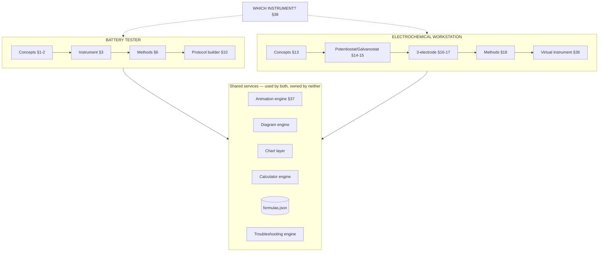

# EDMGLAB — Instrumentation Modules: Integration Report

*Battery Tester + Electrochemical Workstation*
*Responds to spec §41 (report before implementation) and §42 (first coding stage)*
*26 August 2026 · companion to Architecture v0.2*

> Your spec text says "ENERGYLAB" throughout; your follow-up message says EDMGLAB. I've taken ENERGYLAB as a slip and used **EDMGLAB** everywhere. Say the word if it's actually a rename.

---

## 0. Status check — what "existing architecture" means today

Your §41 asks me to inspect the existing architecture before reporting. The honest position, stated plainly because it changes the shape of everything below:

**No code exists yet.** We have produced two architecture documents (v0.1, v0.2). Nothing has been written to disk — no `index.html`, no shell, no animation engine, no data files. Architecture v0.2 Sections E and F already sketched these two modules at the *architectural* level; your new spec is roughly ten times more detailed and supersedes those sketches at the *implementation* level.

So §41.1 ("which existing files need modification") really means **"which planned files change, and which architectural decisions from v0.2 need revising."** That is what Section 1 answers. It also means the Stage-1 list in your §42 has a dependency problem — all sixteen deliverables assume an application shell and a shared animation engine that do not exist. Section 7 proposes a fix that keeps your Stage-1 scope intact.

One decision is still open from v0.2 and blocks the file layout below. I'll flag it once here and once at the end rather than repeatedly: **your §39 proposes `/pages/battery-tester.html` and `/pages/electrochemical-workstation.html` (multi-page); v0.2 §A.1 proposed a single-page shell with hash routing for speed.** Section 6.8 works through the reconciliation. It is a genuinely small code difference, but I need your call before writing files.

---

## 1. Existing (planned) files that need modification

Nine files from the v0.2 plan change. Every change is additive — nothing gets rewritten.

| File | Change | Why |
|---|---|---|
| `index.html` | Add two module routes; add mount point for the virtual instrument panel | New top-level modules |
| `js/nav.js` | Add Battery Tester, Workstation, and "Which instrument?" entries under the **Lab** group | §38 needs a shared entry point between the two modules |
| `js/router.js` | Add route patterns: `#/battery-tester/*`, `#/workstation/*`, `#/method/*`, `#/which-instrument` | New deep-linkable content types |
| `js/data.js` | Load and merge the new per-module data folders; merge both `troubleshooting.json` files into one searchable index (see 5.4) | Two-folder data layout from your §39 |
| `js/lib/animations.js` | **Substantially extended** — from a Play/Pause/Reset controller into the full shared engine of your §37: primitive component library, speed control, explanation toggle, single shared rAF loop | §7 and §37 |
| `js/lib/charts.js` | Add zoom/pan/point-inspection, sign-convention handling, reset; add Nyquist, Bode, Tafel, dQ/dV chart types | §8 and §32 |
| `js/lib/calc-engine.js` | Add normalization-basis and cell-configuration gating (see 6.5) | §9 and §31 require explicit material/electrode/device level |
| `data/formulas.json` | Add the battery and electrochemical equations as **one shared library**, not two | §40 accuracy — see risk 6.5 |
| `data/troubleshooting.json` | Gains a `module` tag so entries can be filtered per module but searched globally | §11 and §33 |

Two v0.2 decisions are **revised** by your new spec:

- **v0.2 §E/§F treated the modules as primarily reference content.** Your spec makes them interactive laboratories with simulators, builders and clickable diagrams. That is a substantially larger build and it changes the roadmap (Section 7).
- **v0.2 had no simulation layer at all.** Your §27 and §36 require one. This introduces a scientific-integrity requirement that must be enforced architecturally, not by convention — see 6.3.

---

## 2. New files to create

I've largely adopted your §39 structure, with three deliberate departures flagged **⚠** and justified in Section 6. Files marked **[S1]** are needed for Stage 1.

### 2.1 Shared foundation (must exist first — see 7.1)

```
/js/lib/
  anim-engine.js       [S1]  Shared animation engine: rAF loop, timeline, controls  §37
  anim-components.js   [S1]  Primitive library: Li⁺, Na⁺, cation, anion, electron,
                             electrode, electrolyte, separator, current collector,
                             particle, carbon layer, pore, arrow, voltage indicator,
                             current indicator, circuit element, label, tooltip  §37
  diagram.js           [S1]  Generic clickable-SVG engine (hotspots from JSON)
                             — powers §3, §14, §15, §16, §17 with ONE component
  sim-label.js         [S1]  Mandatory "Illustrative simulation" wrapper  §27, §36, §40
  decision-tree.js     [S1]  Generic decision-tree renderer  §30, §38
  charts.js            [S1]  Extended: zoom, pan, inspect, reset, sign conventions
  calc-engine.js             Extended: normalization basis + configuration gating
```

### 2.2 Battery Tester module

```
/js/battery-tester/
  index.js             [S1]  Landing page + module routing
  instrument.js        [S1]  Block diagram + fundamentals (§1, §3)
  cells.js                   Cell configuration diagrams (§4)
  workflow.js                Interactive testing workflow (§5)
  methods.js                 Generic method renderer — ALL methods from data ⚠ (§6)
  protocol-builder.js  [S1]  Visual protocol builder + timeline (§10)
  animations.js        [S1]  CC, CV, CC-CV, charge, discharge, cycling, GITT, PITT (§7)
  plots.js             [S1]  Chart configs only — no plotting logic ⚠ (§8)
  troubleshooting.js         Module-scoped view of the shared engine (§11)
  safety.js                  Safety section (§12)
```

### 2.3 Electrochemical Workstation module

```
/js/echem/
  index.js             [S1]  Landing page + module routing
  workstation.js       [S1]  Fundamentals (§13)
  potentiostat.js      [S1]  Potentiostat block diagram (§14)
  galvanostat.js       [S1]  Galvanostat block diagram + comparison (§15)
  electrodes.js        [S1]  Three-electrode interactive diagram (§16, §17)
  methods.js                 Generic method renderer — ALL methods from data ⚠ (§18)
  virtual-instrument.js [S1] Simulated workstation panel (§36)
  /sim/                      Simulation MATHEMATICS only, one file per technique
    cv.js              [S1]  §20, §27
    gcd.js             [S1]  §24
    eis.js             [S1]  Randles / CPE / Warburg impedance model  §25, §26, §27
    ca.js                    §22
    cp.js                    §23
    ocp.js                   §19
    lsv.js                   §21
    tafel.js                 §29
  equivalent-circuits.js     Interactive Rs / Rct / C / CPE / W components (§26)
  ir-compensation.js         §28
  plots.js             [S1]  Chart configs only ⚠ (§32)
  troubleshooting.js         Module-scoped view (§33)
```

### 2.4 Shared between the modules

```
/js/shared/
  which-instrument.js  [S1]  "Which instrument should I use?" (§38)
  method-selector.js   [S1]  Method-selection decision tree (§30)
```

### 2.5 Data files

```
/data/battery-tester/
  concepts.json              §1, §2 fundamentals + operating principles
  instrument.json            Block diagram + hotspot content (§3)
  cells.json                 Cell configurations + component hotspots (§4)
  workflow.json              Workflow steps + per-step content (§5)
  methods.json               11 methods × the §6 field set
  protocols.json             Protocol templates + builder parameter definitions (§10)
  troubleshooting.json       §11
  safety.json                §12

/data/echem/
  concepts.json              §13 fundamentals
  potentiostat.json          Block diagram hotspots (§14, §15)
  electrodes.json            Three-electrode diagram hotspots (§16, §17)
  methods.json               11 methods × the §18 field set
  circuits.json              Equivalent circuit elements (§26)
  troubleshooting.json       §33

/data/shared/
  instrument-choice.json     §38 mapping
  method-decision-tree.json  §30 tree
```

⚠ **Three departures from your §39, all in service of your own §41 rule "do not create duplicate functionality":**

1. **No `equations.json` inside `/data/echem/`.** All equations live in the single global `data/formulas.json`, referenced by ID. Reason in 6.5 — this is the most important one.
2. **`plots.js` in each module holds chart *configuration only*.** The plotting logic is the shared `js/lib/charts.js`. Your §39 listed `plots.js` in both folders, which would mean two zoom implementations to keep in sync.
3. **No `calculations.js` in either module.** Both use the shared `js/lib/calc-engine.js` driven by `calculators.json`. Module-specific behavior is data, not code.

Also: your §39 lists one JS file per electrochemical method (`cv.js`, `gcd.js`, `eis.js`, `ca.js`, `cp.js`, `ocp.js`, `lsv.js`). I've kept those **only for simulation mathematics**, which genuinely differs per technique. The *content pages* for all 22 methods across both modules render from one generic `methods.js` per module, driven by `methods.json`. Otherwise you would maintain 22 near-identical page files, and adding a method would mean writing code rather than adding data.

---

## 3. How the two modules integrate

They stay **separate modules with separate navigation, data, and code**, exactly as your spec requires. They connect at four defined points and nowhere else.



**Connection point 1 — "Which instrument should I use?" (§38).** A shared landing view, reachable from both modules and from the dashboard. Data-driven from `instrument-choice.json`, so entries carry the caveat your spec requires: capability varies by manufacturer and model, and no instrument supports every technique. GITT/PITT are represented as *configuration-dependent* rather than assigned to one instrument.

**Connection point 2 — the method-selection decision tree (§30).** Lives in `/js/shared/` because its leaves point into both modules. Every leaf states what the technique can and cannot tell you, never a bare recommendation.

**Connection point 3 — the shared formula library.** GCD appears in both modules (§6 and §24), and specific capacitance can be computed from either instrument's data. There is exactly one `formula.specific_capacitance` record, carrying `validContext`, referenced by both. This is the mechanism that prevents the two modules from drifting into contradictory statements of the same equation.

**Connection point 4 — one troubleshooting engine, two views.** Authoring happens in two files for clarity; `data.js` merges them into one index at load. So "IR drop" searched from anywhere returns both the cell/contact causes (§11) and the uncompensated-resistance causes (§28), which is the correct answer — a student with a large IR drop does not know in advance which module their problem belongs to.

**What deliberately does *not* connect:** methods, concepts, animations, and instrument diagrams stay module-owned. A CC-CV animation is a battery-tester object; a three-electrode diagram is a workstation object. No shared "electrochemistry" abstraction sits over them, per your instruction not to merge the modules.

---

## 4. How the shared animation system is reused

Your §37 requires one engine, not two. Three layers:

**Layer 1 — `anim-engine.js`: timing and control.** One `requestAnimationFrame` loop for the whole page (see risk 6.9), a timeline abstraction, and the standard control set from your §7: Play, Pause, Reset, **Speed**, **Explanation toggle**, **Labels toggle**. `prefers-reduced-motion` is honoured at this layer — every animation registers a static fallback frame, and the engine renders that instead of running, so no individual animation can forget.

**Layer 2 — `anim-components.js`: the primitive library.** Every item in your §37 list as a parameterized SVG factory: `ion('Li')`, `electron()`, `electrode({role})`, `separator()`, `currentCollector()`, `pore()`, `carbonLayer()`, `arrow()`, `voltageIndicator()`, `currentIndicator()`, `circuitElement(type)`, `label()`, `tooltip()`. Consistent visual language across both modules, styled from `tokens.css` so they follow the theme automatically.

**Layer 3 — module scenes.** Each animation is a short script composing primitives on a timeline. The CC-CV animation (§2) is roughly: an axis pair, a voltage trace, a current trace, a transition marker, and a caption track — perhaps 60 lines, no rendering or timing logic of its own.

**Reuse in practice.** The battery-charging animation (§7) and the Li-ion transport animation from the wider platform are the same primitives on different timelines. The GITT pulse-rest sequence (§7) and the chronoamperometry step-response (§22) share the step-and-relax timeline construct with different axis labels.

**Labelling is enforced, not remembered.** Every scene declares `conceptual: true` or a `simulationBasis` object. The engine renders the required caption — *"Conceptual representation — not an atomistically accurate simulation"* — as part of the frame. A developer cannot ship an unlabelled conceptual animation, because the label is not theirs to omit.

The same principle covers §27 and §36: `sim-label.js` wraps every simulated plot with *"Illustrative simulation — NOT experimental data"*, applied by the chart layer whenever the data source is a simulator. See 6.3.

---

## 5. How the data architecture works

### 5.1 The §34 five-layer split becomes the schema

Your §34 asks that INSTRUMENT / CELL / APPLIED SIGNAL / RESPONSE / DATA PROCESSING / INTERPRETATION stay clearly separated throughout. The strongest way to guarantee that is to make it the **required shape of every method record**, rather than a writing convention:

```json
{
  "id": "method.cv",
  "schemaVersion": 1,
  "module": "echem",
  "name": "Cyclic Voltammetry",
  "aliases": ["CV", "cyclic voltammogram"],

  "instrument":   { "controls": "potential", "measures": "current",
                    "configuration": "three-electrode (material-level) or two-electrode (device-level)" },
  "cell":         { "whatHappens": "…", "dependsOn": ["electrode material", "electrolyte",
                    "concentration", "geometry", "cell configuration"] },
  "appliedSignal":{ "waveform": "triangular potential sweep",
                    "parameters": ["initial E", "vertex E", "scan rate", "cycles"] },
  "response":     { "measured": "current vs potential", "plot": "chart.cv" },
  "processing":   { "steps": ["baseline considerations", "peak identification",
                    "charge integration"], "formulaIds": ["formula.b_value"] },
  "interpretation": { "learnMode": "…", "researchMode": "…" },

  "limitations":  ["…"],
  "commonMistakes": ["…"],
  "troubleshootingIds": ["ts.noisy_cv"],
  "applications": ["…"],
  "relatedIds":   ["method.lsv", "method.gcd", "concept.b_value"]
}
```

One generic renderer produces every method page in both modules from this shape. Consequences worth naming: the five-layer distinction cannot be accidentally blurred by an author; a method missing `limitations` fails the health check; and adding method #23 is a data edit, not a code change.

### 5.2 Loading

`data.js` loads module data lazily on first visit to that module and caches it in memory — a student reading fundamentals never downloads the workstation method set. Battery-tester and echem data are independent; neither blocks the other.

### 5.3 Provenance, extended for simulation

Architecture v0.2 §D.3 defined `theoretical` / `literature` / `datasheet` / `measured` / `userEntered`. Your spec adds a sixth that must be visually distinct from all of them:

| Provenance | Meaning | Rendering |
|---|---|---|
| `illustrative` | Output of a stated mathematical model with user-chosen parameters | Permanent "Illustrative simulation — NOT experimental data" banner; distinct plot styling |

Every simulator output carries `simulationBasis` naming the model and its assumptions — for EIS, the specific equivalent circuit and element equations used; for CV, the model and its stated regime of validity. A simulated curve is never rendered without that basis being inspectable by the student.

### 5.4 Troubleshooting: two files, one index

Authored as `data/battery-tester/troubleshooting.json` and `data/echem/troubleshooting.json`; merged by `data.js` into one searchable index with a `module` tag for filtering. Each entry follows your §11/§33 requirements: symptom, **multiple** possible causes, diagnostic checks, corrective actions, safety notes — and the renderer will not display a single-cause entry, because your spec is explicit that one symptom must never be presented as proving one cause. That is enforced by the health check.

### 5.5 Equations

One `data/formulas.json` for the whole platform. Battery and echem methods reference formula IDs; they never restate equations locally. Each formula carries variables, SI and common units, `validContext` (cell type, device configuration, performance level), `normalizationBasis` (gravimetric / areal / volumetric), assumptions and limitations — everything your §40 requires, in one place, checked once.

---

## 6. Architectural problems and risks

Ordered by how much trouble each causes if ignored.

### 6.1 Stage 1 has no foundation to sit on — **blocking**

All sixteen §42 deliverables assume an application shell (routing, navigation, theme, data loading) and a shared animation engine. Neither exists. Seven of the sixteen are animations or simulations that cannot be built before the engine.

*Fix:* Section 7 splits Stage 1 into 1A (foundation) and 1B (your sixteen items), without cutting anything from your list.

### 6.2 The animation engine is the critical path — **high**

Seven Stage-1 items depend on it. Built well, the remaining scenes are ~60 lines each. Built ad hoc, every scene reimplements timing and controls, and your §37 "do not create separate animation engines" is violated within a week.

*Fix:* Build and freeze the engine API before any scene. Treat it as its own deliverable with its own review.

### 6.3 Simulators vs "do not present simulated data as experimental" — **high, scientific**

Your §40 forbids presenting simulated data as experimental. Your §27 and §36 require simulators. These are compatible only if the boundary is enforced by the system rather than by author discipline. Three architectural rules:

1. **The label is not optional.** Any chart whose data source is a simulator gets the banner from `sim-label.js` automatically. There is no code path that renders a simulated series without it.
2. **The model is always inspectable.** Every simulator exposes `simulationBasis` — the governing equations and assumptions — through an "About this model" control on the plot itself.
3. **No realism theatre.** Simulated curves get no synthetic noise, no fabricated material names, no invented axis values presented as characteristic of a real system. A student must never be able to screenshot a simulator output and mistake it for data.

Rule 3 deserves emphasis: adding plausible-looking noise to make a simulation "look real" is the single easiest way to turn a teaching tool into a source of fabricated data. The simulators will look clean and obviously theoretical, and that is the correct design.

### 6.4 Content volume is the real bottleneck, not code — **high**

Rough count from your spec: 22 methods × ~15 required fields ≈ 330 authored scientific fields, plus ~30 concepts × 12 fields, plus troubleshooting, safety, cell configurations, workflow steps and diagram hotspots. **Somewhere around 600–700 individually written, scientifically checkable pieces of text.**

The code for both modules is perhaps 30% of this project. The other 70% is scientific authoring only you and your group can do — I can draft, but every claim needs your review before it teaches anyone.

*Fix:* the renderers handle partial records natively. A method with `interpretation` and `limitations` written but `applications` still empty renders cleanly, showing what exists and marking the rest "not yet written" rather than breaking or, worse, showing a confident empty section. So the modules ship usable with three methods each and grow continuously, instead of waiting on a complete content set. I'd also suggest we agree a per-method authoring template early so several group members can write in parallel without inconsistency.

### 6.5 Duplicate equations across modules — **high, scientific**

Your §39 puts `equations.json` inside `/data/echem/`, while the platform already has a global `formulas.json`. Specific capacitance, coulombic efficiency, current density and energy/power all legitimately appear in both modules. Two copies means two wordings, two sets of assumptions, and eventually two different answers to the same question — precisely the failure your §40 is written to prevent.

*Fix:* one global `formulas.json`, referenced by ID from both modules. Adopted in Section 2.5.

### 6.6 EIS equivalent-circuit fitting is genuinely hard — **medium**

Your §18 lists "EIS fitting" as a method. Complex nonlinear least-squares fitting is difficult to do well in browser JavaScript: local minima, strong parameter correlation (notably between CPE parameters and Rct), and weighting choices that materially change the result. A fitter that silently returns a bad fit is worse than no fitter, and it collides with your §26 requirement not to present any one circuit as universally correct.

*Fix:* defer automated fitting. Start with **interactive manual fitting** — the student adjusts Rs, Rct, CPE and Warburg parameters with sliders and watches the model curve move against a reference. This is more pedagogically valuable anyway: it builds intuition for which feature of the spectrum each element controls, and it makes parameter correlation visible rather than hidden inside an optimizer. Automated fitting can follow later, with residual plots and an explicit "fit quality is not physical validity" treatment.

### 6.7 Tafel analysis invites misapplication — **medium, scientific**

§29 is correctly scoped as conceptual, but Tafel analysis is routinely misapplied — to non-linear regions, to mass-transport-limited data, and to capacitive systems where it has no meaning. Given your platform serves supercapacitor researchers, some students will try to apply it to EDLC data.

*Fix:* the Tafel module opens with applicability conditions before the method, and the calculator requires the student to state the potential range used and flags ranges that fall outside a plausible Tafel region rather than silently returning a slope.

### 6.8 Multi-page vs single-page — **medium, needs your decision**

Your §39 proposes `/pages/battery-tester.html` and `/pages/electrochemical-workstation.html`. Architecture v0.2 §A.1 proposed a single-page shell with hash routing, chosen for the speed and simplicity you asked for.

Your §41 also says "do not generate a giant single HTML file." Worth separating those two ideas: the single-page shell is a ~100-line `index.html` with all logic in modular JS files — it is not a giant HTML file, and it satisfies that requirement fully. The two approaches differ by roughly twenty lines of routing code, and all module code and data are identical either way.

- **Single-page (v0.2):** module switching under 100 ms, one file to cache offline, one navigation definition. Deep links still work (`#/battery-tester/methods/cccv`).
- **Multi-page (your §39):** each module is a real URL; full page load (~400–800 ms) on every navigation; navigation markup duplicated per page.

*Recommendation:* single-page, for the reasons in v0.2 §A.1. But this is your call and I'll build either. **It is the one thing genuinely blocking file creation.**

### 6.9 Animation performance on mobile — **medium**

Your spec requires mobile-friendly, performant animations, and some views could hold several simultaneously. Naïvely, each animation runs its own `requestAnimationFrame` loop, and a mid-range Android phone will drop frames badly with more than a few running at once.

*Fix, built in from the start:* one shared rAF loop driving all registered scenes; `IntersectionObserver` to pause any animation scrolled off screen; a cap on concurrent running scenes with the rest paused until visible; SVG for structure with Canvas only where particle counts demand it; and a low-power mode that reduces particle counts on constrained devices. Cheap to design in now, painful to retrofit.

### 6.10 Chart interactivity adds a dependency — **low**

Zoom, pan and point inspection (§8, §32) need `chartjs-plugin-zoom` alongside Chart.js — roughly 15 KB, self-hosted per v0.2 §I.2, lazy-loaded only on plot views. Within the payload budget, but worth recording rather than discovering later.

### 6.11 The virtual instrument could be mistaken for instrument control — **low but reputationally important**

Your §36 panel deliberately resembles real instrument software. A student could plausibly believe it is driving hardware.

*Fix:* persistent header text on the panel reading *"Educational simulator — not connected to any instrument"*, alongside the per-plot illustrative label. Same reasoning for the protocol builder (§10), which carries "Educational protocol simulator" and states that a generated protocol is not automatically appropriate for any given chemistry, electrode, cell design or voltage window.

---

## 7. Revised Stage-1 plan

Your §42 list is kept intact. It is split so the foundation exists before the things that depend on it.

### 7.1 Stage 1A — foundation (prerequisite, no user-visible modules)

| # | Deliverable |
|---|---|
| 1 | App shell: `index.html`, router, `nav.js`, `tokens.css`, theme system |
| 2 | `data.js` with lazy per-module loading and schema versioning |
| 3 | **`anim-engine.js`** — rAF loop, timeline, Play/Pause/Reset/Speed/Explanation/Labels, reduced-motion fallbacks, shared-loop performance design |
| 4 | **`anim-components.js`** — the §37 primitive library |
| 5 | **`diagram.js`** — generic clickable-SVG engine driving all four interactive diagrams |
| 6 | **`sim-label.js`** — enforced simulation labelling |
| 7 | `charts.js` with zoom/pan/inspect/reset |
| 8 | Health-check view (validates schemas, cross-references, single-cause troubleshooting entries) |

Exit: an empty but navigable, installable app; one throwaway demo animation proving the engine; one demo clickable diagram proving `diagram.js`.

### 7.2 Stage 1B — your §42 list

**Battery Tester**

| # | Item | Built from |
|---|---|---|
| 1 | Landing page | `index.js` + `concepts.json` |
| 2 | Instrument block diagram | `diagram.js` + `instrument.json` |
| 3 | CC animation | engine + components |
| 4 | CV animation | engine + components |
| 5 | CC-CV animation | engine (transition timeline) |
| 6 | Charge/discharge animation | engine + ion/electron primitives |
| 7 | Basic protocol builder | `protocol-builder.js` + `protocols.json` |
| 8 | Voltage-time graph | `charts.js` |

**Electrochemical Workstation**

| # | Item | Built from |
|---|---|---|
| 1 | Landing page | `index.js` + `concepts.json` |
| 2 | Potentiostat block diagram | `diagram.js` + `potentiostat.json` |
| 3 | Galvanostat block diagram | same, with comparison view |
| 4 | Three-electrode diagram | `diagram.js` + `electrodes.json` — with the WE↔RE potential path and WE↔CE current path visually emphasized per §16 |
| 5 | Basic CV simulation | `sim/cv.js` + `sim-label.js` |
| 6 | Basic GCD simulation | `sim/gcd.js` + `sim-label.js` |
| 7 | Basic EIS simulation | `sim/eis.js` (Rs + Rct ∥ CPE + Warburg) + `sim-label.js` |
| 8 | Method-selection decision tree | `decision-tree.js` + `method-decision-tree.json` |

Deferred to Stage 2 per your instruction, and noted here so nothing is silently dropped: the full method sets (§6, §18), cell configurations (§4), workflow (§5), GITT/PITT animations, equivalent-circuit interactive components (§26), iR compensation (§28), Tafel (§29), the full virtual instrument panel (§36), troubleshooting engines (§11, §33), and safety (§12).

### 7.3 Suggested build order within 1B

Battery Tester items 1–3 first, as the thinnest end-to-end slice touching every shared service — landing page, one diagram, one animation. Once that renders correctly, the remaining thirteen items are variations on proven machinery rather than new problems.

---

## 8. What I need from you before writing code

1. **Single-page or multi-page?** (6.8) The only genuinely blocking item. My recommendation is single-page; your §39 says multi-page; the difference is ~20 lines and I'll build whichever you choose.
2. **Which electrochemical workstation do you have?** Still open from v0.2. The module stays vendor-neutral either way, but knowing the model lets me use your instrument's technique vocabulary as aliases so students searching the term on your screen find the right page.
3. **Confirm Stage 1A.** It adds one preparatory stage before your §42 list. Everything in your list survives; it just gets a foundation to stand on.
4. **Who reviews the science?** (6.4) Around 600–700 authored fields need a reviewer before they teach anyone. If that is you alone, the content track should be paced accordingly; if group members will write in parallel, we should agree the per-method authoring template early.

Answer 1 and 3 and I'll start on Stage 1A.

---

*Scope note: this report covers only the Battery Tester and Electrochemical Workstation modules, per your instruction. It does not revise the wider platform architecture — I'll fold the shared-service changes from Section 1 into Architecture v0.3 once the single-page decision is settled, so the two documents don't drift.*

---

## 9. Stage 2 — what was built (added after Stage 1B shipped)

Stage 2 completes both instrument modules. Everything §7.2 listed as deferred is now built,
with two exceptions noted at the end.

### 9.1 Battery Tester

| Spec | Built | Files |
|---|---|---|
| §4 | Cell formats and configurations, split apart | `battery-tester/cells.js` · `data/battery-tester/cells.json` |
| §5 | Twelve-step clickable testing workflow | `battery-tester/workflow.js` · `workflow.json` |
| §6 | Twelve method records in the five-layer schema | `methods.json` |
| §10 | Protocol builder with a V–t preview | `protocol-builder.js` |
| §11 | Troubleshooting symptom library | `troubleshooting.json` |
| §12 | Safety orientation — 14 hazards, 4 groups | `renderSafety()` · `safety.json` |

The §4 split is the decision worth recording: the spec lists coin, pouch, cylindrical, half,
full, symmetric and three-electrode as one list, but a coin cell can be a half cell *or* a full
cell. **Format** is how the cell is built; **configuration** is what the measurement is about,
and it is the configuration that decides which formula is valid — including the factor of four
between a symmetric device and its single electrode. Presenting them as one list would teach the
wrong model of the relationship.

### 9.2 Electrochemical Workstation

| Spec | Built | Files |
|---|---|---|
| §18 | Eleven method records, OrigaMaster aliases | `data/echem/methods.json` |
| §20, §24, §25 | CV, GCD and EIS simulators | `sim/cv.js` · `sim/gcd.js` · `sim/eis.js` |
| §26 | **Equivalent-circuit element explorer** | `circuits.js` · `sim/circuits.js` · `circuits.json` |
| §29 | **Tafel analysis** | `tafel.js` · `sim/tafel.js` · `tafel.json` |
| §30 | Method-selection decision tree | `decision-tree.js` |
| §33 | Troubleshooting symptom library | `data/echem/troubleshooting.json` |

### 9.3 How §26 was implemented, and why that way

§38 forbids assuming any one equivalent circuit is universally correct. A page that *states* this
and then hands over a fitting tool teaches the opposite of what it says, so the rule is demonstrated
instead:

- **Each element is plotted alone** — Nyquist, log|Z| and phase — so its signature is learned by
  looking. Every element record carries `oftenAssociatedWith` **and** a separate `butNot` list, because
  naming an element after a process is the usual route by which a fit becomes an unsupported claim.
- **Non-uniqueness is demonstrated, not asserted.** Two different topologies are plotted together:
  `Rs + (Rp ∥ C)` and `Ra ∥ (Rb + Cb)`. The mapping between them is exact algebra, derived in the
  header of `sim/circuits.js`:

  ```
  Ra = Rs + Rp        Cb = Rp²·C/(Rs+Rp)²        Rb = Rs·(Rs+Rp)/Rp
  ```

  The two spectra agree to ~4×10⁻¹⁶ relative — double-precision rounding — at every frequency and
  for every parameter setting the sliders allow. The page displays that residual, so the claim is
  checkable rather than rhetorical. No fit quality, residual or information criterion can separate
  the two circuits, which is exactly the point: choosing between circuits needs evidence from
  outside the impedance measurement.

Equal-axis scaling is applied to a Nyquist plot only where the locus has real width. A purely
reactive element has no angle to preserve, and forcing equal axes there would stretch the real
axis across an empty frame to match a 160 kΩ imaginary range.

**Automated CNLS fitting remains deliberately unbuilt**, per §6.6. Nothing on this page changes
that assessment — if anything the degenerate-pair demonstration strengthens it.

### 9.4 How §29 was implemented

§6.7 committed to three things. All three are built, with one deliberate departure:

1. **Applicability before method.** The page opens with four conditions that must all hold, each
   with why it matters and when it fails. The calculator is below them.
2. **The fitting range is an explicit, required choice**, not a default the student can leave alone.
3. **Unsuitable ranges are flagged** — proximity to the limiting current, iR share of the recorded
   overpotential, background share of the total current, and windows narrower than a decade.

*Departure:* §6.7 said the calculator should flag an implausible range "rather than silently
returning a slope". It flags the range **and still returns the slope**, next to the slope the model
actually contains. Refusing to compute would teach that a tool protects you. Showing a fit return
238 mV/dec from a system whose true slope is 118 mV/dec, with R² = 0.98, teaches that it does not.
The `system` selector goes further: set it to a purely resistive electrode — no faradaic reaction
at all — and the same fit returns a plausible-looking ~118 mV/dec in one window and ~700 mV/dec in
another. That is the §29 misapplication warning made unforgettable rather than merely printed.

The comparison is only possible because the response is generated from a stated model. On real data
the fitted number is the only number there is, and the page says so.

### 9.5 Shared-layer changes made during Stage 2

- `sim/complex.js` extracted so the EIS and circuit-element models share one complex arithmetic
  implementation rather than two copies that can drift.
- `.field-label` and `.lim-list` moved into `css/style.css`. Both were used across modules while
  being defined inside one module's inline `<style>` — the same defect class as the `.tabbar` bug.
  `.field-label` is deliberately **not** uppercased: these labels carry symbols where case is
  meaningful (Rs is not RS, n is not N).
- Method records may now declare `interactive: { route, label }`; `method-view.js` renders it as a
  link. Seven method records use it.
- The health check reports a `_kind` file's shape instead of calling it "empty".

### 9.6 Still open

Not part of the instrument modules, and carried into the platform roadmap: materials database (P7),
storage chemistry (P8), electrode preparation and characterisation (P9), the calculators engine (P2),
formula library UI (P1), CSV data import (P4), quiz and glossary (P12), PWA hardening (P13).

The ~35,000 words of scientific content across both modules carry a visible draft banner and are
**pending review by the research group**. The safety section (§12) should be reviewed with your
safety officer specifically.

---

## 10. Formula library and calculation workbench (Roadmap P1 + P2)

The pathway's CALCULATION stage. Two views over one data file, and no per-formula code
anywhere in the application.

### 10.1 The calculator IS the formula record

A formula declares its own `expression`, the units each variable may be entered in, and the
units its result may be shown in. One generic renderer turns that into a working calculator.
Adding a formula is a JSON edit; it is never a code change, and there is no `calculators.json` —
a separate calculator file would have been a second place for the same equation to live and drift.

`js/lib/expr.js` is a real recursive-descent parser, not `eval` or `new Function`. That matters
because the expressions live in a git-tracked content file that group members are explicitly
invited to edit through GitHub's web editor: handing that file a path to arbitrary JavaScript
execution would be indefensible however trusted the authors are. The parser accepts numbers,
declared symbols, `+ − × ÷ ^`, parentheses and a fixed function list. Verified rejections include
`alert(1)`, `process.exit()`, template literals, arrow functions and `__proto__` access.

**Everything is evaluated in SI.** Each unit carries the factor that converts it to SI (and an
additive offset, used only for temperature). Unit confusion — mA against A, g against kg — is by
a wide margin the most common way a specific capacitance comes out a thousand times wrong, so the
conversion is done once, centrally, and shown to the user under "Show the working, in SI".

Authoring this set caught exactly that class of error in review: `mAh/g` had been factored as 3.6
rather than 3600 — a per-gram basis mistaken for per-kilogram. It made specific capacity read
200 000 mAh/g instead of 200. The unit-invariance test now asserts that entering the same physical
quantity in any of a variable's alternative units gives an identical result; all 72 alternative-unit
entries pass.

### 10.2 Ordering is the argument

On a formula page the **valid context comes first** — cell type, configuration, performance level,
normalisation — above the equation and well above the input boxes. A student arriving to compute a
specific capacitance meets the question of which configuration they are in before they meet a place
to type. That ordering is the reason this exists rather than a spreadsheet: the spreadsheet will
happily apply the three-electrode equation to a symmetric device, return a number four times too
large, and look entirely normal doing it.

Where two conventions exist they are **separate records with distinct names**, never one record
with a footnote — the factor-of-four capacitance pair, and the factor-of-two ESR pair (IR drop read
at a current reversal, where the current changes by 2I, versus from rest, where it changes by I).

### 10.3 The workbench asks before it computes

`#/calculators` is organised by what you MEASURED, not by what you want. Pick the measurement,
answer the configuration questions, enter what you read off the curve once, and every quantity that
measurement supports is computed from the same inputs. Quantities that feed others — capacitance
into energy into power, ESR into maximum power — are chained automatically and labelled as chained,
so it stays visible that a number rests on the assumptions of the one above it.

The equations your answers rule out are **shown, greyed, with the reason**, rather than hidden.
Selecting "three-electrode" leaves the symmetric-device form on screen saying *"Ruled out by your
answer: this is the symmetric two-electrode form, and you selected three-electrode."* Hiding it
would teach that only one equation ever existed; showing it disabled teaches that the measurement
chose between them.

### 10.4 Machine-enforced rules added

The health check now refuses to pass a formula whose `expression` does not parse, uses a symbol not
declared in `variables`, leaves an input or a result without units, or states no limitations.
Verified by injecting a deliberately broken record: 3 errors and 1 warning raised, all four naming
the specific defect; removed, back to zero.

### 10.5 Content

28 formulas across supercapacitor, battery, kinetics and shared/electrode domains, each with its
valid context, assumptions, limitations and cross-references. Every one was checked against a
hand-worked value; 28/28 agree. The library is draft and pending review by the research group.
